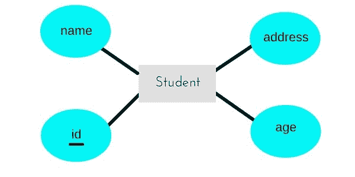
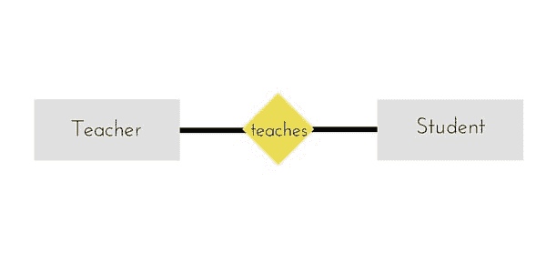

# 从 ER 模型到关系模型

> 原文：<https://www.studytonight.com/dbms/er-to-relational-model.php>

众所周知，ER 模型可以用 ER 图来表示，这是一种很好的设计方式，可以用流程图的形式来表示数据库设计。

使用 ER 模型设计数据库非常方便，方法是创建一个 ER 图，然后将其转换为关系模型来设计您的表。

不是所有的 ER 模型约束和组件都可以直接转换成关系模型，但是可以导出一个近似的模式。

因此，让我们举几个 ER 图的例子，并将其转换为关系模型模式，从而在关系DBMS中创建表。

* * *

## 实体变成表格

ER 模型中的实体被改变成表，或者我们可以说对于 ER 模型中的每个实体，在关系模型中创建一个表。

并且实体的**属性**被转换成表格的列。

并且在 ER 模型中为实体指定的主键将成为关系模型中表的主键。

例如，对于ER模型中的下图ER 图，

关系模型中将创建一个名为**学生**的表，该表有 4 列，`id`、`name`、`age`、`address`和`id`将是该表的主键。

* * *

## 关系变成关系表

在 ER 图中，我们使用菱形/菱形来表示两个实体之间的关系。在关系模型中，我们也为 ER 模型关系创建了一个关系表。

在下面的 ER 图中，我们有两个实体**老师**和**学生**，它们之间有关系。

如上所述，实体被映射到表，因此我们将为**老师**创建表，为**学生**创建表，并将所有属性转换为列。

现在，将为该关系创建一个额外的表，例如 **StudentTeacher** 或给它取任何您喜欢的名称。该表将保存学生和教师的主键，用一个元组来描述关系，哪个教师教哪个学生。

如果有与此关系相关的附加属性，则它们会成为此表的列，如主题名称。

还必须为所有表设置适当的外键约束。

* * *

### 需要记住的要点

同样，我们可以使用 ER 图生成关系数据库模式。以下是这样做时要记住的一些要点:

1.  实体被转换为表，所有属性都成为表中的字段(列)。
2.  实体之间的关系也转换成表，相关实体的主键也作为外键存储在表中。
3.  主键应该正确设置。
4.  对于弱实体的任何关系，如果表中包含任何其他实体的主键，则必须定义外键约束。

* * *

* * *