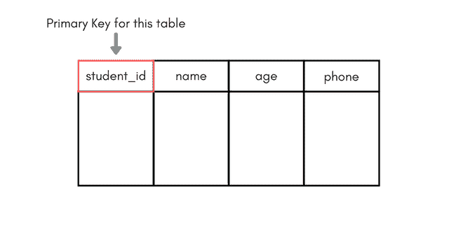
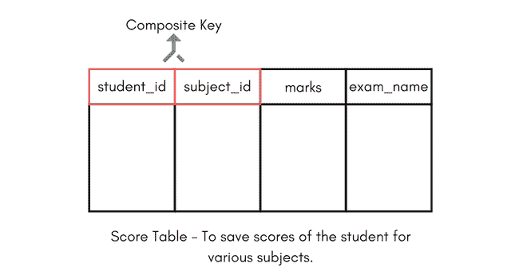

# 数据库键简介

> 原文：<https://www.studytonight.com/dbms/database-key.php>

键是关系数据库模型中非常重要的一部分。它们用于建立和标识表之间的关系，也用于唯一标识表中的任何记录或数据行。

密钥可以是单个属性或一组属性，其中组合可以充当密钥。

下面的视频涵盖了关系DBMS中所有不同的键。

## 为什么我们需要一把钥匙？

在现实世界的应用程序中，存储数据所需的表的数量是巨大的，不同的表也是相互关联的。

此外，表中存储了大量数据。表通常扩展到存储在其中的成千上万条记录，这些记录没有分类也没有组织。

现在，要从这样的数据集中提取任何特定的记录，您必须应用一些条件，但是如果存在重复的数据，并且每次您试图通过应用某些条件来提取一些数据时，都会得到错误的数据，那该怎么办呢？在你得到正确的数据之前，有多少次试验？

为了避免这一切，**键**被定义为容易识别表中的任何数据行。

让我们用一个简单的例子来理解所有的键。

| 学生 id | 名字 | 电话 | 年龄 |
| one | 阿康 | Nine billion eight hundred and seventy-six million seven hundred and twenty-three thousand four hundred and fifty-two | Seventeen |
| Two | 阿康 | Nine billion nine hundred and ninety-one million one hundred and sixty-five thousand six hundred and seventy-four | Nineteen |
| three | Bkon | Seven billion eight hundred and ninety-eight million seven hundred and fifty-six thousand five hundred and forty-three | Eighteen |
| four | Ckon 先生 | Eight billion nine hundred and eighty-seven million eight hundred and sixty-seven thousand eight hundred and ninety-eight | Nineteen |
| five | Dkon | Nine billion nine hundred and ninety million eighty thousand and eighty | Seventeen |

我们来看一个简单的**学生**表，有字段`student_id`、`name`、`phone`和`age`。

* * *

### 超级钥匙

**超级键**定义为表内的一组属性，可以唯一标识表内的每条记录。超级密钥是候选密钥的超集。

> 在上面定义的表中，超级键将包括`student_id`、`(student_id, name)`、`phone`等。

迷茫？第一个非常简单，因为`student_id`对于每一行数据都是唯一的，因此它可以用来唯一地标识每一行。

接下来是`(student_id, name)`，现在两个学生的名字可以相同，但是他们的`student_id`不能相同，因此这个组合也可以是一个键。

同样，每个学生的电话号码都是唯一的，因此`phone`也可以是一个键。

所以它们都是超级钥匙。

* * *

### 候选关键字

候选关键字被定义为能够唯一标识表中每条记录的最小字段集。它是一个属性或一组属性，可以作为表的主键来唯一标识该表中的每条记录。可以有多个候选键。

在我们的示例中，`student_id`和`phone`都是表**学生**的候选键。

*   候选键不能为空。它的价值应该是独一无二的。
*   一个表可以有多个候选键。
*   候选键可以是多个列(属性)的组合。

* * *

### 主关键字

主键是最适合成为任何表的主键的候选键。它是一个可以唯一标识表中每条记录的键。

对于表**学生**我们可以将`student_id`列作为主键。

* * *

### 复合键

由两个或多个唯一标识表中任何记录的属性组成的键称为**复合键**。但是共同构成**复合键**的属性不是独立的或单独的键。

在上图中，我们有一个**分数**表，它存储了学生在特定科目中的分数。

在该表中`student_id`和`subject_id`将一起形成主键，因此它是一个复合键。

* * *

### 辅助或替代键

未被选为主键的候选键被称为辅助键或替代键。

* * *

### 非关键属性

**非关键**属性是表中的属性或字段，而不是表中的**候选关键**属性/字段。

* * *

### 非质数属性

**非主键**属性是除**主键属性以外的属性。**。

* * *

* * *