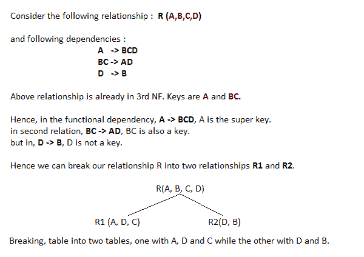

# 博伊斯-柯德范式(BCNF)

> 原文：<https://www.studytonight.com/dbms/boyce-codd-normal-form.php>

Boyce-Codd 范式或 BCNF 是[第三范式](third-normal-form.php)的扩展，也称为 3.5 范式。

在继续使用 Boyce-Codd 范式之前，请查看以下主题，以更好地理解数据库规范化概念:

*   [第一范式(1NF)](first-normal-form.php)
*   [第二范式(2NF)](second-normal-form.php)
*   [第三范式(3NF)](third-normal-form.php)

跟随上面的视频，了解 BCNF 的完整解释。或者，如果你愿意，你甚至可以跳过视频，跳到下面的部分，看完整的教程。

在上一个教程中，我们学习了第三范式，也学习了如何从表中移除**传递依赖关系**，建议你在这个之前学习上一个教程。

* * *

## BCNF 规则

对于满足 Boyce-Codd 范式的表，它应该满足以下两个条件:

1.  应该是**第三范式**。
2.  而且，对于任何依赖项 A → B，A 都应该是**超级键**。

第二点听起来有点棘手，对吧？简单的说就是，对于一个依赖项 A → B，如果 B 是**素属性**，A 就不能是**非素属性**。

* * *

## 举个例子

下面我们有一个带有`student_id`、`subject`和`professor`栏的大学招生表。

| 学生 id | 科目 | 教授 |
| One hundred and one | 爪哇 | P.Java |
| One hundred and one | C++ | 页（page 的缩写）卡片打印处理机（Card Print Processor 的缩写） |
| One hundred and two | 爪哇 | 页（page 的缩写）Java2 |
| One hundred and three | C# | P.查什 |
| One hundred and four | 爪哇 | P.Java |

如您所见，我们还向表中添加了一些示例数据。

在上表中:

*   一个学生可以注册多门课程。例如，学号为**学号为** 101 的学生选择了科目——Java&c++
*   每个科目都有一名教授分配给学生。
*   而且，可以有多位教授教一门课程，就像我们教 Java 一样。

你认为**主键**应该是什么？

嗯，在上面的表中`student_id, subject`一起组成了主键，因为使用`student_id`和`subject`，我们可以找到表的所有列。

这里需要注意的更重要的一点是，一个教授只教一门学科，但是一门学科可能有两个不同的教授。

因此这里`subject`和`professor`之间有一个依存关系，`subject`取决于教授的名字。

该表满足**第一范式**，因为所有值都是原子的，列名是唯一的，并且存储在特定列中的所有值都属于同一域。

该表也满足**第二范式**，因为它们没有**部分依赖**。

并且，不存在**传递依赖**，因此该表也满足**第三范式**。

但是这个表不在 **Boyce-Codd 范式**中。

* * *

### 为什么这张桌子不在 BCNF？

在上表中，`student_id, subject`构成主键，表示`subject`列是一个**主属性**。

但是，还有一个依赖，`professor` → `subject`。

而`subject`是质数属性，`professor`是**非质数属性**，这是 BCNF 不允许的。

* * *

### 如何让 BCNF 满意？

为了让这个关系(表)满足 BCNF，我们将这个表分解成两个表，**学生**表和**教授**表。

下面是这两张表的结构。

**学生表**

| 学生 id | p_id |
| One hundred and one | one |
| One hundred and one | Two |
| 等等... |

并且，**教授表**

| p_id | 教授 | 科目 |
| one | P.Java | 爪哇 |
| Two | 页（page 的缩写）卡片打印处理机（Card Print Processor 的缩写） | C++ |
| 等等... |

现在，这个关系满足 Boyce-Codd 范式。在下一个教程中，我们将学习**第四范式**。

* * *

## 更一般的解释

在下图中，我们试图用关系来解释 BCNF。

* * *

* * *