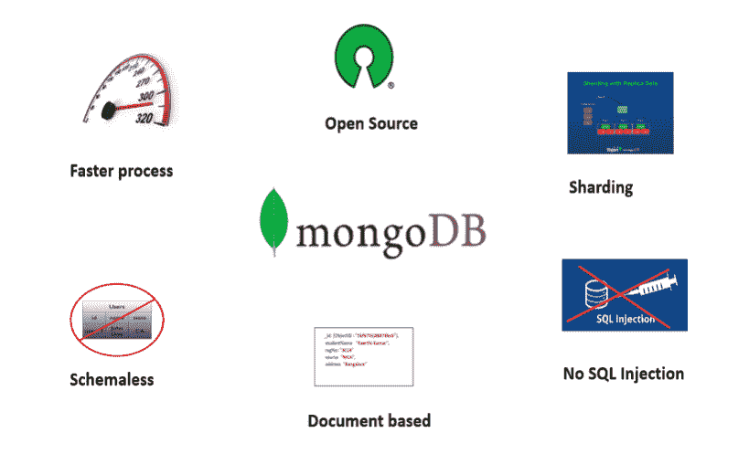

# MongoDB 的优势

> 原文：<https://www.studytonight.com/mongodb/advantages-of-mongodb>

看到了 MongoDB 的良好特性后，现在每个开发人员都应该能够理解为什么将基于 NoSQL 的数据库用于大数据事务和实现可伸缩模型会更好。现在，是时候抛弃关系DBMS的模式定义，利用像 MongoDB 这样的无模式数据库了。让我们看看 MongoDB 的一些重要优势:

1.  首先，安装和设置 MongoDB 非常容易。
2.  MongoDB 最基本的特点是它是一个无模式数据库。不再有模式迁移。因为 MongoDB 是无模式的，所以您的代码定义了您的模式。
3.  导出基于文档的数据模型的能力是 MongoDB 最有吸引力的优势之一。因为它以 BSON(二进制 JSON)、红宝石散列等形式存储数据的方式有助于以非常丰富的方式存储数据，同时能够保存数组和其他文档。
4.  MongoDB 支持的文档查询语言在支持动态查询方面起着至关重要的作用。
5.  非常容易扩展。
6.  由于 MongoDB 中数据的结构化(BSON 格式-键值对)方式，不需要复杂的连接。
7.  与任何关系数据库相比，性能调优都非常容易。
8.  不需要将应用程序对象映射到数据对象。
9.  由于其使用内部存储器进行存储的特性，能够更快地访问数据。
10.  既然它是一个 NOSQL 数据库，那么它显然是安全的，因为不能进行 SQL 注入。
11.  MongoDB 也可以用作文件系统，这有助于实现更简单的负载平衡。
12.  MongoDB 也支持正则表达式和字段搜索。
13.  MongoDB 也可以作为 windows 服务运行。
14.  有大量的文档可用。
15.  MongoDB 不需要运行虚拟机。
16.  MongoDB 遵循其较新版本的常规发布周期。
17.  对分片的支持是它的一个关键特性。分片是将数据存储在不同机器上的过程，以及 MongoDB 在数据增长时处理数据的能力。这导致水平缩放。使用分片，当数据增长增加时，可以写入和读取更多的数据。

* * *

* * *