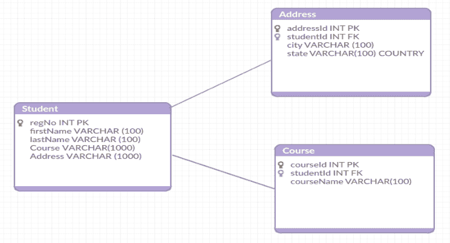

# 蒙古数据库中的数据建模

> 原文：<https://www.studytonight.com/mongodb/data-modelling-in-mongodb>

正如前面课程中所解释的，MongoDB 中的数据是无模式的，这意味着在插入之前不需要为数据定义结构。因为 MongoDB 是一个基于文档的数据库，所以同一个集合中的任何文档都不必具有相同的字段集或结构。这有助于轻松地将文档与实体对象进行映射。一般来说，MongoDB 集合中的文档将总是共享相同的数据结构(推荐用于最佳性能，而不是强制性的)。

给定数据库中数据建模的关键因素或挑战是负载平衡，从而有效地确保性能。在对数据建模时，考虑数据的完整使用(CRUD 操作)以及数据将如何被继承是一项任务。

有两种方法可以在 MongoDB 中建立数据之间的关系:

*   参考文件
*   嵌入的文档

* * *

## 蒙古数据库:参考文档

这是实现存储在不同集合中的数据之间的关系的方法之一。在这种情况下，对一个集合中的数据的引用将用于连接集合之间的数据。

考虑 2 个集合`books`和`authors`，如下图:

```sql
 {
  title: "Java in action",
  author: "author1",
  language: "English",
  publisher: {
             name: "My publications",
             founded:1990,
             location: "SF"
            }
}

{
  title: "Hibernate in action",
  author: "author2",
  language: "English",
  publisher: {
             name: "My publications",
             founded:1990,
             location: "SF"
            }
} 
```

在上面的例子中，`publisher`数据被重复。为了避免这种重复，我们可以将图书的引用添加到 publisher 数据中，而不是在每个图书条目中使用 publisher 的全部数据，如下所示:

```sql
 {
  name: "My Publciations",
  founded:1980,
  location: "CA",
  books: [111222333,444555666, ..]
}

{
   _id:111222333,
   title: "Java in action",
   author: "author1",
   language: "English"
}

{
  _id:444555666,
  title: "Hibernate in action",
  author: "author2",
  language: "English"
} 
```

这也可以反过来做，其中一个可以引用书籍数据中的**发布者 id** ，这是您的选择。

* * *

## 蒙古数据库:嵌入式文档

在这种情况下，一个集合将嵌入到另一个集合中。考虑 2 个集合`student`和`address`。让我们看看如何将地址嵌入学生收藏。下面是一个将单个地址嵌入学生数据的示例。

```sql
 {
  _id:123,
  name: "Student1"
}

{
  _studentId:123,
  street: "123 Street",
  city: "Bangalore",
  state: "KA"
}

{
  _studentId:123,
  street: "456 Street",
  city: "Punjab",
  state: "HR"
} 
```

嵌入多个地址也可以完成。请参见下面的示例:

```sql
 {
  _id:123,
  name: "Student1"
  addresses: [
      	{
             	street: "123 Street",
   		city: "Bangalore",
   		state: "KA"
        },

        {
   		street: "456 Street",
   		city: "Punjab",
   		state: "HR"
        }
    ]
} 
```

* * *

## 蒙古数据库中的数据建模示例

让我们考虑一个在大学建立**学生**数据库的简单例子。假设有 3 个模型–`Student`、`Address`和`Course`。在典型的关系DBMS数据库中，这 3 个模型将被转换成如下所示的 3 个表:



因此，从上面的模型来看，如果必须添加学生的详细信息，那么应该在所有 3 个表中进行输入！！

让我们看看，同样的数据如何在 MongoDB 中建模。在 MongoDB 中，模式设计将只有一个集合`Student`，并将具有以下结构。

```sql
 {
   _id: 123,
   firstName: 'Test',
   lastName: 'Student',
   address :[{
           City: 'Bangalore',
           State: 'Karnataka',
           Country: 'India'
        }
    ],
   Course: 'MCA'
} 
```

在 MongoDB 中，与所有 3 个模型相关的数据将显示在一个集合下！！

MongoDB 提供了多种建模数据的方法。现在你知道怎么做了。

**注意:**集合中的字段名如上面例子中的`firstName`和`lastName`等也使用内存，可能是 10-20 字节左右。但是当数据集非常大时，这会增加大量内存。因此，对于大型数据集，建议使用短字段名来存储集合中的数据，如 **fname** 而不是 **firstName** 。

* * *

* * *