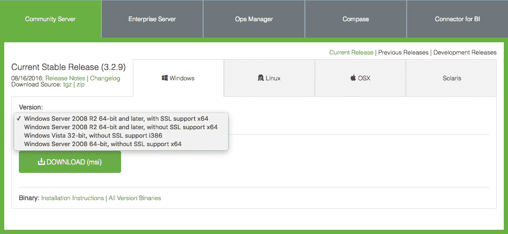
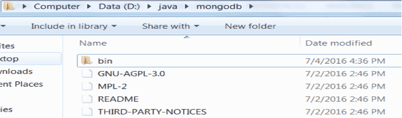
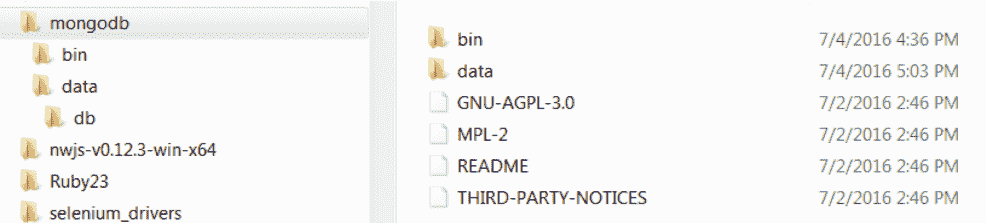
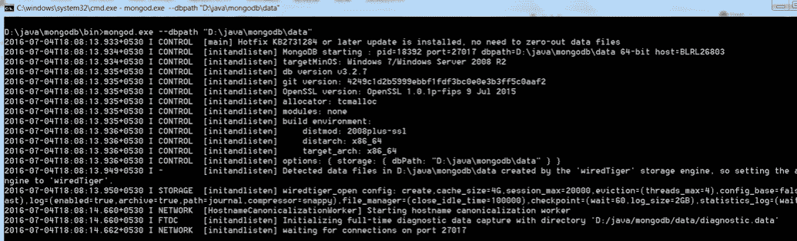
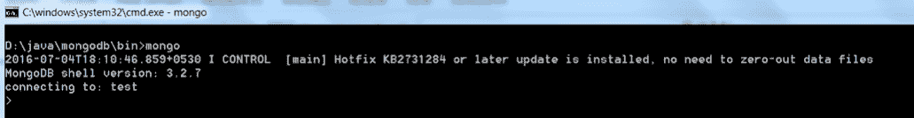

# 在 Windows 和 Linux 上安装 MongoDB

> 原文：<https://www.studytonight.com/mongodb/setup-mongodb>

在之前的教程中，我们已经学习了介绍、概述、优势、特性以及何时使用 MongoDB。在本教程中，我们将学习如何在本地机器上设置 MongoDB。我们将介绍在 Windows 操作系统和 Linux 操作系统上安装 MongoDB 和相关工具的步骤。

* * *

## 在 Windows 上安装 MongoDB

在 Windows 机器上安装 MongoDB 非常容易。以下是安装 MongoDB 的步骤:

1.  Download MongoDB executable `.msi` file from the site [MongoDB Download Centre](https://www.mongodb.org/downloads). Select the latest version for **Windows**, the Windows Server 2008 R2 is the version if you are on Windows 7, 8 or 10.

    

2.  双击下载的`.msi`文件开始安装。在安装过程中选择**自定义**选项，指定您想要安装 MongoDB 的自定义位置。默认安装在`C:\mongodb`目录下。
3.  Once the installation is successful, the below directory structure is created. We have installed our MongoDB in `D:\java\mongodb`

    

4.  导航到 MongoDB 的 bin 目录，了解 MongoDB 中使用的组件。以下是运行它们的一些重要组件和文件:T21】客户

    | 成分 | `.exe`文件 |
    | 计算机网络服务器 | 旺德。exe |
    | 路由器 | mongos.exe |
    | mongo.exe |

5.  It is required to set up the MongoDB environment. MongoDB stores all its data under the folder `data\db`. It is best practice to create this directory under the folder where the MongoDB is installed. So let's create a folder named **data** and one more folder named **db** inside **data** folder as shown below.

    

6.  还要创建一个**日志**文件夹来记录 MongoDB 数据事务。在日志文件夹下，创建一个日志文件`FILE_NAME.log`。
7.  现在，要验证安装是否成功，请打开命令提示符，导航到 MongoDB 已安装文件夹的 **bin** 目录。
8.  Execute the command `mongod.exe --dbpath "DATA_DIRECTORY_PATH"` to configure the **data** path and start the MongoDB server. Please replace the *DATA_DIRECTORY_PATH* with the path of **data** directory present inside MongoDB installed folder. On running this command, the below log will be displayed which says that the MongoDB configuration is successful and the server is up and running fine.

    

9.  Now, open another command prompt window and navigate to the **bin** directory of the MongoDB again, and start the MongoDB client in order to use the database system. Run the command `mongo` in Command Prompt and it will get connected to the MongoDB where the default database is **test**.

    

10.  至此，我们已经成功地在 windows 环境中安装了 MongoDB，并且可以从 MongoDB 开始了。

* * *

* * *