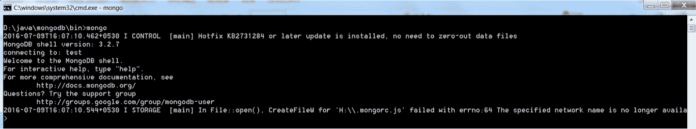
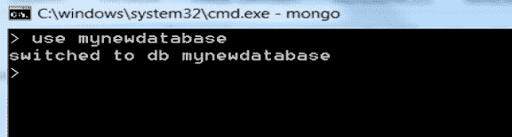
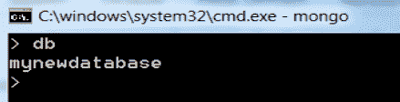
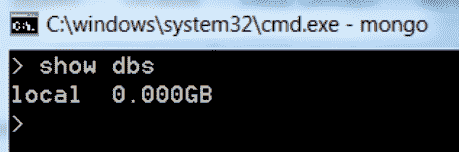
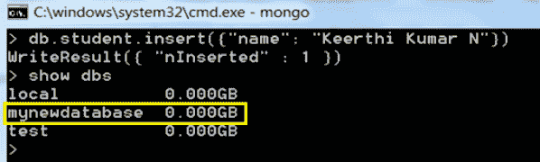
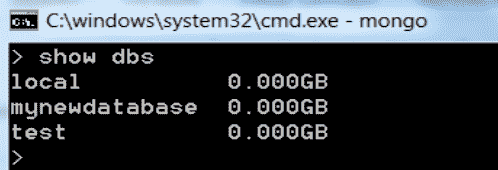
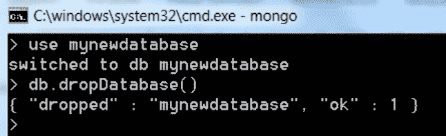
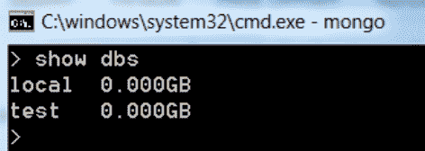

# 在蒙古数据库中创建和删除数据库

> 原文：<https://www.studytonight.com/mongodb/database-create-and-drop-mongodb>

在本教程中，我们将学习如何在 MongoDB 中创建和删除数据库。

* * *

## 蒙古数据库:创建数据库

打开命令提示符，使用`cd`命令导航到 MongoDB 的 **/bin** 文件夹，并在那里执行`mongod`命令。这将启动 MongoDB 服务器。我们必须让这个命令提示符窗口保持活动状态，因为它正在运行 MongoDB。要停止 MongoDB 服务器，只需输入`exit`并按回车键。

现在，打开另一个命令提示符，再次导航到 MongoDB 的 **/bin** 文件夹，执行命令`mongo`。这将打开客户端来运行 MongoDB 命令。



在我们运行`mongo`命令的命令提示窗口中，成功连接到 mongodb 后，只需键入以下命令:

```sql
use database_name
```

如果没有同名的数据库，这将创建一个名为 **database_name** 的新数据库。如果已经存在一个具有上述名称的数据库，那么它只连接到该数据库。



在上图中，它创建了一个名为 **mynewdatabase** 的新数据库，并将连接到该数据库。

要检查当前连接的数据库，在命令提示窗口中输入`db`，结果会得到当前数据库的名称。



要查看 MongoDB 中所有数据库的列表，请使用命令`show dbs`



请注意，运行上述命令后，新创建的数据库 **mynewdatabase** 尚未列出。这是因为，还没有记录被插入到数据库中。只需插入一条记录，然后再次运行该命令，如下所示:



要插入数据，请运行以下命令。别担心，我们会在下节课详细学习。

```sql
db.student.insert({name : "Viraj" })
```

**注意:**在 MongoDB 中，`test`将是默认数据库。如果没有创建数据库，那么所有的数据都将存储在`test`数据库中。

* * *

## 蒙古数据库:删除数据库

首先使用`show dbs`命令检查如下所示的可用数据库列表。



如果新创建的数据库 **mynewdatabase** 必须删除。运行以下命令删除数据库。在删除数据库之前，请连接到需要删除的数据库。

```sql
db.dropDatabase()
```



现在再次检查数据库列表，以验证数据库是否被删除。



请注意，数据库 **mynewdatabase** 已被删除，因此不会列在数据库列表中。

* * *

* * *