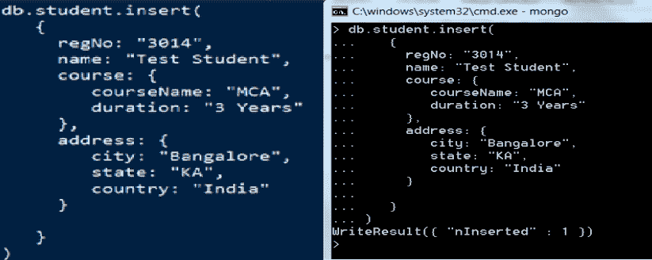
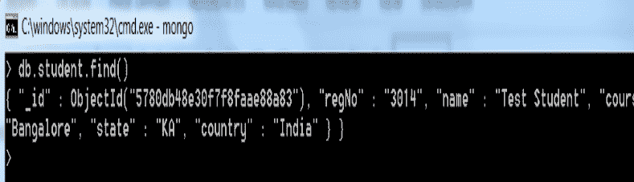
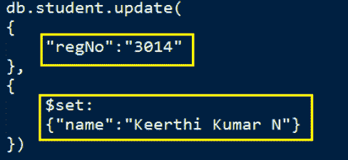
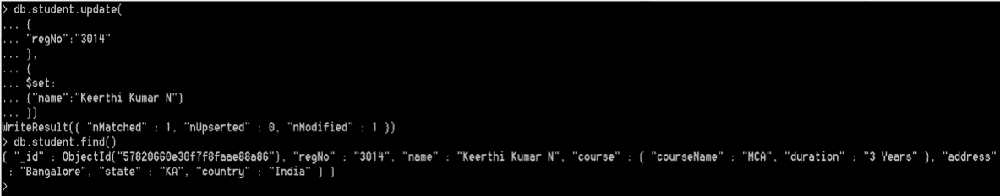

# 蒙古数据库中的 CRUD 操作

> 原文：<https://www.studytonight.com/mongodb/crud-operations-mongodb>

CRUD 操作指的是基本的插入、读取、更新和删除操作。在前一章中，我们学习了如何在 MongoDB 中创建和删除数据库。现在，让我们学习如何在 MongoDB 中执行 CRUD(创建/读取/更新/删除)操作。

* * *

## 蒙古数据库:将文档插入集合(创建)

命令`db.collection.insert()`将对文档集合执行插入操作。

让我们将文档插入`student`集合。您必须连接到数据库才能执行任何插入操作。具体如下:

```
db.student.insert({
	regNo: "3014",
	name: "Test Student",
	course: {
		courseName: "MCA",
		duration: "3 Years"
	},
	address: {
		city: "Bangalore",
		state: "KA",
		country: "India"
	}
})
```



请注意，已经在名为 student 的集合中输入了一个条目。

* * *

## MongoDB:从集合中查询文档(读取)

要检索(选择)插入的文档，请运行以下命令。`find()`命令将检索给定集合的所有文档。

```
db.collection_name.find()
```



**注意:**请注意，检索到的记录包含一个名为`_id`的属性，该属性带有一个名为 **ObjectId** 的唯一标识符值，该值用作文档标识符。

如果要根据某些标准检索记录，应调用`find()`方法传递参数，然后根据指定的属性检索记录。

```
db.collection_name.find({"fieldname":"value"})
```

例如:让我们从**学生**集合中检索记录，其中属性 **regNo** 为 **3014** ，其查询如下:

```
db.students.find({"regNo":"3014"})
```

* * *

## MongoDB:更新集合中的文档(更新)

为了更新 MongoDB 中集合的特定字段值，请运行以下查询。

```
db.**collection_name**.*update*()
```

`update()`上面指定的方法将字段名称和新值作为参数来更新文档。

让我们用 **regNo** 3014 更新文档集合**学生**的属性**名称**。

```
db.student.update({
	"regNo": "3014"	
},
$set:
{
	"name":"Viraj"
})
```



您将在命令提示符下看到以下内容:



* * *

## MongoDB:从集合中删除条目(删除)

现在让我们看看从集合中删除条目。要从集合中删除条目，请运行如下所示的命令:

```
db.collection_name.remove({"fieldname":"value"})
```

例如:`db.student.remove({"regNo":"3014"})`


请注意，运行`remove()`方法后，该条目已从学生集合中删除。

* * *

* * *