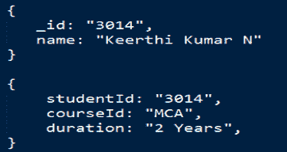
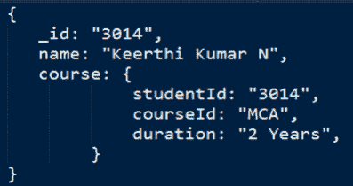
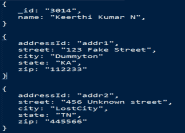
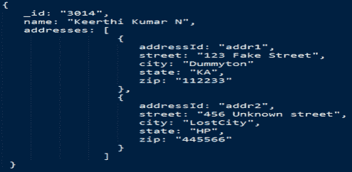
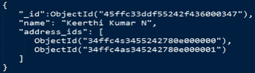
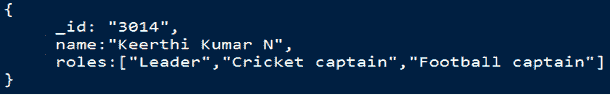
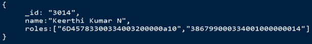

# MongoDB 中的数据关系

> 原文：<https://www.studytonight.com/mongodb/relationships-in-mongodb>

MongoDB 中的关系用于指定一个或多个文档如何相互关联。在 MongoDB 中，可以通过嵌入方式或使用引用方式对关系进行建模。这些关系可以是以下形式:

*   **一对一**
*   **一对多**
*   **多对多**

* * *

## MongoDB:嵌入式关系

在这种方法中，一个文档将嵌入到另一个文档中(像子集一样)。

* * *

## MongoDB:引用关系

在这种方法中，文档是分开保存的(学生和地址)。但是，学生文档将引用地址**文档 id** 字段。这基本上用于设计规范化的关系。任何 NoSQL 数据库背后的基本思想都是消除文档之间的复杂关系，MongoDB 也是这样做的。但是，在某些情况下，这些关系需要在数据库中建模。

* * *

## MongoDB:一对一的关系

考虑一个学院的**学生**数据库，其中学院限制该学生一次只能使用一门**课程**。因此，这只是一对一的关系，即一名学生一次只能注册一门课程。让我们看看这是如何建模的。

上图显示有**学生**数据，与**课程**数据有关系。在 MongoDB 中，这两个集合可以嵌入到一个集合中，如下所示:

* * *

## MongoDB:一对多关系

继续同一个学生数据库示例，考虑一个**学生**可以有多个地址(永久和当前)。让我们看看如何模拟这样一个一对多的用例。

上面您可以看到要建模的数据，下面我们为 MongoDB 存储建模了它。

使用这种嵌入式方法，学生的两个地址都可以通过一个查询来检索！

使用参考方法，上面的数据库可以建模如下:

这里我们使用了地址的 ObejctIds 来引用学生文档中的地址。

* * *

## MongoDB:多对多关系

考虑同一个学生数据库的例子，其中一个学生可以有不同的角色，如领袖，板球队长，足球队长等。即许多角色可以由学生完成，或者学生可以与多个角色相关联。让我们看看如何模拟这种多对多的关系。

**嵌入式方法:**

**参考方法:**

**注意:**在上面的例子中，每个角色将存储在一个单独的`role`文档中，并且通过它们的 ObjectIds 引用相同的内容。

* * *