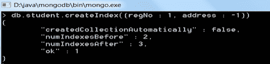

# MongoDB 中的索引

> 原文：<https://www.studytonight.com/mongodb/indexing-in-mongodb>

SQL 编程中的索引只不过是一种特殊的数据结构，用于在数据库的给定表中轻松快速地定位记录，而不需要遍历表中的每一条记录。使用给定表的一列或多列很容易生成索引。需要注意的是，索引使用的数据结构是**二叉树** (B-Tree)。

在 MongoDB 中，索引在高效执行查询方面起着至关重要的作用。基本上，如果在 MongoDB 中没有定义索引，那么它必须扫描给定集合的每个文档。因此，MongoDB 使用索引来减少给定集合中要扫描的文档数量。事实上，MongoDB 的索引或多或少类似于其他关系数据库中使用的索引。

事实上，MongoDB 在集合级别定义索引，并支持对 MongoDB 集合中的任何字段进行索引。

* * *

## MongoDB 中的默认索引

Mongodb 提供了一个名为`_id`的默认索引，它作为访问集合中任何文档的主键。这个`_id`索引基本上避免了为`_id`字段插入两个具有相同值的文档。

* * *

### 使用`createIndex()`创建索引

要在 MongoDB 中创建索引，请运行以下命令:

```sql
db.collection_name.createIndex({field : value })
```

要在字段`regNo`上为学生集合创建索引，请运行命令`db.student.createIndex({regNo : 1})`

以下是运行上述命令时的输出:

```sql
{
	"createdCollectionAutomatically": false,
	"numIndexesBefore" : 1,
	"numIndexesAfter" : 2,
	"ok" : 1
}
```


我们还可以通过运行一个命令在多个字段上创建索引。命令将是:`db.student.createIndex({regNo : 1, address : -1})`



* * *

### MongoDB 中的索引类型

| 变址类型 | 描述 |
| 单字段索引 | 用于在单个字段上创建索引，除了默认的`_id`字段外，它也可以是用户定义的。 |
| 复合指数 | MongoDB 支持多个字段的用户定义索引。 |
| 多键索引 | MongoDB 基本上使用多键索引来存储数组。MongoDB 为数组中的每个元素创建一个单独的索引。如果索引包含来自数组的元素，MongoDB 会智能地识别创建多键索引。 |
| 地理空间索引 | 用于支持地理空间坐标数据所需的查询。 |
| 文本索引 | 该索引用于在集合中搜索字符串内容 |
| 散列索引 | 用于基于哈希的分片 |

因此，有了上面提到的所有特性，索引管理是 MongoDB 应用程序的关键和核心部分。

* * *

* * *