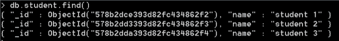
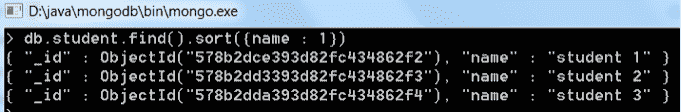
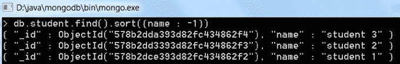

# 在 MongoDB 中排序

> 原文：<https://www.studytonight.com/mongodb/sorting-in-mongodb>

对任何数据库中的数据进行排序是任何数据库管理系统中至关重要的操作之一。MongoDB 提供`sort()`功能，以便对集合中的数据进行排序。MongoDB 中的 Sort 函数接受一个值列表和一个整数值 1 或-1，表示集合是按升序(1)还是降序(1)排序。

排序函数的语法:

```
db.**collection_name**.*find*().*sort*({**KEY** : 1}) 
```

考虑一个名为**学生**的集合，包含 3 条记录。现在让我们看看如何使用 MongoDB 中的`sort()`函数对数据进行排序。

要列出集合中的所有数据，请使用`find()`命令。要创建与示例中相同的示例数据，请创建一个名为`student`的集合，并插入 3 个带有一个字段**名称**和一些值的文档。在下一步中，我们将对这个样本数据运行 sort 命令。



现在运行下面的查询，以升序按**名称**字段对数据进行排序:

```
db.**student**.*find*().*sort*({**name** : 1})
```



现在运行下面的查询，按照**名称**字段的降序对数据进行排序:

```
db.**student**.*find*().*sort*({**name** : -1})
```



**注意:**如果未指定排序首选项(即 1 或-1)，则默认情况下，集合中的文档按升序排序。

* * *

* * *