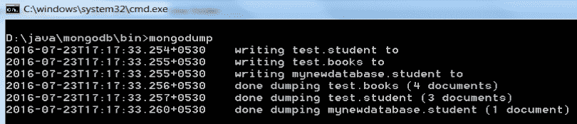
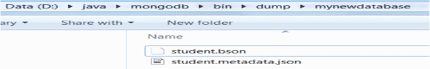
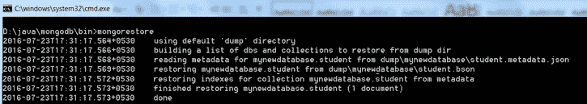

# MongoDB中的数据备份和恢复

> 原文：<https://www.studytonight.com/mongodb/data-backup-and-restore-mongodb>

对于任何DBMS来说，数据备份都是至关重要且要求极高的过程之一。主要原因是很难预测数据会如何以及何时丢失。因此，无论何时设置数据库，我们都需要确保在发生任何丢失事件时为数据备份做好准备，这是一种理想且最佳的做法。

备份只不过是数据库中数据的副本，有助于在数据发生灾难性事件时重用数据库。

* * *

## MongoDB:进行数据备份

为了在 mongodb 中执行数据备份过程，应该使用 mongodump 命令。这个命令将把所有存储的数据转储到 mongodb 的转储目录中。它还有助于从远程服务器备份数据。

为了正确执行数据备份，请遵循以下说明:

1.  使用命令`mongod`启动 mongodb 服务器
2.  在新的命令提示符下使用命令`mongo`启动 mongodb 客户端。
3.  Switch to the required collection and run the command mongodump. Since the `mongodump` is not actually command from mongodb shell, you need to execute the command as shown below.

    

4.  从上面的截图观察者得知，集合`mynewdatabase`的所有数据都已经被转储。

Mongodump 基本上是从数据库中读取数据，并创建一个 BSON 文件来转储数据。Mongodump 只从数据库中写入文档。数据的最终备份将具有空间效率。数据的备份将存储在 mongodb 的 **bin\dump** 文件夹下。

此外，使用 mongodump 还有一个缺点，当集合中的数据大于可用的系统内存时，这会对性能产生一些影响。

* * *

## MongoDB:从备份中恢复数据

现在让我们学习如何在 mongodb 中恢复备份数据。数据备份基本上用于在发生丢失事件时重建数据。MongoDB 通过它的一个名为`mongorestore`的实用工具来帮助恢复备份数据，这也是一个命令。

下面的截图显示了如何使用 MongoDB 中的命令`mongorestore`恢复备份数据。

上面的截图显示已成功恢复转储的收集数据。

* * *

* * *