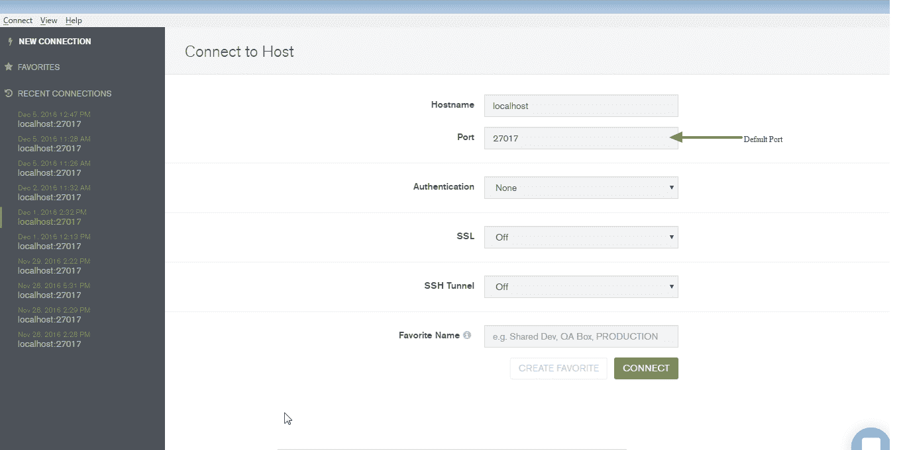
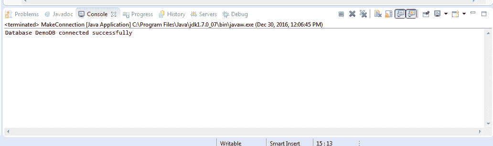
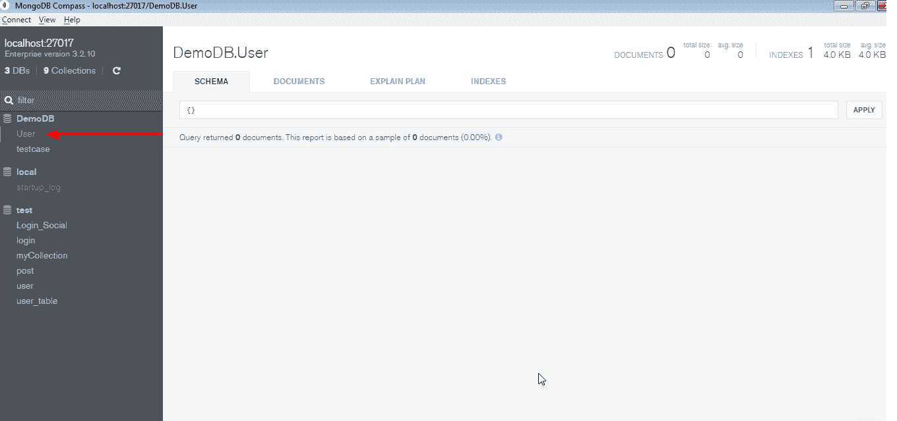

# Java 与 MongoDB 的集成

> 原文：<https://www.studytonight.com/mongodb/java-integration>

在本文中，我们将学习如何将 MongoDB 与 Java 集成，并将探索基本的 CRUD(创建、检索、更新和删除)操作。

下载 Jar，使用**mongo-Java-driver-3 . 10 . 0 . Jar**。将 jar 添加到 Java 构建路径中。现在，我们已经准备好通过 Java 用 MongoDB 执行 CRUD 操作了。

在这里，我们使用了 MongoDB Compass——一个 MongoDB 的图形用户界面工具来可视化我们的查询输出。

我们可以使用这个用户界面连接到数据库，然后在这里测试我们的查询。



* * *

## 与蒙古数据库建立连接的 Java 代码

首先，我们必须在我们的 java 项目中添加**mongo-Java-driver-3 . 10 . 0 . jar**文件作为依赖项。所以我们将添加**马文依赖**如下:

```
<dependency>
    <groupId>org.mongodb</groupId>
    <artifactId>mongo-java-driver</artifactId>
    <version>3.10.0</version>
</dependency>
```

要找到上述 Mongo Java 驱动的[最新版本](https://search.maven.org/classic/#search%7Cgav%7C1%7Cg%3A%22org.mongodb%22%20AND%20a%3A%22mongo-java-driver%22)，请查看以下链接。

下面我们有一个简单的带有`main()`方法的 Java 类，它使用`MongoClient`类来建立与 MongoDB 的连接。

```
package com.mongo;

import com.mongodb.DB; 
import com.mongodb.MongoClient; 

public class MakeConnection { 
	public static void main(String[] args) {
		try { 
			// code to create the connection
			MongoClient mongoClient = new MongoClient("localhost", 27017); 
			// code to connect to the database
			DB db = mongoClient.getDB("DemoDB");

			System.out.println("Database DemoDB connected successfully");
		} 
		catch(Exception e) { 
			e.printStackTrace(); 
		} 
	}
}
```

当执行上述代码时，控制台上将产生以下输出:



**注意**:如果你使用的是旧版的 mongodb java 驱动，也就是< = 2.10.0，那么你应该使用下面的代码和`Mongo`类来创建连接。

```
// code to create the connection
Mongo mongo = new Mongo("localhost", 27017); 
// code to connect to the database
DB db = mongoClient.getDB("DemoDB"); 
```

如果您的 MongoDB 以身份验证模式运行，那么您必须在连接到数据库时提供用户名和密码，如下所示:

```
// code to connect to the database with authentication
DB db = mongoClient.getDB("DemoDB");
boolean auth = db.authenticate("username", "password".toCharArray()); 
```

* * *

## 蒙古数据库:显示所有数据库

一旦我们能够使用`MongoClient`成功建立连接，我们就可以使用以下代码来显示所有可用的数据库:

```
// display all the databases
mongoClient.getDatabaseNames().forEach(System.out::println); 
```

上述代码的输出将是:

本地 0.000GB 解调 0.000GB

上面用于显示所有数据库列表的 java 代码类似于 MySQL 命令`show databases;`

* * *

## 蒙古数据库:创建集合

如果我们想从我们的 java 程序中创建一个集合(就像关系数据库中的表一样)，我们可以这样做:

```
package com.mongo;

import com.mongodb.DB; 
import com.mongodb.MongoClient;
import com.mongodb.BasicDBObject; 

public class MakeConnection { 
	public static void main(String[] args) {
		try { 
			// code to create the connection
			MongoClient mongoClient = new MongoClient("localhost", 27017); 
			// code to connect to the database
			DB db = mongoClient.getDB("DemoDB");

			db.createCollection("User", new BasicDBObject());
			System.out.println("Collection User created successfully");

		} 
		catch(Exception e) { 
			e.printStackTrace(); 
		} 
	}
}
```

执行上述代码后，将在我们的数据库中创建一个名为 **User** 的新集合。

您也可以在 MongoDB 指南针用户界面中看到这些集合。



* * *

* * *