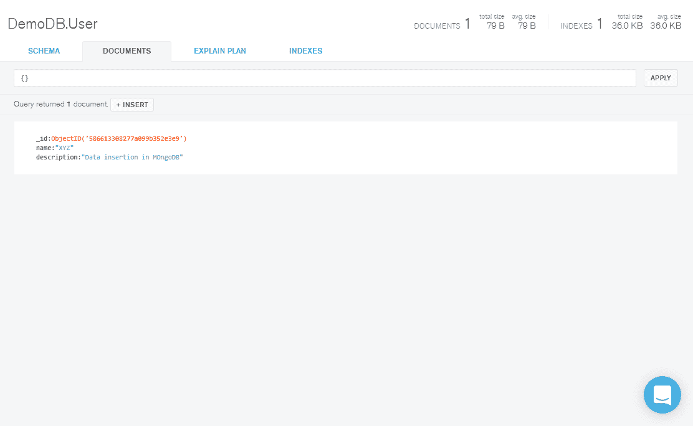
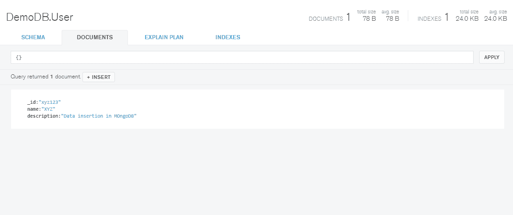

# 用 Java 实现蒙古数据库:插入文档

> 原文：<https://www.studytonight.com/mongodb/data-insertion-mongodb>

我们将继续收集**用户**的数据，这些数据是我们在[连接到 MongoDB 数据库](java-integration)后创建的。让我们考虑在我们的集合**用户**中插入数据的各种场景。

* * *

### 将文档插入集合，默认`_id`

假设我们想在用户集合中创建一个文档，其中包含字段**名称**和**描述**，我们将使用以下代码片段:

```
package com.mongo;

import com.mongodb.DB; 
import com.mongodb.MongoClient; 
import com.mongodb.BasicDBObject;
import com.mongodb.DBCollection;

public class MakeConnection { 
	public static void main(String[] args) {
		try { 
			// code to create the connection
			MongoClient mongoClient = new MongoClient("localhost", 27017); 
			// code to connect to the database
			DB db = mongoClient.getDB("DemoDB");

			// get the User collection from DB
			DBCollection userCollection = db.getCollection("User");
			BasicDBObject bO = new BasicDBObject();

			bO.put("name", "XYZ");
			bO.put("description", "Data insertion in MongoDB");

			// inserting data into collection
			userCollection.insert(bO);
		} 
		catch(Exception e) { 
			e.printStackTrace(); 
		} 
	}
}
```

在上面的代码片段中，我们使用`getCollection()`方法获取现有集合**用户**。然后创建一个`BasicDBObject`对象，并将字段**名称**和**描述**放入有值的对象中。生成的输出可以使用 MongoDB Compass 工具看到。



作为执行上述代码的结果，使用随机生成的`_id`值创建了一个具有名称和描述的新条目。

* * *

### 通过自定义将文档插入集合`_id`

在任何集合中创建文档(插入数据)时，mongoDB 都提供自己的**唯一 id** ，称为 **_id** 。如果我们想提供自己的自定义 id，我们可以提供。请参考下面的代码片段。

```
package com.mongo;

import com.mongodb.DB; 
import com.mongodb.MongoClient; 
import com.mongodb.BasicDBObject;
import com.mongodb.DBCollection;

public class MakeConnection { 
	public static void main(String[] args) {
		try { 
			// code to create the connection
			MongoClient mongoClient = new MongoClient("localhost", 27017); 
			// code to connect to the database
			DB db = mongoClient.getDB("DemoDB");

			// get the User collection from DB
			DBCollection userCollection = db.getCollection("User");
			BasicDBObject bO = new BasicDBObject();

			// adding custom _id
			bO.put("_id", "xyz123");
			bO.put("name", "XYZ");
			bO.put("description", "Data insertion in MongoDB");

			// inserting data into collection
			userCollection.insert(bO);
		} 
		catch(Exception e) { 
			e.printStackTrace(); 
		} 
	}
}
```

当执行上述程序时，一个新的文档被插入到集合中，其值与为`_id`字段提供的值一起提供。



在输出中，我们可以发现该文档是用我们唯一的自定义 id 创建的:`xyz123`。

* * *

* * *