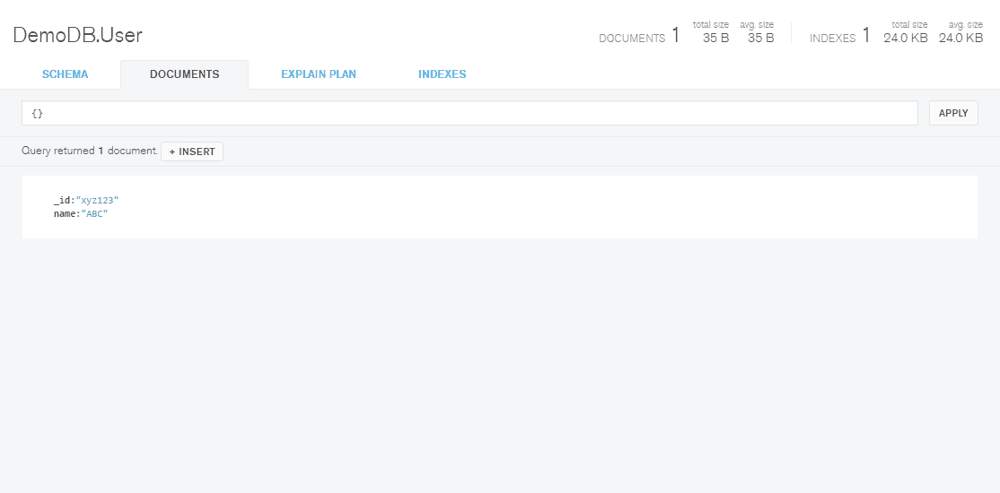
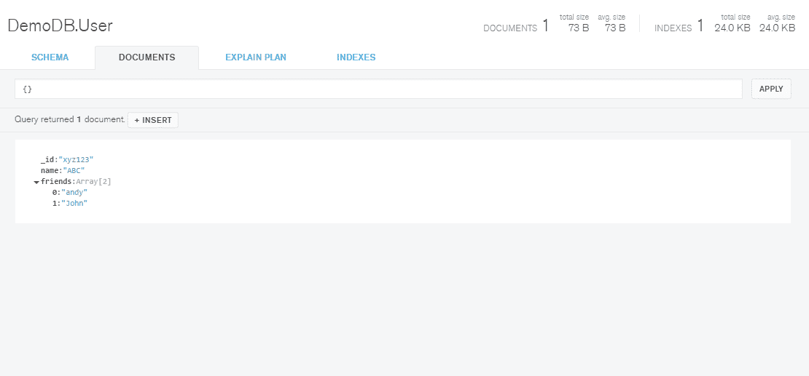
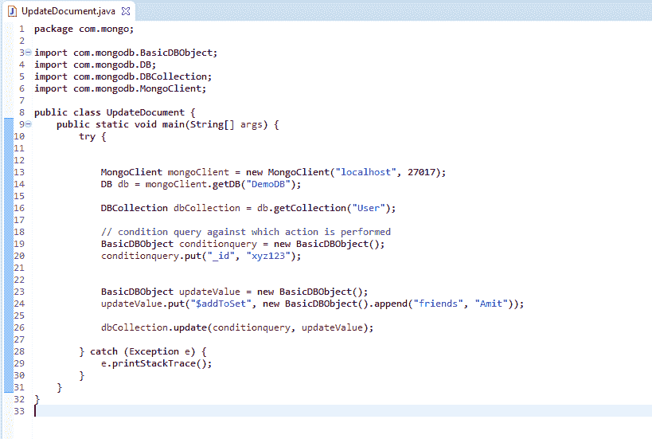
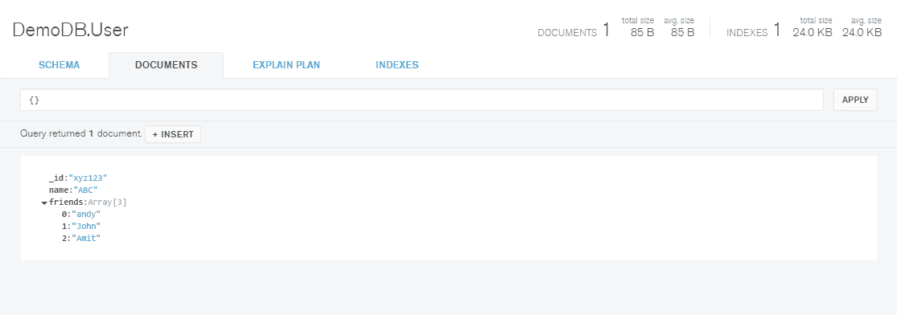
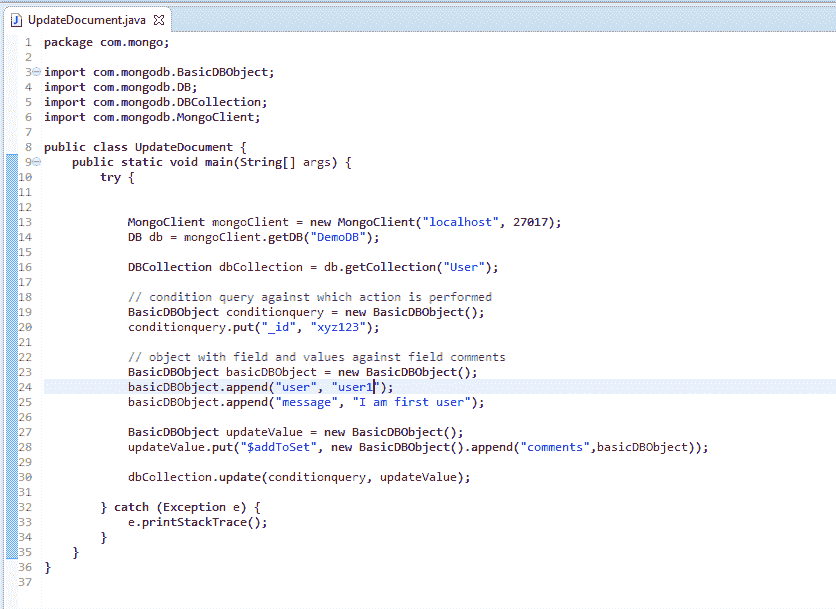
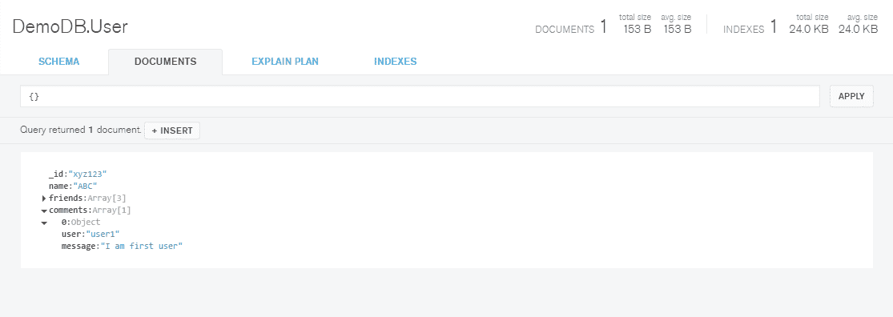

# 用 Java 开发蒙古数据库:更新文档

> 原文：<https://www.studytonight.com/mongodb/data-updation-mongodb>

在更新数据库的任何集合中的文档数据时，我们会遇到各种场景，让我们一步一步地分析它们。

* * *

## 更新单个字段值

我们将更新字段`name`并将其值更改为 **ABC** 。为此，我们必须首先找到正确的文档来更新值，这可以使用一些已知的字段来完成。在我们的案例中，我们将找到具有`_id`值 **xyz123** 的文档，该文档将在我们的查询中充当条件，然后我们将更新`name`字段的值。

```
package com.mongo;

import com.mongodb.DB; 
import com.mongodb.MongoClient; 
import com.mongodb.BasicDBObject;
import com.mongodb.DBCollection;

public class MakeConnection { 
	public static void main(String[] args) {
		try { 
			// code to create the connection
			MongoClient mongoClient = new MongoClient("localhost", 27017); 
			// code to connect to the database
			DB db = mongoClient.getDB("DemoDB");

			// get the User collection from DB
			DBCollection userCollection = db.getCollection("User");

			// condition query to get document which has to be updated
			BasicDBObject queryObj = new BasicDBObject();
			queryObj.put("_id", "xyz123");

			// create new document with data to be updated
			BasicDBObject newObj = new BasicDBObject();
			newObj.put("name", "ABC");

			// updating data into collection
			userCollection.update(queryObj, newObj);
		} 
		catch(Exception e) { 
			e.printStackTrace(); 
		} 
	}
}
```

在上述情况下，现有文档将被完全替换，这意味着如果它有除`name`字段之外的一些其他字段，那么这些字段将被删除。但我们不想那样，对吧。我们希望能够只更新任何文档中的单个值，在这种情况下，我们应该使用更新修改器`$set`。

`$set`更新修饰符是一个关键字，它通知 mongo 在文档中只应该更新提供的字段

让我们更新上面的代码:

```
package com.mongo;

import com.mongodb.DB; 
import com.mongodb.MongoClient; 
import com.mongodb.BasicDBObject;
import com.mongodb.DBCollection;

public class MakeConnection { 
	public static void main(String[] args) {
		try { 
			// code to create the connection
			MongoClient mongoClient = new MongoClient("localhost", 27017); 
			// code to connect to the database
			DB db = mongoClient.getDB("DemoDB");

			// get the User collection from DB
			DBCollection userCollection = db.getCollection("User");

			// condition query to get document which has to be updated
			BasicDBObject queryObj = new BasicDBObject();
			queryObj.put("_id", "xyz123");

			// create new document with data to be updated
			BasicDBObject newObj = new BasicDBObject();
			newObj.put("$set", new BasicDBObject.append("name", "ABC"));

			// updating data into collection
			userCollection.update(queryObj, newObj);
		} 
		catch(Exception e) { 
			e.printStackTrace(); 
		} 
	}
}
```

上面的代码给出了更新任何文档的正确方法。上述程序的输出将是:



字段**名称**的值从 **xyz** 更新为 **ABC** 。

在上述情况下，现有文档为

* * *

## 更新文档字段中的数组

考虑一个场景，我们有一个字段**朋友的数组**



如果我们想通过添加值来更新这个数组，我们可以参考下面的代码片段:



而阿米特则是加入了对场阵**友方**。



* * *

## 更新文档字段中的对象

我们甚至可以使用更新查询将对象添加到对象数组中。举个例子，针对场**评论**，如果我们想添加多个各种场的对象，是可以的。

下面是代码片段:



相应的输出是:



* * *

* * *