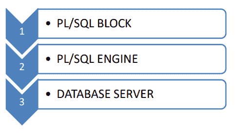
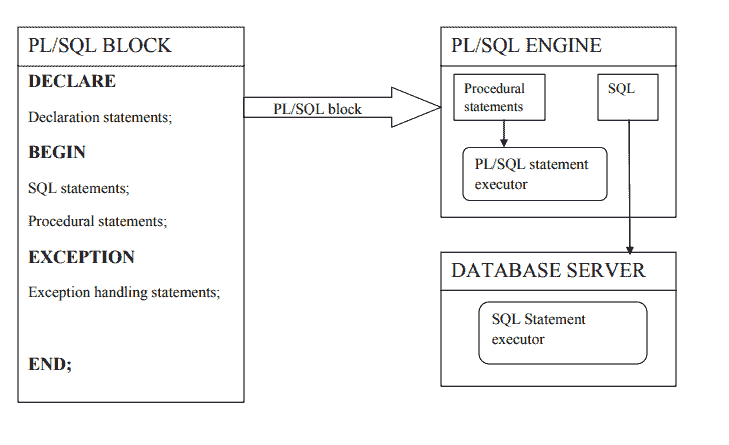

# PL/SQL 概述

> 原文：<https://www.studytonight.com/plsql/overview-of-plsql>

PL/SQL 代表结构化查询语言的**过程语言扩展。基本上，SQL 用于执行创建数据库、在数据库中存储数据、更新数据库中的数据、检索数据库中存储的数据等基本操作，而 PL/SQL 是一种完全结构化的**过程化**语言，它使开发人员能够将 SQL 的功能与其过程化语句结合起来。**

* * *

## PL/SQL 的特点

以下是 PL/SQL 的一些有用特性:

1.  **Portable:**

    PL/SQL 应用程序可以在我们安装了 oracle 的所有类型的操作系统上执行。

2.  **Efficient:**

    无需使用 oracle 引擎，PL/SQL 就可以高效地执行各种计算。这提高了事务性能。

3.  **Error-checking:**

    PL/SQL 允许错误检查，并在发生错误时显示用户友好的消息。

4.  **Development tool:**

    PL/SQL 支持 SQL 语句的执行以及变量声明、条件语句、循环和分支、过程、函数和触发器的功能。

5.  **Exception Handling:**

    PL/SQL 代码能够处理可能影响程序流程的异常，因此有助于使代码更加可靠。

有了 PL/SQL 中的上述特性，可以在使用数据库的实际项目中看到 PL/SQL 编程的效用。因为它能够在数据库上执行各种逻辑操作，而这些操作不能使用简单的 SQL 查询来执行。

**例如**，考虑到我们有一个**学校管理系统**数据库，我们想查看最近 5 年在学校录取的学生名单以及他们缴纳的费用。与此同时，我们想加上给教师和非教师的工资总额。我们不能仅仅通过执行 SQL 查询来获取这些记录，我们可能能够收集数据，但是这需要多个 SQL 查询。

另一方面，如果我们使用 PL/SQL，我们可以在 PL/SQL 程序中编写过程或方法来执行数据库上的复杂逻辑。另一个优点是，我们还可以轻松检测错误，因为它显示用户友好的消息，甚至支持异常处理。

* * *

### PL/SQL 架构

PL/SQL 体系结构由以下三个组件组成，如下图所示:

让我们了解这三个组成部分是什么，

1.  **PL/SQL Block:**

    PL/SQL 块创建描述要执行的进程的结构化逻辑代码块。这样的块由 SQL 语句和 PL/SQL 指令组成，然后传递给 oracle 引擎执行。我们将在下一个教程中详细了解这一点。

2.  **PL/SQL Engine:**

    包含过程语句的 [PL/SQL 块](plsql-block)由 PL/SQL 引擎内部的 PL/SQL 语句执行器执行。简单地说，PL/SQL 引擎提供了执行 PL/SQL 块的环境。

3.  **Database Server:**

    最后但同样重要的是，数据库服务器。这可以是甲骨文数据库服务器或 MySQL 数据库服务器。数据库服务器将数据存储在表中。

下面我们有一个 3 个组件的简单图示:

* * *

* * *