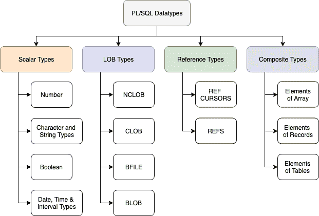

# PL/SQL 中的数据类型

> 原文：<https://www.studytonight.com/plsql/datatype-in-plsql>

PL/SQL 数据类型不仅仅局限于编写 SQL 查询，它们还被用在 PL/SQL 块中，就像任何其他编程语言一样。

提供数据类型指定当执行任何 PL/SQL 代码块时，Oracle 将如何存储和处理任何数据。

数据类型定义了所使用的数据类型，无论是数字、单词(字符串)还是单个字符等。根据所需的数据类型，可以在 PL/SQL 中使用以下数据类型:

因此，我们有 4 大类数据类型，它们是:

1.  **标量类型**:这些是基本的数据类型，通常包含单个值，如数字或字符串。标量类型有 4 个不同的类别，在上图中列出，即**数字类型**、**字符和字符串**、**布尔类型**和**日期和时间**等。
2.  **LOB 类型**:该数据类型处理大型对象，用于指定这些大型对象的位置，如文本文件、图像等，这些对象通常不存储在数据库之外。
3.  **引用类型**:该数据类型用于保存指针值，指针值通常存储其他程序项的地址。
4.  **复合类型**:最后但同样重要的是，顾名思义，这种类型的数据是可以单独操作/处理的单个数据的组合。

我们不会在下面介绍所有这些不同的数据类型，但我们会介绍最广泛使用的数据类型。

* * *

### 数量

**范围:** p= 1 至 38 s= -84 至 127

该数据类型用于存储数字数据。这里，`p`是精度`s`是刻度。

**示例:**

1.  `Age NUMBER(2);`其中，**年龄**是可以存储 **2** 位数的变量
2.  `percentage NUMBER(4,2);`其中，**percent**是一个可以存储小数点前 4 (p)位和小数点后 2 (s)位的变量。

* * *

### CHAR(大小)

**范围:** 1 到 2000 字节

*   该数据类型用于存储固定长度的字母字符串。
*   它的值用单引号括起来。
*   占用整个声明的内存大小，即使空间没有被数据利用。

**示例:**

1.  `rank CHAR(10);`其中， **rank** 是一个最多可以存储 10 个字符的变量。如果存储在 rank 中的数据长度(charcaters)是 5，那么它将仍然占据所有 10 个空间。5 内存中的空间将被使用，剩余的空白内存空间将被浪费。

* * *

### VARCHAR(大小)

**范围:** 1 到 2000 字节

*   该数据类型用于存储可变长度的字母数字字符串。
*   它的值用单引号括起来。
*   占用整个声明的内存大小，即使空间没有被数据利用。

**示例:**

1.  `address VARCHAR(10);`其中，**地址**是一个变量，最多可以占用 10 个字节的内存空间，并且可以在其中存储字母数字值。未使用的空间被浪费了。

* * *

### VARCHAR2(尺寸)

**范围:** 1 到 4000 字节

*   该数据类型用于存储可变长度的字母数字字符串。
*   它的值用单引号括起来。
*   它释放内存中未使用的空间，从而节省未使用的空间。

**示例:**

1.  `name VARCHAR2(10);`其中，**名称**是一个变量，可以占用最多 10 个字节的内存来存储一个字母数字值。释放未使用的内存空间。

* * *

### 日期

**范围:**公元前 4712 年 1 月 1 日至 9999 年 12 月 31 日

*   它以日期格式**存储数据**
*   该数据类型的值用单引号括起来。

**示例:**

1.  `DOB DATE;`其中， **DOB** 是以定义的格式存储出生日期的变量(即‘13-FEB-1991’)

* * *

### %TYPE

*   它存储数据类型未知的变量的值，并且当我们希望变量继承表列的数据类型时。
*   此外，它的值通常是从数据库中的现有表中检索的，因此它采用它所用于的列的数据类型。

**示例:**

1.  `Student sno %TYPE;`，其中**学生**是在数据库中创建的表的名称， **sno** 是数据类型未知的变量，`%TYPE`用于存储其值。

* * *

### BOOLEAN

*   该数据类型用于条件语句。
*   它存储逻辑值。
*   可以是`TRUE`也可以是`FALSE`

**示例:**

1.  `isAdmin BOOLEAN;`其中， **isAdmin** 是一个变量，其值可以是真或假，具体取决于被检查的条件。

* * *

### 结论

上面介绍的数据类型是最常用的。但是还有许多不同的数据类型，您可以通过以下链接查看官方 Oracle 参考资料:

*   pl/SQL lob 类型
*   [PL/SQL 编号类型](https://docs.oracle.com/cd/B19306_01/appdev.102/b14261/datatypes.htm#i46029)
*   [PL/SQL 字符和字符串类型](https://docs.oracle.com/cd/B19306_01/appdev.102/b14261/datatypes.htm#i43252)
*   [PL/SQL 布尔类型](https://docs.oracle.com/cd/B19306_01/appdev.102/b14261/datatypes.htm#CJACJGBG)
*   [PL/SQL 日期时间](https://docs.oracle.com/cd/B19306_01/appdev.102/b14261/datatypes.htm#i45907)

在本教程中，我们介绍了 PL/SQL 中使用的数据类型，在此过程中，我们也讨论了很多变量。如果您感到困惑，请继续下一个教程，我们已经介绍了所有关于 PL/SQL 变量的内容。

* * *

* * *