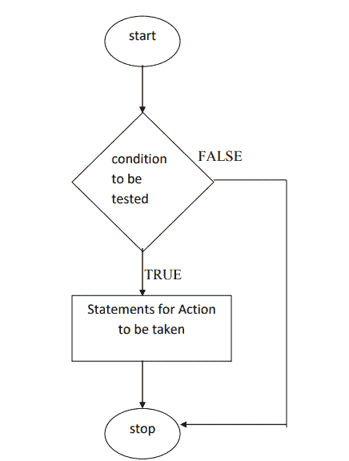
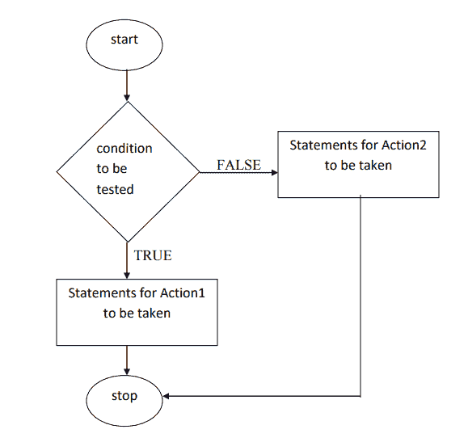
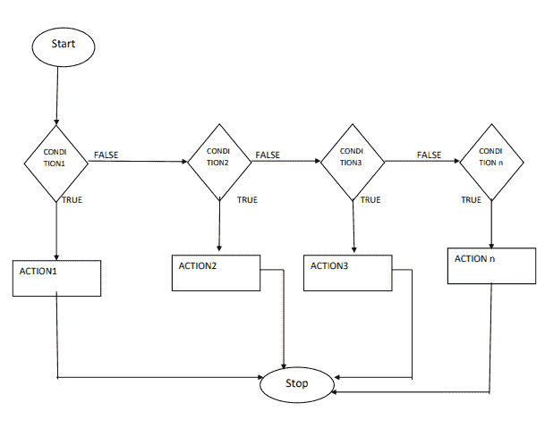

# 条件语句

> 原文：<https://www.studytonight.com/plsql/decision-making-plsql>

决策语句是那些负责根据某种条件从多个给定语句中执行一个语句的语句。该条件将返回真或假。根据条件返回的内容，执行相关联的语句。

比如有人说，*考 40 分就能通过考试，否则就不及格*。在这种情况下，条件是得到 40 分，如果是真的，那么这个人将通过，否则他/她将失败。

这可以使用决策语句在 PL/SQL 块中逻辑实现。

PL/SQL 中的决策语句有两种类型:

1.  If Else 语句
2.  选择语句

让我们用例子一个一个来看。

* * *

## PL/SQL: `if`语句

当只有一个条件需要测试时，可以使用`if`语句或`if...then`语句。如果条件的结果是**真**，则执行特定的动作，否则如果是**假**，则不采取任何动作，程序的控制将移出`if`代码块。

**语法:**

```sql
if <test_condition> then
	body of action
end if; 
```

下面我们有一个图表，或者我们可以说一个显示使用`if`条件语句的流程图:



现在我们知道了`if`语句的目的及其语法，下面我们来看一个例子。

### 是时候举个例子了！

我们有一个简单的程序可以在两个给定的数字中找到最大的数字。

```sql
set serveroutput on;
DECLARE
	x int:=10;
	y int:=80;
BEGIN
	if(y>x) then
		dbms_output.put_line('Result: ' ||y|| ' is greater than ' ||x);
	end if;
END;
```

结果:80 大于 10 PL/SQL 过程成功完成。

* * *

## PL/SQL: `if`...`then`...`else`声明

使用这个语句组，我们可以根据条件指定两个语句或两组语句，这样当条件为真时，执行一组语句，如果条件为假，则执行另一组语句。

**语法:**

```sql
if <test_condition> then
	statement 1/set of statements 1
else
	statement 2/set of statements 2
end if;
```

下面我们有一个图表，或者我们可以说一个显示`if`使用的流程图...`then`...`else`病情声明:



既然我们知道了`if`的目的是什么...`then`...`else`语句及其语法，我们来看一个例子。

### 是时候举个例子了！

下面我们有一个程序来查找用户给定的数字是**偶数**还是**奇数**。

```sql
set serveroutput on;

DECLARE
	x int;
BEGIN
	x := &x;
	if mod(x,2) = 0 then
		dbms_output.put_line('Even Number');
	else
		dbms_output.put_line('Odd Number');
	end if;
END;
```

为成功完成的偶数 PL/SQL 过程输入 x:6 的值。

在上述程序中，使用了`mod`函数，该函数将把`x`的值除以 **2** 后的余数返回。

* * *

## PL/SQL: `if`...`then`...`elsif`...`else`声明

它用于检查多个条件。在这种情况下有时需要测试多个条件`if`...`then`...`else`语句不能使用。为此，`if`...`then`...`elsif`...`else`语句适用于逐一测试所有条件的情况，无论哪个条件被发现为**真**，都将执行该代码块。如果所有条件均为**假**，则执行`else`部分。

在下面的语法中，可以看到首先检查**条件 1** ，如果是真的，则执行后面的语句，然后控制移出完整的`if`块，但是如果条件是假的，则控制检查**条件 2** 并重复相同的过程。如果所有条件都失败，则执行`else`部分。

**语法:**

```sql
if <test_condition1> then
	body of action
elsif <test_condition2>then
	body of action
elsif<test_condition3>then
	body of action
...
...
...
else
	body of action
end if;
```

正如您在上面的语法中所看到的，我们可以有多个`elsif`语句，并且可以有任意多的条件。下面我们有一个图表，或者我们可以说一个流程图:



让我们看一个代码示例来更好地理解这个概念，

### 是时候举个例子了！

下面我们有一个程序来找出两个给定的数字是否相等，如果它们不相等，那么哪个更大。

```sql
set serveroutput on;

DECLARE
	a int;
	b int;
BEGIN
	a := &a;
	b := &b;
	if(a>b) then
		dbms_output.put_line(‘a is greater than b’);
	elsif(b>a) then
		dbms_output.put_line(‘b is greater than a’);
	else
		dbms_output.put_line(‘Both a and b are equal’);
	end if;
END;
```

输入值 a: 8 输入值 b: 5 a 大于 b PL/SQL 过程成功完成。

* * *

## PL/SQL:案例语句

如果我们试图用一行来描述案例陈述，那么我们可以说意思是“**众多**中的一个”。这是一个决策声明，从多个可用选项中仅选择一个选项。

为此，它使用了一个**选择器**。这个选择器可以是一个变量、函数或过程，它返回一些值，并根据结果执行一个 case 语句。如果所有案例都失败，则执行`else`案例。

**语法:**

```sql
CASE selector
	when value1 then Statement1;
	when value2 then Statement2;
	...
	...
	else statement;
end CASE;
```

让我们举个例子来看看案例陈述是如何起作用的。

### 是时候举个例子了！

下面我们有一个程序来演示一个简单的案例陈述的使用。

```sql
set serveroutput on;
DECLARE
	a int;
	b int;
BEGIN
	a := &a;
	b := mod(a,2);
	CASE b
		when 0 then dbms_output.put_line('Even Number');
		when 1 then dbms_output.put_line('Odd Number');
 		else dbms_output.put_line('User has not given any input value to check');
	END CASE;
END;
```

输入成功完成的:7 奇数 PL/SQL 过程的值。

在上述程序中，使用了`mod`函数，该函数将返回`a`的值除以 2 后的余数。根据所选案例将被执行的情况，余数将为 0 或 1。

* * *

## 搜索的案例陈述

在这种类型的案例陈述中，不使用选择器，而是使用子句本身检查测试条件。当条件为**真**时，执行其后的语句，否则依次使用**当**子句检查其他测试条件。如果所有测试条件都失败，则执行`else`情况。

**语法:**

```sql
CASE
	when <test_condition1> then statement1;
	when <test_condition2> then statement2;
    ...
    ...
	else defaultstatement;
end case;
```

让我们举一个例子来看看搜索到的案例语句的作用。

### 是时候举个例子了！

下面我们有一个程序来演示搜索案例语句的使用。

```sql
set serveroutput on;

DECLARE
	dt Date;
	str varchar2(10);
BEGIN
	dt := '&date';
	str := to_char(dt,'DY');
	CASE
		when str in ('SAT','SUN') then dbms_output.put_line('Its the Weekend');
 		else dbms_output.put_line('Not a Weekend');
	END CASE;
END;

```

输入 dt:28-APR-2019 周末日期 PL/SQL 程序成功完成的值。

* * *

* * *