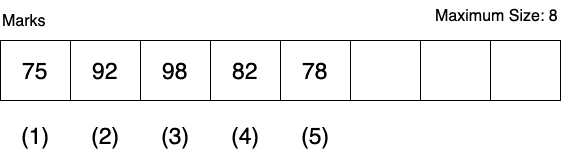

# PL/SQL 数组——`VARRAY`

> 原文：<https://www.studytonight.com/plsql/plsql-array>

在 PL/SQL 中，我们有一个名为`varray`的数据结构，它是一个可变大小的数组，可以用来顺序存储固定大小的相同类型的数据元素，其中元素的数量可以从零(空)到声明的最大大小不等。

varray 将数据存储在相邻的存储位置，其中第一个元素存储在最低地址位置，最后一个元素存储在最高地址位置。

要访问存储在 varray 类型变量中的数据元素，我们使用语法`variable_name(index)`，其中`index`从第一个元素的 **1** 开始，一直到元素的当前上限，这意味着在给定点存在的元素数量(不是数组的最大大小)。

上限随着您在数组中添加或移除元素而不断变化，但它不能超过数组的最大大小。

无论何时从数据库中存储和取回 varray，其索引和元素顺序都保持稳定。

例如，在下图中，我们有一个大小为 **8** 和 **5** 的 varray `Marks`数据元素存储在其中。



在上面的 varray `Marks`中如果你想访问第二个元素，你所需要做的就是`Marks(2)`

> 数据库将 varray 变量存储为单个对象。如果 varray 变量小于 4 KB，它将驻留在作为列的表中；否则，它驻留在表之外，但在同一个表空间中。

* * *

## 声明变量类型

我们可以使用 [PL/SQL 块](plsql-block)中的`TYPE`语句来声明一个新的 varray 类型。

```sql
TYPE varr_type_name IS VARRAY(n) of <element_type>
```

例如，

```sql
TYPE snamearray IS VARRAY(10) OF VARCHAR2(20); 
Type sagearray IS VARRAY(10) OF INTEGER;
```

在上面的例子中，我们初始化了两个 varray 类型，第一个可以保存 varchar 类型的 **10 个**元素，第二个可以保存 integer 类型的 10 个元素。

未初始化的 varray 变量是 null 集合。您必须初始化它，要么使它为空，要么给它分配一个非空值。

* * *

## 是时候举个例子了！

在下面的程序中，我们使用了 varray:

```sql
DECLARE 
   type snamesarray IS VARRAY(5) OF VARCHAR2(10); 
   type smarks IS VARRAY(5) OF INTEGER; 
BEGIN 
   snames namesarray := namesarray('John', 'Adam', 'Elly', 'Kate', 'Ron'); 
   marks smarks := smarks(42, 88, 62, 89, 97); 
   no_of_students := snames.count; 
   dbms_output.put_line('Total '|| no_of_students || ' Students'); 
   FOR i in 1 .. no_of_students LOOP 
      dbms_output.put_line('Student: ' || snames(i) || ' 
      Marks: ' || marks(i)); 
   END LOOP; 
END; 
/
```

共 5 名学生学生:约翰·马克斯:42 学生:亚当·马克斯:88 学生:艾莉·马克斯:62 学生:凯特·马克斯:89 学生:罗恩·马克斯:97 PL/SQL 程序成功完成。

正如您在上面的例子中看到的，我们已经声明了两种 varray 类型，一种用于存储学生姓名，另一种用于存储学生分数。

然后我们在我们的 PL/SQL 块中使用它们来存储学生姓名和学生标记。

* * *

* * *