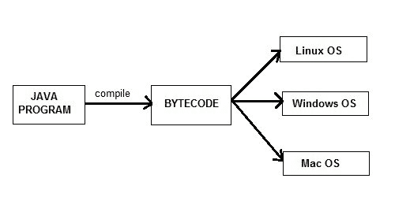

# Java 特性

> 原文：<https://www.studytonight.com/java/features-of-java.php>

创建 Java 背后的主要原因是将可移植性和安全性特性引入计算机语言。除了这两个主要特征之外，还有许多其他特征在塑造这种杰出语言的最终形式中发挥了重要作用。这些特点是:

### 1)简单

Java 很容易学习，语法也相当简单、干净、易懂。C++中令人困惑和模糊的概念要么在 Java 中被忽略，要么以一种更简洁的方式被重新实现。

*Eg :* 指针和操作符重载在 java 中并不存在，但曾经是 C++的重要组成部分。

### 2)面向对象

在 java 中，所有的东西都是有一些数据和行为的对象。Java 可以很容易地扩展，因为它是基于对象模型的。以下是面向对象程序设计的一些基本概念。

1.  目标
2.  班级
3.  遗产
4.  多态性
5.  抽象
6.  包装

### 3)稳健

Java 主要通过强调编译时错误检查和运行时检查来努力消除容易出错的代码。但是 Java 改进的主要领域是内存管理和错误处理异常，引入了自动**垃圾收集器**和**异常处理**。

### 4)平台独立

不像其他编程语言，如 C，C++等被编译成特定平台的机器。Java 保证是一次编写、随处运行的语言。

在编译时，Java 程序被编译成字节码。这种字节码是独立于平台的，可以在任何机器上运行，另外这种字节码格式也提供了安全性。任何具有 Java 运行时环境的机器都可以运行 Java 程序。

### 5)安全

说到安全性，Java 永远是首选。借助 java 安全特性，它使我们能够开发无病毒、无脾气的系统。Java 程序总是在 Java 运行时环境中运行，与系统操作系统几乎没有交互，因此更安全。

### 6)多线程

Java 多线程特性使得编写可以同时完成许多任务的程序成为可能。多线程的好处是，它利用相同的内存和其他资源同时执行多个线程，就像在打字时，语法错误会被检查一样。

### 7)建筑中性

编译器生成的字节码与特定的计算机体系结构无关，因此 Java 程序在任何机器上都很容易解释。

### 8)便携式

Java 字节码可以携带到任何平台。没有依赖于实现的功能。与存储相关的一切都是预定义的，例如:原始数据类型的大小

### 9)高性能

Java 是一种解释语言，所以它永远不会像 C 或 C++这样的编译语言那样快。但是，Java 通过使用即时编译器实现了高性能。

### 10)分布式

Java 也是一种分布式语言。程序可以设计成在计算机网络上运行。Java 有一个特殊的类库，用于使用 TCP/IP 协议进行通信。与 C/C++相比，在 Java 中创建网络连接非常容易。

### JAVA 8 的新特性

下面提到的是作为 Java 8 版本的一部分进行的一些核心升级。快速浏览一下就可以了，我们稍后会详细探讨。

*   通过提供可选类功能、Lamda 表达式、流等，提高了生产率。
*   易用性
*   改进的多语种编程。a**polygot**是一个程序或脚本，以在多种编程语言中有效的形式编写，并且它在多种编程语言中执行相同的操作。所以 Java 现在支持这种类型的编程技术。
*   提高安全性和性能。

### JAVA 11 的新特性

Java 11 是一个推荐的 LTS 版本的 Java，它包括各种重要的特性。这些功能包括现有主题中的新增和升级。快速浏览一下就可以了，我们稍后会详细探讨。

*   包括对 Unicode 10.0.0 的支持
*   超文本传输协议客户端已经标准化
*   编译器线程的惰性分配
*   将区域设置数据更新为 Unicode CLDR 版本 33
*   JEP 331 低开销堆分析
*   JEP 181 基于嵌套的访问控制
*   增加了智能池电子商务支持(RFC 5639)
*   增强的密钥存储机制
*   JEP 332 传输层安全性 1.3
*   JEP 330 启动单文件源代码程序

## Java 版本

Java Editions 或者我们可以说这个平台是一个程序的集合，它帮助开发和运行用 Java 编程语言编写的程序。Java Editions 包括执行引擎、编译器和一组库。由于 Java 是独立于平台的语言，因此它不特定于任何处理器或操作系统。

### 1.Java 标准版

Java 标准版是一个计算平台，用于开发和部署桌面和服务器环境中使用的可移植代码。Java 标准版也被称为 Java 2 平台，标准版(J2SE)。

Java 标准版有各种各样的 API，如 Java 类库等。Java SE 的最佳实现是甲骨文公司的 Java 开发工具包(JDK)。

### 2.Java 微版

Java Micro Edition 是一个计算平台，用于为嵌入式和移动设备开发和部署可移植代码。Java 微版又称 Java 2 平台微版(J2ME)。Java 微版是由太阳微系统公司设计的，后来甲骨文公司在 2010 年收购了它。

**例:**微控制器、传感器、网关、手机、打印机等。

### 3.Java 企业版

Java 企业版是一组规范，通过分布式计算和网络服务等功能扩展了 Java SE 8。Java 企业版的应用程序运行在参考运行时上。该参考运行时处理事务、安全性、可伸缩性、并发性和要部署的组件的管理。Java 企业版又称 Java 2 平台企业版(J2EE)，目前已更名为 Jakarta EE。

**例:**电子商务、会计、银行信息系统。

### 4.应用

JavaFX 用于创建桌面应用程序，也用于创建丰富的互联网应用程序(RIA)，这些应用程序可以在各种设备上运行。JavaFX 几乎已经取代 Swing 成为 Java 标准版的标准 GUI 库。支持桌面计算机和网络浏览器。

* * *