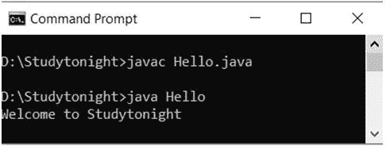
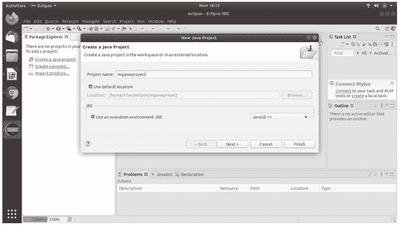
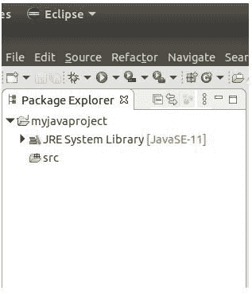
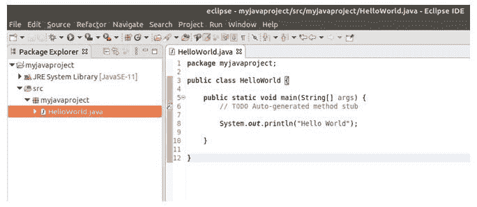
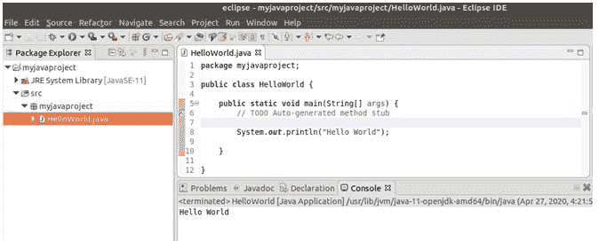
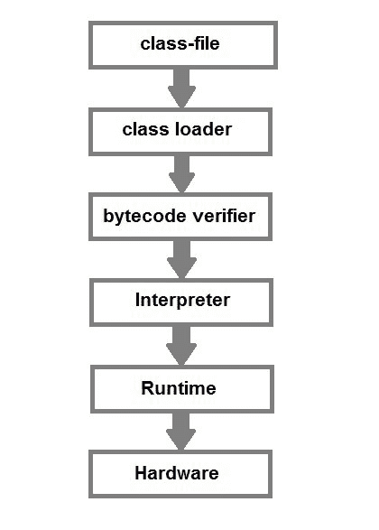

# Java HelloWorld 程序

> 原文：<https://www.studytonight.com/java/first-java-program.php>

用 Java 创建 Hello World 程序不是一个单行程序。它由各种其他代码行组成。因为 Java 是一种面向对象语言，所以它需要在类中编写代码。让我们看一个简单的 java 程序。

```java
**class** Hello
{
  	public static void **main**(String[] *args*)
  	{
     	System.out.println ("*Hello World program*");
  	}
}
```

让我们了解上述程序的组成及其要点。

**类** : class 关键字用于在 Java 中声明类

**public** :是访问说明符。公共意味着这个功能对所有人都是可见的。

**static** : static 又是一个用来让一个函数静态的关键字。要执行静态函数，您不必创建类的对象。这里的 **main()** 方法由 JVM 调用，不为类创建任何对象。

**void** :是返回类型，表示这个函数不会返回任何东西。

**main** : main()方法是一个 Java 程序中最重要的方法。这是被执行的方法，因此所有的逻辑都必须在 main()方法中。如果 java 类没有 main()方法，就会导致编译错误。

**String[] args** :表示类型为 String，名称为 args 的数组。我们将在 Java 数组部分讨论更多关于数组的内容。

**System.out.println** :这是用来在控制台上打印任何东西的，比如 C 语言的 *printf* 。

* * *

## 编译和运行第一个 Java 程序的步骤

**第一步:**打开一个文本编辑器，如上写代码。

**步骤 2:** 将文件保存为 Hello.java

**第三步:**打开命令提示符，转到保存第一个 java 程序的目录，假设它保存在 C 驱动器中。

**第四步:**输入`javac Hello.java`并按回车键**(回车键)**编译你的代码。这个命令将调用 Java 编译器，要求它编译指定的文件。如果代码中没有错误，命令提示符将带您进入下一行。

**第五步:**现在在命令提示符下输入`java Hello`运行你的程序。

**第六步:**你会看到**你好世界程序**打印在你的命令提示符下。

* * *

## 编写 Java 程序的方法

以下是编写 Java 程序的一些方法:

**改变修饰符和方法的顺序是 Java 接受的。**

**语法:**静态公共 void main(String as[])

**示例:**

```java
	 class Hello
{
	static public void main(String as[])
	{
	System.out.println ("Welcome to Studytonight");
	}
} 

```



* * *

## 使用 Eclipse 的 Hello World 程序

Eclipse 是一个IDE，用于开发应用。它是由 eclipse 基金会设计开发的，如果你没有 Eclipse 下载，那就按照这个下载链接[从这里下载 Eclipse](https://www.eclipse.org/downloads/)从这里我们将看到如何使用 eclipse IDE 创建和运行 **hello world** 程序。它需要以下步骤，包括**创建项目、类文件、编写代码、运行代码等**。

#### 运行 Eclipse 并创建项目

打开 eclipse 启动，然后创建新项目。要创建项目，点击**文件**菜单，选择 **Java 项目**选项。它将打开一个窗口，询问项目名称。提供项目名称，然后单击“完成”按钮。见下面截图。



创建项目后，我们可以在左侧栏中看到新创建的项目，如下所示。



### 创建 Java 类

现在通过在**项目**和**上右键单击**选择类文件选项来创建 Java 类文件。它将打开一个窗口询问类名，提供类名并点击完成按钮。


### 写你好世界

上面创建的类文件包括一些代码行，也包括主方法。现在我们需要写一个 print 语句来打印 Hello World 消息。



### 运行程序

现在通过从菜单栏中选择**运行**菜单或使用 **Ctrl+F11** 按钮组合来运行程序。运行后，它会将 Hello World 打印到程序窗口底部的控制台上。



这是一个简单的程序，我们在这里运行，同时使用 IDE，我们可以创建和构建大规模的应用。如果你是一个初学者，并且不熟悉 Eclipse，那么不要担心它很容易操作，只要按照上面的步骤来创建程序。

## 现在让我们看看运行时会发生什么

写完你的 Java 程序后，你什么时候会试着编译它。编译器将对您的程序执行一些编译操作。

一旦成功编译成字节码(。类文件)由编译器生成。



编译后您将尝试何时运行字节代码(。类文件)，在运行时执行以下步骤:-

1.  类加载器加载 java 类。它是 JVM Java 虚拟机的子系统。
2.  字节码验证器检查代码片段中是否有可能侵犯对象访问权限的非法代码。
3.  解释器读取字节代码流，然后逐步执行指令。

* * *

* * *