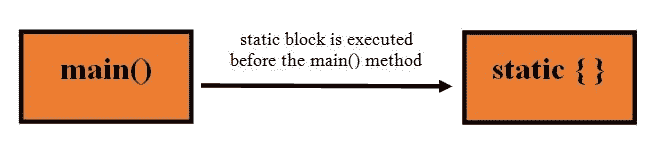
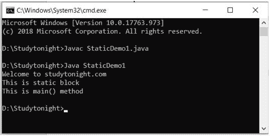
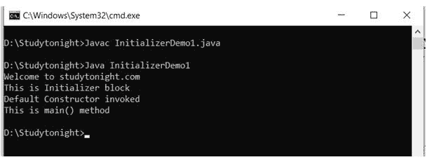
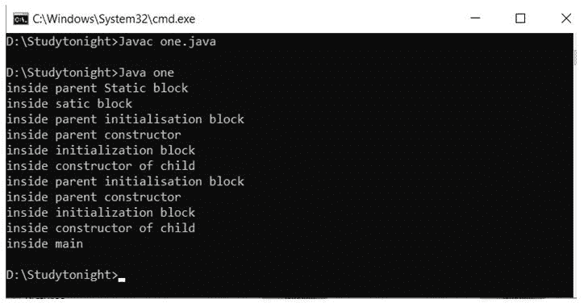

# Java 中的静态块

> 原文：<https://www.studytonight.com/java/static-and-initializer-block.php>

在 Java 中，static 关键字主要用于内存的管理。静态关键字可以与变量、方法、块和嵌套类一起使用。程序中的静态块是在主方法之前由 JVM (Java 虚拟机)执行的一组语句。在类加载时，如果我们想执行任何任务，我们可以在静态块中定义该任务，这个任务将在类加载时执行。在一个类中，可以定义任意数量的静态块，这些静态块将从上到下执行。



**语法:**

```java
	 static {
		**********
		**********
		// statements….
		**********
		**********
	} 

```

### 静态块的示例

执行程序时，静态块在主方法之前执行。写入静态块的语句将首先执行。然而，两者都是静态的。

```java
	 class StaticDemo1
{
	static
	{
		System.out.println("Welcome to studytonight.com");
		System.out.println("This is static block");

	}
	public static void main(String as[])
	{
		System.out.println("This is main() method");
	}
} 

```



### 多个静态块的示例

当我们有多个静态块时，每个块按顺序执行。第一个静态块将首先执行。

```java
	 class StaticDemo1
{
	static
	{
		System.out.println("Welcome to studytonight.com");
		System.out.println("This is static block I");

	}
	public static void main(String as[])
	{
		System.out.println("**********************");
		System.out.println("This is main() method");
	}
	static
	{
		System.out.println("**********************");
		System.out.println("This is static block II");

	}
	static
	{
		System.out.println("**********************");
		System.out.println("This is static block III");

	}
} 

```


### Java 中的初始化器块

在 Java 中，初始化器块用于初始化实例数据成员。每当创建对象时都会执行初始化程序块。初始值设定项块被复制到 Java 编译器中，然后复制到每个构造器中。初始化块在构造器中的代码之前执行。

**示例:**

```java
	 class InitializerDemo1
{
	{
		System.out.println("Welcome to studytonight.com");
		System.out.println("This is Initializer block");

	}
	public InitializerDemo1()
	{
		System.out.println("Default Constructor invoked"); 
	}
	public static void main(String as[])
	{
		InitializerDemo1 obj = new InitializerDemo1();
		System.out.println("This is main() method");
	}
} 

```



### 使用静态和初始值设定项块的示例

在一个 Java 程序中，我们可以同时拥有静态块和初始化块。但是静态块甚至会在初始化器块之前先执行。见下面的例子。

```java
	 public class one extends two {
    static {
System.out.println("inside satic block");
    }

one() {
System.out.println("inside constructor of child");
    }

    {
System.out.println("inside initialization block");
    }

    public static void main(String[] args) {
        new one();
        new one();
System.out.println("inside main");
    }
}

class two{
    static {
System.out.println("inside parent Static block");
    }
    {
System.out.println("inside parent initialisation block");
    }

two() {
System.out.println("inside parent constructor");
    }
} 

```



* * *