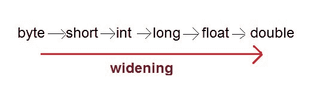
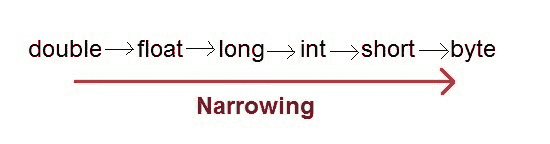
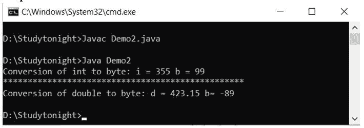

# Java 中的类型转换

> 原文：<https://www.studytonight.com/java/type-casting-in-java.php>

转换是将一个类型值更改为另一个类型的过程。在 Java 中，我们可以将一种类型的值转换成另一种类型。它被称为类型铸造。

**示例:**

```java
int x = 10;
byte y = (byte)x;
```

在 Java 中，类型转换分为两种类型，

*   加宽铸造(隐式)



*   缩小铸造(显式完成)



* * *

## 加宽或自动类型转换

自动型铸造发生在，

*   这两种类型是兼容的
*   目标类型大于源类型

**示例:**

```java
public class Test
{
    public static void main(String[] args)
    {
      int i = 100;
      long l = i; <font color="green">**//no explicit type casting required**</font>
      float f = l;  <font color="green">**//no explicit type casting required**</font>
      System.out.println("Int value "+i);
      System.out.println("Long value "+l);
      System.out.println("Float value "+f);
    }

}
```

整数值 100 长数值 100 浮点数值 100.0

* * *

## 收缩或显式类型转换

当您将较大的类型值赋给较小类型的变量时，您需要执行显式类型转换。如果我们不执行强制转换，那么编译器会报告编译时错误。

**示例:**

```java
public class Test
{
    public static void main(String[] args)
    {
      double d = 100.04;
      long l = (long)d;  <font color="green">**//explicit type casting required**</font>
      int i = (int)l; <font color="green">**//explicit type casting required**</font>

      System.out.println("Double value "+d);
      System.out.println("Long value "+l);
      System.out.println("Int value "+i);
    }

}
```

双精度值 100.04 长值 100 整数值 100

## 显式转换的示例

这里，我们还有一个显式转换的例子，double 类型存储为 long，long 存储为 int 等。

```java
  class CastingDemo1
{ 
    public static void main(String[] args) 
    { 
      double d = 120.04;  
      long l = (long)d;   
      int i = (int)l;  
      System.out.println("Double value "+d); 
      System.out.println("Long value "+l);  
      System.out.println("Int value "+i);  
    }  
} 

```


### int 和 double 转换为字节的示例

这里，我们使用显式类型转换将 int 和 double 类型转换为字节类型。

```java
  class Demo2
{ 
    public static void main(String args[])  
    {  
      byte b;  
      int i = 355;  
      double d = 423.150; 
      b = (byte) i; 
      System.out.println("Conversion of int to byte: i = " + i + " b = " + b);  
      System.out.println("*************************************************"); 
      b = (byte) d;        
      System.out.println("Conversion of double to byte: d = " + d + " b= " + b);
  } 
} 

```



* * *

* * *