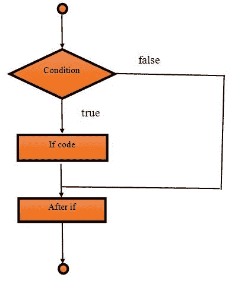
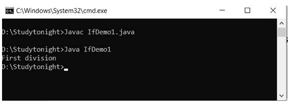
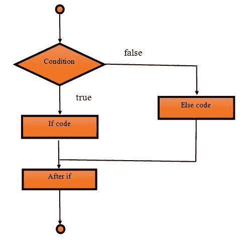
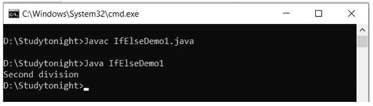
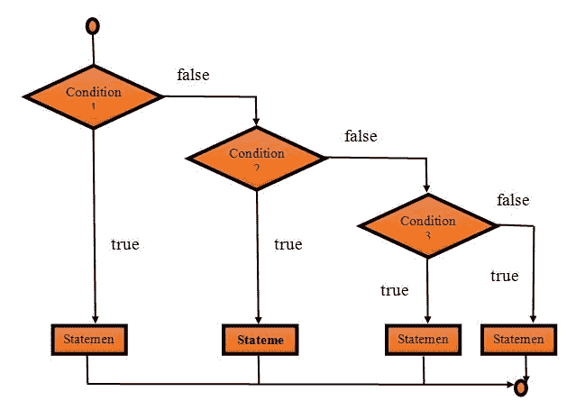
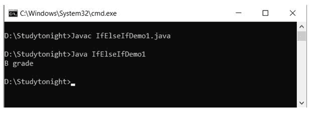
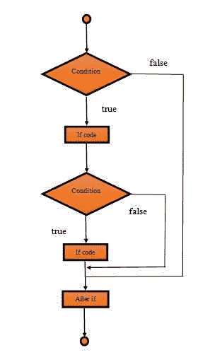
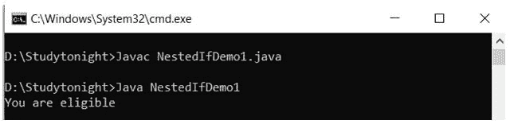

# Java `If Else`语句

> 原文：<https://www.studytonight.com/java/conditional-statement.php>

在 Java 中，if 语句用于测试条件。该条件与返回 true 的语句匹配，否则返回 false。If 语句有四种类型，它们是:

**例如**，如果我们想创建一个程序来**测试正整数**，那么我们必须测试这个整数是否大于零。

在这种情况下，if 语句很有帮助。

Java 中有四种类型的 if 语句:

1.  如果语句
2.  if-else 语句
3.  如果-否则-如果梯子
4.  嵌套 if 语句

### 如果语句

if 语句是一个基于条件的语句，仅在提供的条件为真时执行。

 ****If 语句语法:**

```java
	 if(condition)
{  
	//code
} 

```

我们可以用下图来理解 if 语句的流程。它表明只有当条件为真时，写在 if 中的**代码才会执行。**

#### **中频模块数据流图**



**示例:**

在这个例子中，我们测试学生的分数。如果分数大于 65，那么学生将获得第一名。

```java
	 public class IfDemo1 {  
public static void main(String[] args) 
	{  
	int marks=70;  
	if(marks > 65)
		{  
		System.out.print("First division");  
		}  
	}  
} 

```



### if-else 语句

if-else 语句用于测试条件。如果条件为真，如果块执行，否则块执行。

这在我们想要基于**假**结果执行一些操作的场景中是有用的。

else 块仅在条件为**假**时执行。

**语法:**

```java
	 if(condition)
{  
	//code for true  
}
else
{  
	//code for false  
} 

```

在这个框图中，我们可以看到当条件为真时，如果块执行，否则块执行。

#### **If Else 模块的数据流图**



**if else 示例:**

在这个例子中，我们测试学生分数，如果分数大于 65，那么如果块执行，否则块执行。

```java
	 public class IfElseDemo1 {  
	public static void main(String[] args) 
	{  
		int marks=50;  
		if(marks > 65)
		{  
			System.out.print("First division");  
		}  
		else
		{  
			System.out.print("Second division");  
		}
	}  
} 

```



### 如果-否则-如果阶梯语句

在 Java 中，if-else-if 梯形语句用于测试条件。它用于测试多个语句中的一个条件。

当我们有多个条件要执行时，建议使用 if-else-if 梯形。

**语法:**

```java
	 if(condition1)
{  
	//code for if condition1 is true  
}
else if(condition2)
{  
	//code for if condition2 is true  
}  
else if(condition3)
{  
	//code for if condition3 is true  
}  
...  
else
{  
	//code for all the false conditions   
} 

```

它包含多个条件，如果任何条件为真，则执行，否则执行 else 块。

#### **If 否则 If 块的数据流图**



**示例:**

这里，我们正在测试学生成绩，并根据获得的成绩显示结果。如果分数大于 50 分，学生将得到他的分数。

```java
	 public class IfElseIfDemo1 {  
public static void main(String[] args) {  
int marks=75;  
    if(marks<50){
System.out.println("fail");  
    }  
    else if(marks>=50 && marks<60){
System.out.println("D grade");  
    }  
    else if(marks>=60 && marks<70){
System.out.println("C grade");  
    }  
    else if(marks>=70 && marks<80){
System.out.println("B grade");  
    }  
    else if(marks>=80 && marks<90){
System.out.println("A grade");  
}else if(marks>=90 && marks<100){  
System.out.println("A+ grade");  
}else{  
System.out.println("Invalid!");  
    }  
}  
} 

```



### 嵌套 if 语句

在 Java 中，嵌套 if 语句是另一个 if 内部的 if。在这种情况下，当外部块为真时，在另一个 if 块内部创建一个 if 块，然后只执行内部块。

**语法:**

```java
	 if(condition)
{    
     		//statement
     if(condition)
{  
             //statement 
    }    
} 

```

#### **嵌套 If 块的数据流图**



**示例:**

```java
	 public class NestedIfDemo1 {    
public static void main(String[] args) 
{      
int age=25;  
int weight=70;    
if(age>=18)
{    
if(weight>50)
{  
System.out.println("You are eligible");  
}    
}    
}	
} 

```



* * ***