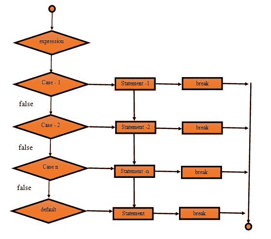
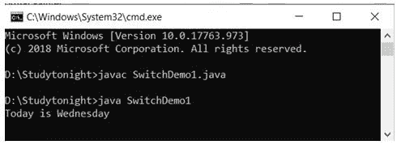
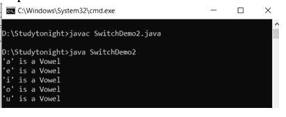

# Java `switch`语句

> 原文：<https://www.studytonight.com/java/switch-statement.php>

在 Java 中，switch 语句用于从多个条件中执行一条语句。它类似于 if-else-if 梯子。

Switch 语句由基于条件的案例和默认案例组成。

在 switch 语句中，表达式可以是**字节、短、char 和 int** 类型。

从 **JDK-7，枚举，字符串**也可以用于开关情况。

以下是使用 switch 语句时的一些规则:

1.  可以有一个或 N 个案例。
2.  案例中的值必须是唯一的。
3.  案例的每个语句都可以有一个 break 语句。它是可选的。

**语法:**

下面是用 Java 声明开关大小写的语法。

```java
	 switch(expression)
{    
case value1:    
 			//code for execution;    
 			break;  //optional  
case value2:    
 // code for execution
 break;  //optional  
......    
......
......
......
Case value n:
// code for execution
 break;  //optional  

default:     
 code for execution when none of the case is true;    
} 

```

#### 交换块的数据流图



#### **示例:使用整数值**

在本例中，我们使用 **int 类型**值来匹配案例。本示例基于数值返回日期。

```java
	 public class SwitchDemo1{ 
    public static void main(String[] args) 
    { 
int day = 3; 
        String dayName; 
        switch (day) { 
        case 1: 
dayName = "Today is Monday"; 
            break; 
        case 2: 
dayName = "Today is Tuesday"; 
            break; 
        case 3: 
dayName = "Today is Wednesday"; 
            break; 
        case 4: 
dayName = "Today is Thursday"; 
            break; 
        case 5: 
dayName = "Today is Friday"; 
            break; 
        case 6: 
dayName = "Today is Saturday"; 
            break; 
        case 7: 
dayName = "Today is Sunday"; 
            break; 
        default: 
dayName = "Invalid day"; 
            break; 
        } 
System.out.println(dayName); 
    } 
} 

```



#### **在 Switch 语句中使用枚举的示例**

正如我们已经说过的，Java 允许在开关情况下使用**枚举**。所以我们正在创建一个元音字母的枚举，并在 switch case 中使用它的元素。

```java
	 public class SwitchDemo2{      
       public enumvowel{a, e, i, o, u}    
       public static void main(String args[])    
       {    
vowel[] character= vowel.values();    
           for (vowel Now : character)    
           {    
                switch (Now)    
                {    
                    case a:    
System.out.println("'a' is a Vowel");    
                        break;    
                    case e:    
System.out.println("'e' is a Vowel");    
                        break;    
                    case i:    
System.out.println("'i' is a Vowel");    
                        break;         
                    case o:    
System.out.println("'o' is a Vowel");    
                        break;    
                    case u:    
System.out.println("'u' is a Vowel");    
                        break;    
                    default:    
System.out.println("It is a consonant");    
                }    
            }    
        }    
} 

```



* * *

#### **例:开关箱内的串**

由于 Java 允许在开关情况下使用字符串值，所以我们使用字符串来创建一个基于字符串的开关情况示例。

```java
	 public static void main(String[] args) {  
    String name = "Mango";  
    switch(name){  
    case "Mango":  
        System.out.println("It is a fruit");  
        break;  
    case "Tomato":  
        System.out.println("It is a vegitable");  
        break;  
    case "Coke":  
        System.out.println("It is cold drink");  
    }  
}  
} 

```

这是一种水果

* * *

#### **例:无断路开关情况**

Break 语句用于**中断程序的当前执行**。在开关情况下，断开用于**终止开关情况**的执行并将控制转移到开关情况的外部。

在开关情况下可选择使用**断开。让我们看看如果我们不利用休息时间会发生什么。**

```java
	 public class Demo{      

    public static void main(String[] args) {  
        String name = "Mango";  
        switch(name){  
        case "Mango":  
            System.out.println("It is a fruit");  
        case "Tomato":  
            System.out.println("It is a vegitable");  
        case "Coke":  
            System.out.println("It is cold drink");  
        }  
    }
} 

```

这是水果，这是蔬菜，这是冷饮

**See, if we don’t use break, it executes all the cases after matching case.**

* * *

* * *