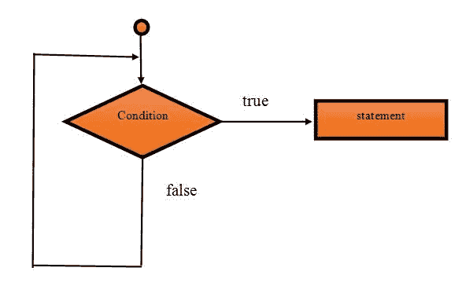
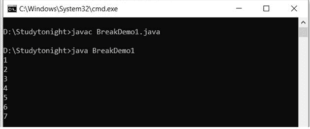
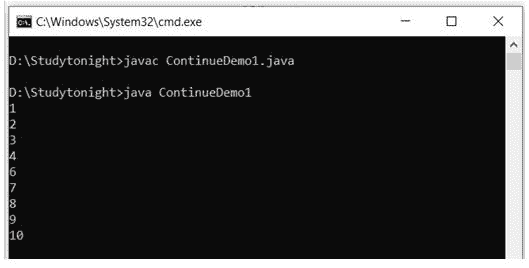
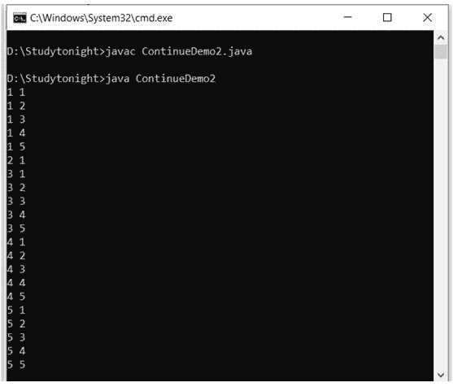

# Java `break`和`continue`语句

> 原文：<https://www.studytonight.com/java/break-continue-statement-in-java.php>

Java `break`和`continue`语句用于管理程序流程。我们可以在循环中使用它们来控制循环迭代。这些语句让我们能够控制循环和切换语句，使我们能够跳出循环或者跳过当前循环迭代跳到下一个迭代。

在本教程中，我们将通过示例详细讨论每一个。

## break 语句

在 Java 中，break 是用来**中断程序当前执行**流程的语句。

我们可以在循环中使用 break 语句、开关盒等。

如果在循环内使用中断**，那么它将终止循环。**

如果在最内循环中使用中断**，那么中断将仅终止最内循环，并且执行将从外循环开始。**

如果在开关情况下使用 break，那么它将在匹配的情况之后终止执行。使用 break，我们已经在切换案例主题中介绍过了。

**语法:**

```java
	 jump-statement;    
break; 

```

**`break`语句数据流图**



**示例:**

在本例中，我们在循环中使用了 break，当值为 8 时，循环将终止。

```java
	 public class BreakDemo1 {  
public static void main(String[] args) {  

for(inti=1;i<=10;i++){  
        if(i==8){

            break;  
        }  
System.out.println(i);  	
    }  
}  
} 

```



**使用边循环边磨合的示例**

循环可以是任何一个不管是 for 还是 while，break 语句都会这么做。这里，我们在 do while 循环中使用 break。

```java
	 public class BreakDoWhileDemo1
{  
public static void main(String[] args) 
{    
		inti=1;   
		do
{  
			if(i==15)
{  
			i++;  
				break; 
			}  
			System.out.println(i);  
			i++;  
		}while(i<=20);  
 }  
} 

```


**示例:最里面的循环中断**

在这个例子中，我们在最里面的循环中使用**中断。但是当 j 等于 2 并且**控制转到从下一次迭代开始的外部循环**时，循环每次都中断。**

```java
	 public class Demo{          
    public static void main(String[] args) {  
    	for(int i=1;i<=2;i++){  
            for (int j = 0; j <=3; j++) {
				if(j==2)
					break;
				System.out.println(j);
			}          
        }  
    }  
} 

```

0 1 0 1

## 连续语句

在 Java 中，continue 语句用于**跳过循环**的当前迭代。它**立即跳到循环的下一个迭代**。我们可以对循环、**同时循环**和**同时循环**使用带有**的 continue 语句。**

```java
	 jump-statement;    
continue; 

```

**示例:**

在这个例子中，我们在 for 循环中使用了 continue 语句。看，它不会将 5 打印到控制台，因为在第五次迭代中，continue 语句跳过了迭代，这就是 print 语句不执行的原因。

```java
 public class ContinueDemo1
{  
public static void main(String[] args) 
{  
		for(inti=1;i<=10;i++)
		{
			if(i==5)
{
			continue;
			}  
			System.out.println(i);  
		}  
}  
} 

```



**示例:**

我们可以使用**标签和`continue`语句**来**设置流量控制**。通过使用标签，我们可以在指定位置**转移控制权。**

在这个例子中，我们使用标签将控制转移到外部循环。

```java
 public class ContinueDemo2 {  
public static void main(String[] args) {  
xy:  
for(inti=1;i<=5;i++){    
pq:  
for(int j=1;j<=5;j++){    
                        if(i==2&&j==2){
                            continue xy;    
                        }    
System.out.println(i+" "+j);    
                    }    
            }    
}  
}

```



**示例:在 While 循环中继续**

continue 语句可以与 while 循环一起使用来管理程序的流控制。正如我们已经知道的，continue 语句用于跳过循环的当前迭代。这里，如果变量值为 5，它也将跳过执行。

```java
	 public class Demo{      

    public static void main(String[] args) {
    	int i=1;

    	while (i < 10) {
    	  if (i == 5) {
    	    i++;
    	    continue;
    	  }
    	  System.out.println(i);
    	  i++;
    	}
    }  
} 

```

1 2 3 4 6 7 8 9

我们可以看到输出，5 是缺失的，因为在第五次迭代时由于 continue 语句 JVM 跳过了 print 语句。

* * *

* * *

* * *