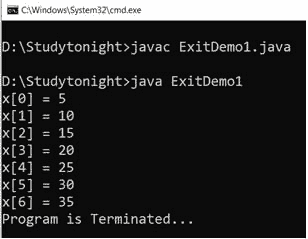

# Java 命令行参数

> 原文：<https://www.studytonight.com/java/command-line-argument.php>

命令行参数是在运行时传递给程序的参数。这是在 Java 中将参数传递给主方法的方式。这些参数存储在字符串类型**参数**参数中，该参数是主要的方法参数。

要访问这些参数，您可以简单地遍历循环中的 args 参数，或者使用直接索引值，因为 args 是 String 类型的数组。

例如，如果我们运行一个包含 main 方法的 HelloWorld 类，并在运行时为它提供参数，那么语法如下。

```java
java HelloWorld arg1 arg2 ...
```

我们可以传递**任意数量的参数**，因为参数类型是数组。让我们看一个例子。

**Example**

在这个例子中，我们创建了一个类 HelloWorld，在运行程序的过程中，我们提供了命令行参数。

```java
class cmd
{
    public static void main(String[] args)
    {
        for(int i=0;i< args.length;i++)
        {
            System.out.println(args[i]);
        }
    }
}
```

**Execute this program as java cmd 10 20 30**

10 20 30

为了基于某种条件或程序逻辑在两者之间终止程序，Java 提供了 **exit()** ，可用于在任意点终止程序。这里我们用例子讨论一下**退出()**的方法。

### Java `System.exit()`方法

在 Java 中，`exit()`方法在 java.lang.System 类中。此方法用于退出或终止正在运行的程序。它可以取零或非零值。`exit(0`)用于成功终止，`exit(1)`或`exit(-1)`用于不成功终止。 `exit()`方法不返回值。

**示例:**

在这个程序中，我们根据一个条件，使用`exit()`方法终止程序。

```java
	 import java.util.*; 
import java.lang.*; 

class ExitDemo1
{ 
    public static void main(String[] args) 
    { 
        intx[] = {5, 10, 15, 20, 25, 30, 35, 40, 45, 50}; 

        for (inti = 0; i<x.length; i++) 
        { 
            if (x[i] >= 40) 
            { 
                System.out.println("Program is Terminated..."); 
                System.exit(0); 
            } 
            else
                System.out.println("x["+i+"] = " + x[i]); 
        } 
    } 
} 

```



* * *

* * *