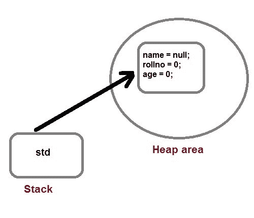

# 什么是 OOPS

> 原文：<https://www.studytonight.com/java/object-and-classes.php>

OOPS 是一种编程方法，它借助于基于现实世界的算法来解决现实生活中的问题。它使用现实世界的方法来解决问题。因此，面向对象技术为编写程序提供了比 C、ALGOL、PASCAL 等过程编程语言更好、更简单的方法。[点击这里观看 Java 中 OOPS 概念的视频](https://www.youtube.com/watch?v=xoL6WvCARJY)

Java 是一种面向对象的语言，它支持像类和对象这样的面向对象的概念。在 OOPS 中，数据被视为重要数据，**被封装在类**中，然后对象在运行时用来访问该数据。

OOPS 提供了优于其他编程范例的优势，包括以下特性。

* * *

## OOPS 的主要功能

*   遗产
*   多态性
*   包装
*   抽象

作为一种面向对象的语言，Java 支持上面给出的所有特性。我们将在后面详细讨论所有这些特性。

* * *

## Java 类

在 Java 中，一切都被封装在类下。类是 Java 语言的核心。它可以被定义为**一个描述特定实体的行为和状态的模板**。

类定义新的数据类型。一旦定义，这种新类型可以用来创建该类型的对象。

对象是**类**的一个实例。你也可以称之为逻辑模板类的物理存在。

在 Java 中，要声明一个类**类**关键字被使用。一个类包含**数据和对该数据进行操作的方法**。类中定义的数据或变量称为**实例变量**，对这些数据进行操作的代码称为**方法**。

因此，实例变量和方法被称为**类成员**。

* * *

### Java 类的规则

*   一个类只能有**公共或默认(无修饰符)**访问说明符。
*   可以是**抽象的，最终的，也可以是具体的(正常类)。**
*   它必须有**类关键字**，类后面必须跟一个合法的标识符。
*   它可以选择只扩展一个父类。默认情况下，它扩展了**对象**类。
*   变量和方法在一组大括号中声明。

Java 类可以包含字段、方法、构造器和块。让我们看看一个类的一般结构。

#### Java 类语法

```java
	 class  class_name {
     field;
     method;
} 

```

* * *

### 一个简单的类例子

假设，**学生**为一个班级，学生姓名、卷号、年龄均为其**字段**、**信息()**为一个**方法**。那么类将如下所示。

```java
class Student.
{
 String name;
 int rollno;
 int age;
void info(){
 // some code
}
} 
```

这就是一个类的结构。它是一个物体的蓝图。我们可以通过使用对象来调用它的字段和方法。

类内声明的字段称为**实例变量**。它在运行时创建对象时获取内存。

**类中的方法**类似于用于执行操作和表示对象行为的函数。

了解了这个类之后，现在让我们来了解什么是对象。

* * *

### Java 对象

对象是类的实例，而类是对象的蓝图。对象代表类，由**属性**和**行为**组成。

属性引用在类中用声明的字段，行为表示类中可用的方法。

在现实世界中，我们可以把物体理解为一部手机，它有自己的属性，如:姓名、费用、颜色等，还有像打电话、聊天等行为。

所以我们可以说物体是一个真实世界的实体。一些现实世界的物体有:球、风扇、汽车等。

有一种在 Java 中创建对象的语法。

* * *

#### **Java 对象语法**

* * *

```java
className variable_name = new className();
```

这里， **className** 是类的名称，可以是上面例子中我们声明的:Student。

**变量名称**是引用变量的名称，用于**保存所创建对象的引用**。

**new** 是一个关键字，用于为对象分配内存。

让我们看一个例子来创建我们在上面的类部分中创建的类 Student 的对象。

虽然还有许多其他方法可以创建类的对象。我们已经在单独的主题中详细介绍了这一部分。

* * *

#### **示例:对象创建**

* * *

```java
Student std = new Student();
```

这里， **std** 是一个在运行时表示类 Student 的对象。

**新的**关键字创建对象的实际物理副本，并将其分配给**标准**变量。它将有物理存在，并在堆区域获得内存。**新操作符为对象**动态分配内存。



在这张图片中，我们可以了解一个对象是如何引用内存区域的。

现在让我们通过一个真实的例子来结合理解对象和类。

* * *

#### **示例:创建类及其对象**

* * *

```java
	 public class Student{      

	 String name;
	 int rollno;
	 int age;

	void info(){
	  System.out.println("Name: "+name);
	  System.out.println("Roll Number: "+rollno);
	  System.out.println("Age: "+age);
	}  

	public static void main(String[] args) {
		Student student = new Student();

		// Accessing and property value
		student.name = "Ramesh";
		student.rollno = 253;
		student.age = 25;

		// Calling method
		student.info();

	}
} 

```

名称:拉面卷编号:253 年龄:25

在这个例子中，我们创建了一个类 Student 和一个对象。在这里，您可能会惊讶地看到 main()方法，但不要担心它只是 JVM 开始执行的程序的入口点。

这里，我们使用 main 方法来创建 Student 类的对象，并访问它的字段和方法。

* * *

#### **示例:类字段**

* * *

```java
	 public class Student{      

	 String name;
	 int rollno;
	 int age;

	void info(){
	  System.out.println("Name: "+name);
	  System.out.println("Roll Number: "+rollno);
	  System.out.println("Age: "+age);
	}  

	public static void main(String[] args) {
		Student student = new Student();

		// Calling method
		student.info();

	}
} 

```

名称:空卷号:0 年龄:0

在这种情况下，如果我们没有初始化类字段的值，那么它们将被初始化为它们的**默认值**。

* * *

### 实例变量的默认值

**int，byte，short，long - > 0**

**浮动，双→ 0.0**

**字符串或任何引用=空**

**布尔→假**

这些值在运行时的对象创建过程中由 JVM 的默认构造器初始化。

* * *

* * *