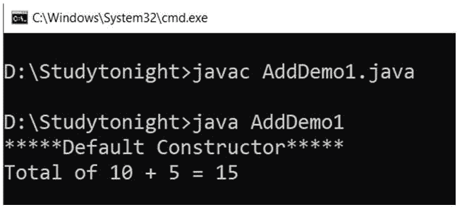
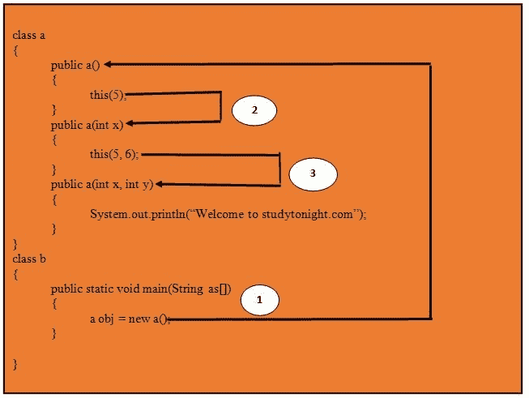
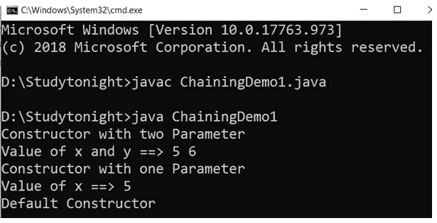
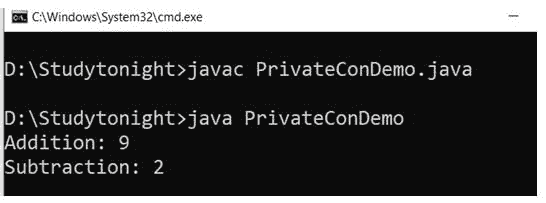

# Java 中的构造函数

> 原文：<https://www.studytonight.com/java/constructor-in-java.php>

构造函数是一种用于初始化对象的特殊方法。每个类都有一个隐式或显式的构造函数。

如果我们没有在类中声明一个构造函数，那么 JVM 会为这个类构建一个默认的构造函数。这就是所谓的**默认构造函数**。

构造函数与声明它的类名同名。**构造函数必须没有显式返回类型**。Java 中的构造函数**不能是**抽象的、静态的、最终的或者同步的。构造函数不允许使用这些修饰符。

**声明构造函数的语法**

```java
  className (parameter-list){
  code-statements
} 

```

**类名**是类名，因为**构造函数名与类名**相同。

**参数列表**是可选的，因为构造函数可以参数化，也可以非参数化。

### 构造函数示例

在 Java 中，构造函数在结构上看起来像下面程序中给出的。Car 类有一个为实例变量提供值的构造函数。

```java
class Car
{
 String name ;
 String model;
 Car( )    **//Constructor**
 {
  name ="";
  model="";
 }
}
```

* * *

## 构造函数的类型

Java 支持两种类型的构造函数:

*   默认构造函数
*   参数化构造函数

每次创建新对象时，至少会调用一个构造函数。

```java
Car c = new Car()       **//Default constructor invoked**
Car c = new Car(name); **//Parameterized constructor invoked**
```

* * *

## 默认构造函数

在 Java 中，如果一个构造函数没有任何参数，它就被称为默认构造函数。默认构造函数可以是用户定义的，也可以由 JVM 提供。

如果一个类不包含任何构造函数，那么在运行时 JVM 会生成一个默认构造函数，称为系统定义默认构造函数。

如果一个类包含一个不带参数的构造函数，那么它被称为用户定义的默认构造函数。在这种情况下，JVM 不会创建默认构造函数。

创建构造函数的**目的是初始化对象**的状态。

下图显示了 JVM 如何在运行时向类添加构造函数。


### 用户定义默认构造函数

程序员在类中定义的构造函数称为用户定义的默认构造函数。

**示例:**

在本例中，我们创建了一个与类名同名的构造函数。

```java
  class AddDemo1
{  
  AddDemo1()
  {
    int a=10;
    int b=5;
    int c;
    c=a+b;
    System.out.println("*****Default Constructor*****");
    System.out.println("Total of 10 + 5 = "+c);
  }  

  public static void main(String args[])
  {  
    AddDemo1 obj=new AddDemo1();  
  }  
} 

```



## 构造函数重载

像方法一样，构造函数也可以重载。重载构造函数根据其参数类型或参数数量进行区分。构造函数重载与方法重载没有太大区别。在方法重载的情况下，您有多个名称相同但签名不同的方法，而在构造函数重载中，您有多个签名不同的构造函数，但唯一的区别是**构造函数没有返回类型**。

* * *

#### 构造函数重载示例

```java
class Cricketer
{
 String name;
 String team;
 int age;
 Cricketer ()   **//default constructor**.
 {
  name ="";
  team ="";
  age = 0;
 }
 Cricketer(String n, String t, int a)   **//constructor overloaded**
 {
  name = n;
  team = t;
  age = a;
 }
 Cricketer (Cricketer ckt)     **//constructor similar to copy constructor of c++** 
 {
  name = ckt.name;
  team = ckt.team;
  age = ckt.age;
 }
 public String toString()
 {
  return "this is " + name + " of "+team;
 }
}

Class test:
{
 public static void main (String[] args)
 {
  Cricketer c1 = new Cricketer();
  Cricketer c2 = new Cricketer("sachin", "India", 32);
  Cricketer c3 = new Cricketer(c2 );
  System.out.println(c2);
  System.out.println(c3);
  c1.name = "Virat";
  c1.team= "India";
  c1.age = 32;
  System .out. print in (c1);
 }
}
```

这是印度的萨钦这是印度的萨钦这是印度的维拉特

* * *

### 构造函数链接

构造函数链接是**从同一个类中的另一个构造函数**调用一个构造函数的过程。由于只能从另一个构造函数调用构造函数，因此构造函数链接用于此目的。

从另一个构造函数**调用构造函数时，使用这个关键字**。此关键字用于引用当前对象。

让我们看一个理解构造函数链接的例子。

```java
  class Test
{
 Test()
 {
  this(10);
 }
 Test(int x)
 {
  System.out.println("x="+x);
 }
public static void main(String arg[])
{
Test object = new Test();
}
} 

```

x=10

当我们想要通过创建类的单个对象来执行多个任务时，使用构造函数链接。

在下图中，我们描述了同一类中构造函数调用的流程。



**示例:**

让我们再看一个例子来理解构造函数链。这里我们已经创建了三个构造函数，并通过使用这个关键字来调用它们。

```java
  class abc
{
  public abc()
  {
    this(5);
    System.out.println("Default Constructor");
  }
  public abc(int x)
  {
    this(5, 6);
    System.out.println("Constructor with one Parameter");
    System.out.println("Value of x ==> "+x);
  }
  public abc(int x, int y)
  {
    System.out.println("Constructor with two Parameter");
    System.out.println("Value of x and y ==> "+x+" "+y);
  }
}
class ChainingDemo1
{
  public static void main(String as[])
  {
    abcobj = new abc();
  }
} 

```



* * *

### 私有构造函数

在 Java 中，我们可以创建私有构造函数来防止类被实例化。这意味着通过声明一个私有构造函数，它限制创建该类的对象。

私有构造函数用于创建**单例类**。一个只能有一个对象的类，称为单例类。

在私有构造函数中，只能创建一个对象，该对象是在类中创建的，并且所有方法都是静态的。如果类中存在私有构造函数，则无法创建对象。一个有私有构造函数并且所有方法都是静态的类叫做**实用类**。

**示例:**

```java
  final class abc
{
  private abc()
  {}
  public static void add(int a, int b)
  {
    int z = a+b;
    System.out.println("Addition: "+z);
  }
  public static void sub(int x, int y)
  {
    int z = x-y;
    System.out.println("Subtraction: "+z);
  }

}
class PrivateConDemo
{
  public static void main(String as[])
  {
    abc.add(4, 5);
    abc.sub(5, 3);
  }
} 

```



* * *

* * *