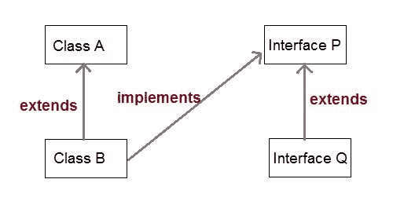
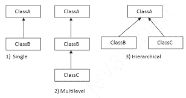
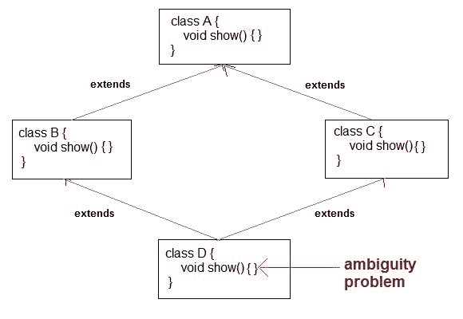
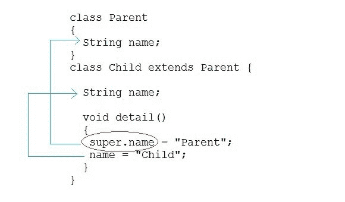

# Java 中的继承

> 原文：<https://www.studytonight.com/java/inheritance-in-java.php>

继承是面向对象编程的关键特征之一。继承提供了允许一个类继承另一个类的属性的机制。当一个类扩展另一个类时，它会继承所有非私有成员，包括字段和方法。Java 中的继承最好从父子关系来理解，在 Java 语言中又称为**超类**(父类)**子类**(子类)。

继承定义了**是一个超级类和它的子类之间的关系。`extends`和`implements`关键词在 Java 中用来描述继承。**



让我们看看**如何扩展**关键字来实现继承。表现为超类和子类的关系。

```java
class Vehicle
{
    ......
}
class Car extends Vehicle
{
    .......    //extends the property of vehicle class
}
```

现在根据上面的例子。在 OOPs 术语中，我们可以说，

*   **车**是**车**的特级。
*   **车**是**车**的子类。
*   汽车是一种交通工具。

* * *

## 继承的目的

1.  它提高了代码的可重用性，即在父/超/基类中定义的相同方法和变量可以在子/子/派生类中使用。
2.  它通过允许方法覆盖来促进多态性。

* * *

## 继承的弊端

使用继承的主要缺点是两个类(父类和子类)紧密耦合**。**

 **这意味着，如果我们更改父类的代码，它将影响到继承/派生父类的所有子类，因此，**不能相互独立**。

* * *

### 继承的简单例子

在继续之前，让我们举一个简单的例子，试着更好地理解继承的概念，

```java
class Parent
{
    public void p1()
    {
        System.out.println("Parent method");
    }
}
public class Child extends Parent {

    public void c1()
    {
        System.out.println("Child method");
    }
    public static void main(String[] args)
    {
        Child cobj = new Child();
        cobj.c1();  //method of Child class
        cobj.p1();  //method of Parent class
    }
}
```

子方法父方法

在上面的代码中，我们有一个类**父类**，它有一个方法`p1()`。然后我们创建一个新的类**子类**，它使用`extends`关键字继承类**父类**，并定义自己的方法`c1()`。现在通过继承类**子**也可以访问类**父**的`public`方法`p1()`。

### 继承超类的变量

超类的所有成员隐式继承到子类。成员由类的实例变量和方法组成。

#### 例子

在本例中，子类将访问超类中定义的变量。

```java
class Vehicle
{
    // variable defined
    String vehicleType;
}
public class Car extends Vehicle {

    String modelType;
    public void showDetail()
    {
        vehicleType = "Car";    //accessing Vehicle class member variable
        modelType = "Sports";
        System.out.println(modelType + " " + vehicleType);
    }
    public static void main(String[] args)
    {
        Car car = new Car();
        car.showDetail();
    }
}
```

跑车

* * *

## 继承的类型

Java 主要只支持下面列出的三种继承类型。

1.  单一继承
2.  多级继承
3.  分级继承

**注意:**Java 不支持多重继承

我们可以从下图中快速查看继承类型。



* * *

### 单一继承

当一个类扩展到另一个类时，它就形成了单一继承。在下面的例子中，我们有两个类，其中类 A 扩展到类 B，形成单一继承。

```java
    class A{
    int a = 10;
    void show() {
        System.out.println("a = "+a);
    }
}

public class B extends A{

public static void main(String[] args) {
    B b = new B();
    b.show();

    }
} 

```

a=10

在这里，我们可以注意到 show()方法是在类 A 中声明的，但是使用子类 Demo 对象，我们可以调用它。这显示了这两个类之间的继承。

### 多级继承

当一个类扩展到另一个类时，这个类也扩展了另一个类，形成了多级继承。例如，C 类扩展到 B 类，B 类也扩展到 A 类，A 类和 B 类的所有数据成员和方法现在都可以在 C 类中访问

#### 示例:

```java
    class A{
    int a = 10;
    void show() {
        System.out.println("a = "+a);
    }
}

class B extends A{
    int b = 10;
    void showB() {
        System.out.println("b = "+b);
    }
}

public class C extends B{

public static void main(String[] args) {
    C c = new C();
    c.show();
    c.showB();  
    }
} 

```

a=10 b=10

### 分级继承

当一个类被两个或多个类扩展时，就形成了层次继承。例如，B 类扩展到 A 类，C 类也扩展到 A 类，在这种情况下，B 和 C 都共享 A 类的属性。

```java
    class A{
    int a = 10;
    void show() {
        System.out.println("a = "+a);
    }
}

class B extends A{
    int b = 10;
    void showB() {
        System.out.println("b = "+b);
    }
}

public class C extends A{

    public static void main(String[] args) {
        C c = new C();
        c.show();
        B b = new B();
        b.show();
    }
} 

```

a = 10 a = 10

### 为什么 Java 不支持多重继承？

*   消除歧义。
*   提供更易维护和清晰的设计。



* * *

### `super`关键字

在 Java 中，`super`关键字用来指代子类的直接父类。换句话说 **super** 关键字被子类在需要引用它的直接超类时使用。



#### 使用`super`关键字引用父类属性的子类示例

在这个例子中，我们将只关注访问父类属性或变量。

```java
class Parent
{
    String name;

}
public class Child extends Parent {
    String name;
    public void details()
    {
        super.name = "Parent";  //refers to parent class member
        name = "Child";
        System.out.println(super.name+" and "+name);
    }
    public static void main(String[] args)
    {
        Child cobj = new Child();
        cobj.details();
    }
}
```

父母和孩子

* * *

#### 使用`super`关键字引用父类方法的子类示例

在这个例子中，我们将只关注访问父类方法。

```java
class **Parent**
{
    String name;
    public void details()
    {
      name = "Parent";
        System.out.println(name);
    }
}
public class **Child** extends **Parent** {
    String name;
    public void details()
    {
        super.details();	**//calling Parent class details() method**
        name = "Child";
        System.out.println(name);
    }
    public static void main(String[] args)
    {
        Child cobj = new Child();
        cobj.details();
    }
}
```

父代子代

* * *

#### 子类使用`super`关键字调用父类`constructor`的例子

在这个例子中，我们将着重于访问父类构造器。

```java
class **Parent**
{
    String name;

    public Parent(String n)
    {
        name = n;
    }

}
public class **Child** extends **Parent** {
    String name;

    public Child(String n1, String n2)
    {

        super(n1);       **//passing argument to parent class constructor**
        this.name = n2;
    }
    public void details()
    {
        System.out.println(super.name+" and "+name);
    }
     public static void main(String[] args)
    {
        Child cobj = new Child("Parent","Child");
        cobj.details();
    }
}
```

父母和孩子

**注意:**使用 super 关键字从子类调用父类构造器时，super 关键字应该始终是子类的方法/构造器中的第一行。

#### 问:你能在构造器中同时使用`this()`和`super()`吗？

不，因为 super()和 this()都必须是构造器中的第一个语句。因此我们不能一起使用它们。

* * *

* * ***