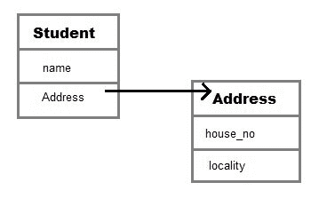

# Java 中的聚合

> 原文：<https://www.studytonight.com/java/aggregation.php>

聚合是一个术语，用于指代两个对象之间的**单向关系**。例如，**学生**班级可以有**参考**的**地址**班级，反之则没有意义。

在 Java 中，聚合表示 **HAS-A 关系**，这意味着当一个类包含另一个已知有聚合的类的引用时。

HAS-A 关系是基于使用，而不是继承。换句话说，如果类 A 引用了类 B 的一个实例，那么类 A 与类 B 有一种关系

让我们通过一个例子来理解它，并考虑两个班级学生和地址。每个学生都有自己的地址，这使得有关系，但地址有学生没有任何意义。我们可以使用 Java 代码更清楚地理解它。

```java
Class Address{
int street_no;
String city;
String state;
int pin;
Address(int street_no, String city, String state, int pin ){
this.street_no = street_no;
this.city = city;
this.state = state;
this.pin = pin;
}
}

class Student
{
  String name;
  Address ad;
} 
```

在上面的代码中，我们可以看到**学生**班级与**地址**班级有-关系。我们也画了一个图像来说明这两个类之间的关系..



`Student`类有一个类型为`Address`的实例变量。由于我们在`Student`类中有一个类型为`Address`的变量，它可以使用地址引用来调用`Address`类的方法，在这种情况下，地址引用是`ad`。

### 聚合的优势

使用聚合的主要优势是维护**代码的可重用性**。如果一个实体与某个其他实体有关系，那么只需引用它就可以重用代码。

* * *

## 聚合示例

现在让我们用一个例子来理解它，这里我们创建了两个类作者和图书，图书类通过引用与作者类有关系。现在我们能够得到这两个类的所有属性。

```java
class Author
{
  String authorName;
  int age;
  String place;

  // Author class constructor
  Author(String name, int age, String place)
  {
    this.authorName = name;
    this.age = age;
    this.place = place;
  }
}

class  Book
{
  String name;
  int price;
  // author details
  Author auther;
  Book(String n, int p, Author auther)
  {
    this.name = n;
    this.price = p;
    this.auther = auther;
  }
  public static void main(String[] args) {
    Author auther = new Author("John", 42, "USA");
    Book b = new Book("Java for Begginer", 800, auther);
    System.out.println("Book Name: "+b.name);
    System.out.println("Book Price: "+b.price);
    System.out.println("------------Auther Details----------");
    System.out.println("Auther Name: "+b.auther.authorName);
    System.out.println("Auther Age: "+b.auther.age);
    System.out.println("Auther place: "+b.auther.place);
  }

} 
```

书名:Java for Begginer 书价:800 -作者详情-作者姓名:约翰·作者年龄:42 作者地点:美国

让我们再举一个例子来理解聚合。假设我们还有一个 Publisher 类，那么 Book 类只需将其引用用作 Author 类，就可以重用 Publisher 类的详细信息。让我们用 Java 代码来理解它。

```java
  class Publisher{

  String name;
  String publisherID;
  String city;

  Publisher(String name, String publisherID, String city) {
    this.name = name;
    this.publisherID = publisherID;
    this.city = city;
  }
}

class Author
{
  String authorName;
  int age;
  String place;

  // Author class constructor
  Author(String name, int age, String place)
  {
    this.authorName = name;
    this.age = age;
    this.place = place;
  }
}

class Book
{
  String name;
  int price;
  // author details
  Author auther;
  Publisher publisher;
  Book(String n, int p, Author auther, Publisher publisher )
  {
    this.name = n;
    this.price = p;
    this.auther = auther;
    this.publisher = publisher;
  }
  public static void main(String[] args) {
    Author auther = new Author("John", 42, "USA");
    Publisher publisher = new Publisher("Sun Publication","JDSR-III4", "LA");
    Book b = new Book("Java for Begginer", 800, auther, publisher);
    System.out.println("Book Name: "+b.name);
    System.out.println("Book Price: "+b.price);
    System.out.println("------------Author Details----------");
    System.out.println("Auther Name: "+b.auther.authorName);
    System.out.println("Auther Age: "+b.auther.age);
    System.out.println("Auther place: "+b.auther.place);
    System.out.println("------------Publisher Details-------");
    System.out.println("Publisher Name: "+b.publisher.name);
    System.out.println("Publisher ID: "+b.publisher.publisherID);
    System.out.println("Publisher City: "+b.publisher.city);
  }

} 

```

图书名称:Java for Begginer 图书价格:800 -作者详细信息-作者姓名:John Auther 年龄:42 作者地点:美国-出版商详细信息-出版商名称:Sun Publication 出版商 ID: JDSR-III4 出版商城市:洛杉矶

## 用 Java 编写

合成是一种更受限制的聚合形式。组合可以被描述为当一个类包含另一个类时，它依赖于另一个类，以至于如果没有包含的类，它就不能在功能上存在。例如一个类`Car`没有`Engine`就不能存在，因为它将不再起作用。

因此单词 **Composition** 的意思是组成某物的项目，如果我们改变它们所改变的事物的组成，类似地，在 Java 类中，一个类包括另一个类，如果所包括的类为外部类提供核心功能意义，那么这个类被称为 Composition。

```java
class Car
{
  private Engine engine;
  Car(Engine en)
  {
    engine = en;
  }
}
```

这里通过检查代码，我们可以理解，如果 Car 类与 Engine 类没有关系，那么 Car 就不存在。

组合是一种**设计技术**，不是 Java 的特性，但是我们可以用 Java 代码来实现。

* * *

### 问:什么时候使用继承和聚合？

当您想要使用任何类的某些属性或行为而不需要修改它或向它添加更多功能时，在这种情况下**聚合**是一个更好的选择，因为在聚合的情况下，我们只是使用类内的任何外部类作为变量。

然而当你想要使用和修改任何外部类的一些属性或行为，或者可能想要在它上面添加更多的函数时，最好使用**继承**。

要了解更多关于继承的知识，您可以访问我们这里的详细教程。[点击这里查看 Java 中的继承](https://www.studytonight.com/java/inheritance-in-java.php)

* * *

* * *