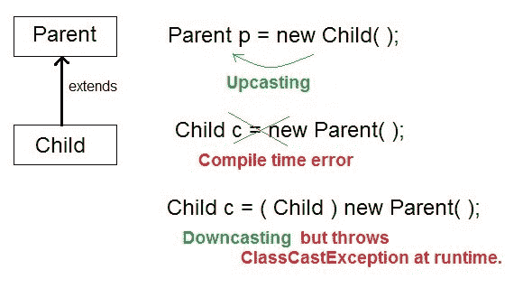

# Java `instanceof`运算符和向下转换

> 原文：<https://www.studytonight.com/java/instanceof-operator.php>

在 Java 中，的**instance 是一个运算符，用于检查对象引用。它检查对象的引用是否属于提供的类型。它返回**真或假**，如果对象引用是指定的类型，则返回真或假。**

我们可以使用 instanceof 运算符来检查对象引用是属于父类、子类还是接口。

它也被称为类型比较运算符，因为它将实例与类型进行比较。

### 实例的应用

除了测试对象类型，我们还可以将其用于对象**向下转换**。然而，我们可以使用类型转换来执行向下转换，但是它可能会在运行时引发 ClassCastException。

为了避免异常，我们使用 instanceof 运算符。这样做有助于执行铸造。

当我们进行类型转换时，检查类型转换是否有效总是一个好主意。instanceof 在这里帮助我们。我们总是可以首先使用 instanceof 检查有效性，然后进行类型转换。

下面给出了声明 instanceof 运算符的语法。

**语法**

```java
(object) instanceof (type)
```

**对象:**是对象引用变量。

**类型:**可以是类，也可以是接口。

* * *

### 举个例子

我们举个例子来了解一下`instanceof`运算符的用法。这里我们测试的引用类型是 Test 类的类型，它返回 true。

```java
public class Test
{
    public static void main(String[] args)
    {
        Test t = new Test();
        System.out.println(t instanceof Test);
    }
}
```

真实的

### 示例:接口引用类型

让我们使用 instanceof 运算符创建一个接口并测试引用类型。如果引用对象引用了正确的接口类型，则该运算符返回。见下面的例子

```java
  interface Callable{
  void call();
}

class Demo implements Callable {
  public void call() {
    System.out.println("Calling...");
  }
  public static void main(String[] args) {

    Callable d = new Demo();
    // Refer to a class
    System.out.println((d instanceof Demo));
    // Refer to an interface
    System.out.println((d instanceof Callable));

  }
} 

```

真实真实

如果引用变量保持**为空**，则实例返回**假**。让我们再看一个例子。

```java
  class Demo {

  public static void main(String[] args) {

    Demo d = null;
    System.out.println(d instanceof Demo);

  }
} 

```

错误的

### 示例:继承

让我们再举一个例子来理解运算符的**实例，其中我们创建了 5 个类，其中一些扩展到了另一个类。现在通过创建对象，我们测试引用对象属于哪个类。**

```java
  class Parent{}

class Child1 extends Parent{}

class Child2 extends Parent{}

class Demo
{
  public static void main(String[] args)
  {
      Parent p =new Parent();
      Child1 c1 = new Child1();
      Child2 c2 = new Child2();

      System.out.println(c1 instanceof Parent);         //true
      System.out.println(c2 instanceof Parent);         //true
      System.out.println(p instanceof Child1);          //false
      System.out.println(p instanceof Child2);          //false

      p = c1;
      System.out.println(p instanceof Child1);          //true
      System.out.println(p instanceof Child2);          //false

      p = c2;
      System.out.println(p instanceof Child1);          //false
      System.out.println(p instanceof Child2);          //true

   }

} 

```

真真假假真真假假真真假假

## Java 中的向下转换

向下转换是使用运算符的**实例的优势之一。向下转换是**在**子**类**中持有**父**类的对象**引用**对象的过程。与**上推**相反，子代的**对象**分配给**父代**类引用对象。**

然而，我们可以使用**类型转换**来执行向下转换，但是它会在运行时抛出**类转换异常**。所以**为了避免**这个，我们使用 instanceof 运算符来执行向下转换。

你可以通过下图了解整个过程。



* * *

#### 使用`instanceof`运算符向下转换的示例

```java
**class Parent{ }**

public class **Child** extends **Parent**
{
    public void check()
    {
        System.out.println("Sucessfull Casting");
    }

    public static void show(Parent p)
    {
       if(p instanceof Child)
       {
           Child b1=(Child)p;
           b1.check();
       }
    }

    public static void main(String[] args)
    {

      Parent p=new Child();

      Child.show(p);

      }
}
```

成功完成铸造

* * *

* * *