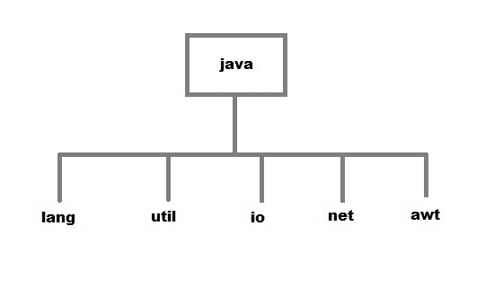

# Java 包

> 原文：<https://www.studytonight.com/java/package-in-java.php>

包是相关类的集合。Java 使用包将任何 Java 项目中相关的[类](object-and-classes)、[接口](java-interface)和[子包](subpackage-and-static-import)分组。

我们可以假设 package 是一个用来存储类似文件的文件夹或目录。

在 Java 中，包用于避免名称冲突，控制类、接口和枚举等的访问。使用 package 可以更容易地找到相关的类，并且它还为包含数百个类和其他文件的项目提供了一个良好的结构。

让我们通过一个简单的例子来理解它，假设我们有一些数学相关的类和接口，然后为了将它们收集到一个简单的地方，我们必须创建一个包。

## Java 包的类型

包可以是内置的和用户定义的，Java 以存储相关类和子包的 API 的形式提供了一组丰富的内置包。

*   **内置包:**数学、util、lang、i/o 等都是内置包的例子。
*   **用户定义包:**由用户创建的用于对其项目的类和接口进行分类的 Java 包被称为用户定义包。



### 如何创建包

用 java 创建一个包非常容易，只需在 java 源文件中包含一个 package 命令，后跟包的名称作为第一条语句。

```java
package mypack;
public class employee 
{
    String empId;
    String name; 
} 
```

上面的语句将在项目目录中创建一个名为 **mypack** 的包。

Java 使用文件系统目录来存储包。例如，您定义为属于 **mypack** 包的任何类的`.java`文件必须存储在名为 **mypack** 的**目录**中。

### 关于包装的其他要点:

*   包语句必须是程序中的第一个语句，甚至在导入语句之前。
*   包始终被定义为与包名同名的单独文件夹。
*   将所有类存储在那个包文件夹中。
*   我们希望在包之外访问的包的所有类都必须声明为公共的。
*   包中的所有类必须以 package 语句作为其第一行。
*   该包的所有类都必须在使用前编译。

* * *

#### Java 包示例

现在让我们通过一个例子来理解包的创建，这里我们创建了一个 **leanjava** 包，它存储了 FirstProgram 类文件。

```java
//save as FirstProgram.java  
package learnjava;  
public class FirstProgram{  
    public static void main(String args[]) {  
        System.out.println("Welcome to package example");  
    }  
} 
```

### 如何在包内编译 Java 程序？

这就像编译一个普通的 java 程序。如果您没有使用任何 IDE，您需要按照下面给出的步骤成功编译您的包:

```java
javac -d . FirstProgram.java
```

`-d`开关指定生成的类文件的存放目的地。您可以使用任何目录名，如 **d:/abc** (如果是 windows)等。如果要将包保持在同一个目录内，可以使用`.`(点)。

### 如何运行 Java 包程序？

要运行我们使用上述命令编译的编译类，我们还需要指定包名。使用下面的命令运行类文件。

```java
java learnjava.FirstProgram
```

欢迎使用打包示例

运行程序后，我们会在控制台上看到“欢迎使用包示例”的消息。你可以把它和程序中使用的 print 语句进行比较。

### 如何导入 Java 包

要将 java 包导入到类中，我们需要使用 java **import** 关键字，该关键字用于将包及其类访问到 java 程序中。

使用 import 将内置和用户定义的包访问到您的 java 源文件中，以便您的类可以通过直接使用其名称来引用另一个包中的类。

有 3 种不同的方法可以引用不同包中的任何类:

1.  不导入包
2.  导入指定类别的包
3.  导入包含所有类的包

让我们通过例子来理解每一个。

### 访问没有导入关键字的包

如果使用完全限定名将任何类导入到程序中，那么在程序中只能访问该包的特定类，同一包中的其他类将不可访问。对于这种方法，不需要使用`import`语句。但是每次访问类或接口时，都必须使用完全限定名。这通常在两个包具有相同名称的类时使用。例如:`java.util`和`java.sql`包包含`Date class`。

### 例子

在这个例子中，我们在包包中创建了一个类 A，在另一个类 B 中，我们在创建类 A 的对象时访问它

```java
//save by A.java  
package pack;  
public class A {  
    public void msg() {
        System.out.println("Hello");
    }  
}  

//save by B.java  
package mypack;  
class B {  
    public static void main(String args[]) {  
        pack.A obj = new pack.A();  //using fully qualified name  
        obj.msg();  
    }  
} 
```

你好

### 导入特定类别

包可以有许多类，但有时我们只想访问程序中的特定类。在这种情况下，Java 允许我们指定类名和包名。如果我们使用 import `packagename.classname`语句，那么只有包中名为 classname 的类可以使用。

### 示例:

在这个例子中，我们创建了一个存储在包包中的演示类，在另一个测试类中，我们通过导入带有类名的包名来访问演示类。

```java
//save by Demo.java  
package pack;  
public class Demo {  
    public void msg() {
        System.out.println("Hello");
    }  
}  

//save by Test.java  
package mypack;  
import pack.Demo;  
class Test {  
    public static void main(String args[]) {  
        Demo obj = new Demo();  
        obj.msg();  
    }  
} 
```

你好

### 导入包的所有类

如果我们使用 **packagename。*声明**，则该包的所有类和接口都可以访问，但是[子包](subpackage-and-static-import)中的类和接口将不可用。

`import`关键字用于使当前包可以访问另一个包的类。

### 示例:

在这个例子中，我们在 **learnjava** 包中创建了一个类 First，通过使用 import 关键字在另一个类 Second 中访问它。

```java
//save by First.java  
package learnjava;  
public class First{  
    public void msg() {
        System.out.println("Hello");
    }  
}  

//save by Second.java  
package Java;  
import learnjava.*;    
class Second {  
    public static void main(String args[]) {  
        First obj = new First();  
        obj.msg();  
    }  
} 
```

你好

* * *