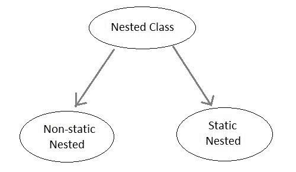
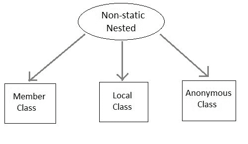

# Java 嵌套类

> 原文：<https://www.studytonight.com/java/nested-classes.php>

在另一个类中定义的类称为嵌套类。嵌套类的范围由其封闭类的范围限定。

**语法:**

```java
class Outer{
//class Outer members

class Inner{
//class Inner members
}

} //closing of class Outer
```



### 嵌套类的优点

1.  这是一种对只在一个地方使用的类进行逻辑分组的方式。
2.  它增加了封装。
3.  它可以产生可读性和可维护性更高的代码。

如果您想创建一个只由封闭类使用的类，那么没有必要为此创建一个单独的文件。相反，您可以将其添加为**“内部类”**

* * *

## 静态嵌套类

如果嵌套类，即在另一个类中定义的类，应用了静态修饰符，那么它被称为**静态嵌套类**。既然如此，静态嵌套类只能访问其外部类的静态成员，即它不能直接引用其封闭类的非静态成员。由于这个限制，静态嵌套类很少被使用。

* * *

## 非静态嵌套类

非静态嵌套类是嵌套类中最重要的类型。也叫**内班**。它可以访问外部类的所有变量和方法，包括它的私有数据成员和方法，并且可以直接引用它们。但反之则不然，即 Outer 类不能直接访问 Inner 类的成员。内部类可以声明为私有、公共、受保护或具有默认访问权限，而外部类只能具有公共或默认访问权限。

关于内部类，需要注意的一点是，它只能在外部类的范围内创建。如果外部类之外的任何代码试图直接实例化内部类，Java 编译器会生成一个错误。



在方法外部创建的非静态嵌套类称为**成员内部类**。

在方法内部创建的非静态嵌套类称为**局部内部类**。如果要调用本地内部类的方法，必须在方法中实例化这个类。我们不能在本地内部类中使用私有、公共或受保护的访问修饰符。只允许使用抽象修饰符和最终修饰符。

* * *

### 内部类示例(成员类)

```java
class Outer
{
  public void display()
  {
    Inner in=new Inner();
    in.show();
  }

  class Inner
  {
    public void show()
    {
      System.out.println("Inside inner");
    }
  }
}

class Test
{
  public static void main(String[] args)
  {
    Outer ot = new Outer();
    ot.display();
  }
}
```

内部内部

* * *

### 方法内部的内部类示例(本地内部类)

```java
class Outer
{
  int count;
  public void display()
  {
    for(int i=0;i<5;i++)
    {
      //Inner class defined inside for loop
      class inner
      {
        public void show()
        {
          System.out.println("Inside inner "+(count++));
        }
      }
      Inner in=new Inner();
      in.show();
    }
  }
}

class Test
{
  public static void main(String[] args)
  {
    Outer ot = new Outer();
    ot.display();
  }
}
```

内部 0 内部 1 内部 2 内部 3 内部 4 内部

* * *

### 在外部类之外实例化的内部类示例

```java
class Outer
{
  int count;
  public void display()
  {
    Inner in = new Inner();
    in.show();
  }

  class Inner
  {
    public void show()
    {
      System.out.println("Inside inner "+(++count));
    }
  }
}

class Test
{
  public static void main(String[] args)
  {
    Outer ot = new Outer();
    Outer.Inner in = ot.new Inner();
    in.show();
  }
}
```

内部 1

* * *

## 匿名类

一个没有名字的类叫做**发音类**。

```java
interface Animal
{
  void type();
}

public class ATest {
  public static void main(String args[])
  {
    //Annonymous class created
    Animal an = new Animal() {
      public void type()
      {
        System.out.println("Annonymous animal");
      }
    };
    an.type();
  }
}
```

匿名动物

这里创建了一个实现**动物**交互的类，它的名字将由编译器决定。这个发音类将提供**类型()**方法的实现。

* * *

* * *