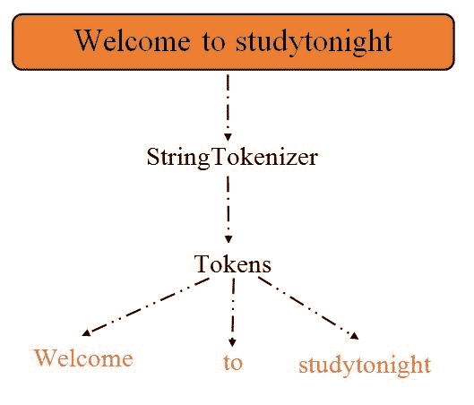

# java stringtokenizer

> 原文：<https://www.studytonight.com/java/string-tokenizer.php>

在 Java 中，StringTokenizer 用于根据提供的分隔符将字符串拆分为标记。分隔符可以在对象创建时指定，也可以基于每个标记指定。

它的对象在内部维护要标记化的字符串中的当前位置。它位于`java.util`包中。

在字符串中，标记器对象在内部维护，并从给定的字符串中返回子字符串的标记。

注意:StringTokenizer 是一个不推荐使用的类，仅出于兼容性原因才可用。

我们可以从下图中了解到，标记器是如何将字符串分成标记的。



### 以下是字符串标记器中的构造函数

1\. StringTokenizer(字符串 str)

2\. StringTokenizer(字符串 str，字符串 delim)

3\. StringTokenizer(String str、String delim、booleanreturnvalue)

### 以下是字符串标记器中的方法

1.booleanhasMoreTokens()

2\. 字符串下一个令牌（）

3\. 字符串下一个令牌（字符串解密）

4.booleanhasMoreElements()

5.对象 nextElement()

6.intcountTokens()

### 示例:

在这个例子中，我们使用 Stringtokenizer 根据空间将字符串分解成标记。

```java
	 import java.util.StringTokenizer;  
public class TokenDemo1
{  
	public static void main(String args[])
	{  
		StringTokenizerobj = new StringTokenizer("Welcome to studytonight"," ");  
		while (obj.hasMoreTokens()) 
		{  
			System.out.println(obj.nextToken());  
		}  
	}  
} 

```

欢迎今晚来学习

### 例子

让我们再举一个例子来理解标记器，这里我们基于冒号(:)分隔符将字符串分成标记。

```java
	 import java.util.*;
public class TokenDemo2{
	public static void main(String args[])
	{
		String a= " : ";
		String b= "Welcome : to : studytonight : . : How : are : You : ?";
		StringTokenizer c = new StringTokenizer(b, a);
		int count1 = c.countTokens();
		for (inti = 0; i<count1; i++)
			System.out.println("token [" + i + "] : "
					+ c.nextToken());
		StringTokenizer d= null;
		while (c.hasMoreTokens())
			System.out.println(d.nextToken());
	}
} 

```


* * *