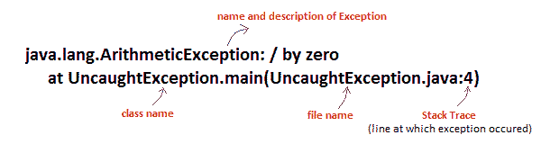
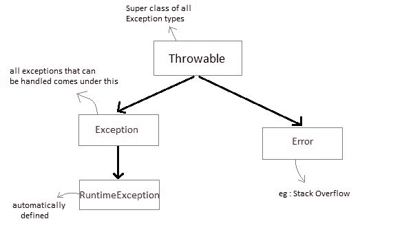

# Java 异常处理

> 原文：<https://www.studytonight.com/java/exception-handling.php>

异常处理是一种在运行时处理异常的机制。异常是指程序执行过程中出现的导致程序异常终止的情况。可能有几个原因会导致异常，包括程序员错误、硬件故障、需要打开的文件找不到、资源耗尽等。

假设我们运行一个程序从一个文件中读取数据，如果该文件不可用，那么该程序将停止执行，并通过报告异常消息来终止程序。

异常的问题是，它终止程序并跳过剩余的执行，这意味着如果程序有 100 行代码，并且在第 10 行发生异常，那么程序将通过跳过剩余的 90 行代码的执行而立即终止。

为了处理这个问题，我们使用异常处理来避免程序终止，并通过跳过异常代码来继续执行。

Java 异常处理为用户提供了一个关于这个问题的有意义的消息，而不是一个系统生成的消息，用户可能无法理解这个消息。

### 未捕获的异常

让我们用一个例子来理解异常。当我们不处理异常时，它会导致意外的程序终止。在这个程序中，由于被零除，将抛出一个算术异常。

```java
class UncaughtException
{
 public static void main(String args[])
 {
  int a = 0;
  int b = 7/a;     // Divide by zero, will lead to exception
 }
}
```

这将在运行时导致异常，因此 Java 运行时系统将构造一个异常，然后抛出它。由于我们在上面的程序中没有任何处理异常的机制，因此默认处理程序(JVM)将处理异常，并将在终端上打印异常的详细信息。



### Java 异常

Java 异常是描述程序中发生的异常的对象。当 java 中发生异常事件时，就称之为抛出异常。负责处理异常的代码称为**异常处理程序**

### 如何处理异常

Java 提供控件来处理程序中的异常。下面列出了这些控件。

*   尝试:用于封闭可疑代码。
*   Catch:它充当异常处理程序。
*   最后:用于执行必要的代码。
*   抛出:它显式抛出异常。
*   抛出:它通知可能的异常。

我们将在接下来的教程中讨论所有这些。

### 例外的类型

在 Java 中，根据异常的性质，异常大致可以分为检查异常、未检查异常和错误。

*   **已检查异常**

JVM 在编译时可以预测的异常为**例**:找不到需要打开的文件，SQLException 等。这些类型的异常必须在编译时检查。

*   **未检查异常**

未检查的异常是扩展 RuntimeException 类的类。未检查的异常在编译时被忽略，在运行时被检查。对于**示例**:算术异常、空指针异常、数组索引超出界限异常。运行时检查未检查的异常。

*   **错误**

错误在代码中通常被忽略，因为您很少能对错误做任何事情。对于**示例**，如果发生栈溢出，将会出现错误。这种类型的错误不能在代码中处理。

## Java 异常类层次结构

所有异常类型都是类**的子类**，它位于异常类层次结构的顶部。



*   **异常**类用于程序应该捕获的异常情况。此类被扩展以创建用户特定的异常类。
*   **RuntimeException** 是 Exception 的一个子类。该类下的异常是为程序自动定义的。
*   **异常类型**错误类型**被 Java 运行时系统用来指示与运行时环境本身有关的错误。栈溢出就是这种错误的一个例子。**

* * *