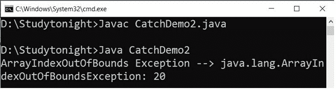

# 试着用 Java 捕捉

> 原文：<https://www.studytonight.com/java/try-and-catch-block.php>

**试试**和**抓**都是 Java **关键词**用于**异常处理**。try 块用于封装**疑似**代码。可疑代码是在程序执行过程中可能引发异常的代码。

例如，如果一个代码由于被零除而引发算术异常，那么我们可以将该代码包装到 try 块中。

```java
  try{
  int a = 10;
  int b = 0
  int c = a/b; // exception
} 

```

**catch** 块也称为**处理程序**用于处理异常。它处理由包含在 try 块中的代码引发的异常。Try 块必须提供 catch 处理程序或 finally 块。我们将在下一个教程中讨论 finally block。

catch 块只能在 try 块之后使用。我们也可以使用多个 catch 块和一个 try 块。

```java
  try{
  int a = 10;
  int b = 0
  int c = a/b; // exception
}catch(ArithmeticException e){
  System.out.println(e);
} 

```

### 尝试捕获语法

为了声明 try catch 块，下面给出了一个通用语法。

```java
  try{
  // suspected code
}catch(ExceptionClass ec){} 

```

异常处理是通过在异常发生时将程序的执行转移到适当的异常处理程序(catch 块)来完成的。

### 示例:处理异常

现在让我们通过一个简单的例子来理解这个尝试和捕捉，在这个例子中，我们将一个数除以零。代码包含在 try 块中，并提供了一个 catch 处理程序来处理异常。

```java
class Excp
{
  public static void main(String args[])
  {
    int a,b,c;
    try
    {
      a = 0;
      b = 10;
      c = b/a;
      System.out.println("This line will not be executed");
    }
    catch(ArithmeticException e)
    {
      System.out.println("Divided by zero");
    }
    System.out.println("After exception is handled");
  }
}
```

处理异常后除以零

### 说明

这个程序将抛出一个异常，因为我们试图在**尝试**块内用零除一个数。程序控制转移到**外，尝试**块。因此“*这一行不会被执行*”不会被编译器解析。抛出的异常在 **catch** 块中处理。一旦异常被处理，程序控制继续程序中的下一行，即 catch 块之后。从而打印出处理异常后的行“*”。*

 ** * *

### 多个捕捉块

一个 try 块后面可以跟多个 catch 块。这意味着在一次试块之后，我们可以有任意数量的捕捉块。如果在受保护的代码(try 块)中出现异常，该异常将被传递到列表中的第一个 catch 块。如果异常类型与第一个 catch 块匹配，它将被捕获，否则异常将被传递到下一个 catch 块。这种情况一直持续到异常被捕获或通过所有捕获。

### 多重捕获语法

要声明多重捕获处理程序，我们可以使用以下语法。

```java
  try  
  {  
   // suspected code
  }  
  catch(Exception1 e)  
  {  
    // handler code
  }   
catch(Exception2 e)  
{  
  // handler code
} 

```

现在让我们看一个实现用于捕获可能的异常的多个 catch 块的例子。

当我们不确定程序执行期间异常的类型时，多个 catch 块非常有用。

### 多个捕捉块的示例

在这个例子中，我们试图获取一个整数对象的整数值。但是由于输入错误，抛出了数字格式异常。

```java
  class Demo{
  public static void main(String[] args) {
    try
    { 
      Integer in = new Integer("abc");
      in.intValue();

    } 
    catch (ArithmeticException e) 
    { 
      System.out.println("Arithmetic " + e); 
    } 
    catch (NumberFormatException e) 
    { 
      System.out.println("Number Format Exception " + e); 
    } 
  }
} 

```

数字格式异常:对于输入字符串:“abc”

在上面的例子中，我们使用了多个 catch 块，并根据异常的类型执行第二个 catch 块。

### 示例:多重异常

让我们通过另一个例子来理解多个 catch 处理程序的使用，这里我们在 catch 异常中使用了三个 catch 处理程序。

```java
public class CatchDemo2
{  
  public static void main(String[] args) 
  {  
    try
    {    
      int a[]=new int[10];    
      System.out.println(a[20]);  
    }    
    catch(ArithmeticException e)  
    {  
      System.out.println("Arithmetic Exception --> "+e);  
    }    
    catch(ArrayIndexOutOfBoundsException e)  
    {  
      System.out.println("ArrayIndexOutOfBounds Exception --> "+e);  
    }    
    catch(Exception e)  
    {  
      System.out.println(e);  
    }                 
  }  
} 
```



一次只处理一个异常，并且只执行一个相应的 catch 块。

### 不可达捕获块的示例

在使用多个 **catch** 语句时，重要的是要记住 **catch** 中类 Exception 的子类必须在它们的任何超级类之前，否则会导致编译时错误。这是因为在 Java 中，如果有任何代码不可访问，那么就会产生编译时错误。

```java
class Excep
{
  public static void main(String[] args)
  {
    try
    {
      int arr[]={1,2};
      arr[2]=3/0;
    }
    catch(Exception e)    //This block handles all Exception
    {
      System.out.println("Generic exception");
    }
    catch(ArrayIndexOutOfBoundsException e)    //This block is unreachable
    {
      System.out.println("array index out of bound exception");
    }
  }
}
```

一般例外

* * *

### 嵌套 try 语句

**试试**语句可以将**嵌套在**的另一个区块**里面。当块的一部分可能导致一个错误，而整个块可能导致另一个错误时，使用嵌套的 try 块。如果内部 **try** 块没有针对特定异常的**捕捉**处理程序，则检查外部 **try 捕捉块**是否匹配。**

```java
class Excep
{
  public static void main(String[] args)
  {
    try
    {
      int arr[]={5,0,1,2};
      try
      {
        int x = arr[3]/arr[1];
      }
      catch(ArithmeticException ae)
      {
        System.out.println("divide by zero");
      }
      arr[4]=3;
    }
    catch(ArrayIndexOutOfBoundsException e)
    {
      System.out.println("array index out of bound exception");
    }
  }
}
```

除以零数组索引超出界限异常

### 需要记住的要点

1.  如果您没有在程序中显式使用 try catch 块，java 将提供一个默认的异常处理程序，每当异常发生时，它将在终端上打印异常详细信息。
2.  超级类**可投掷**覆盖 **toString()** 功能，以字符串形式显示错误信息。
3.  在使用多个 catch 块时，始终确保异常类的子类在它们的任何超级类之前。否则你会得到编译时错误。
4.  在嵌套 try catch 中，如果需要，内部 try 块使用自己的 catch 块以及外部 try 的 catch 块。
5.  只能抛出可抛出类或其子类的对象。

* * **