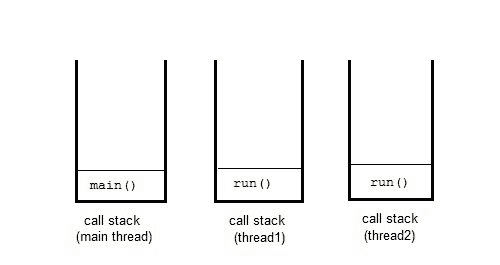

# Java 多线程简介

> 原文：<https://www.studytonight.com/java/multithreading-in-java.php>

多线程是同时运行多个线程的概念。线程是在多线程环境中执行的进程的轻量级单元。

一个程序可以分成许多小的进程。每个小进程都可以作为一个单独的线程(一个轻量级进程)来处理。您可以将轻量级进程视为执行代码或系统调用的虚拟 CPU。您通常不需要关心用线程编程的轻量级进程。多线程程序包含两个或多个可以并发运行的线程，每个线程定义一个单独的执行路径。这意味着一个程序可以同时执行两个或多个任务。例如，一个线程正在文件上写入内容，同时另一个线程正在执行拼写检查。

在 Java 中， **thread** 这个词有两种不同的意思。

*   **线程**类的一个实例。
*   或者，执行线程。

像 java 中的任何其他对象一样， **Thread** 类的实例只是一个对象。但是一个执行线程意味着一个单独的“轻量级”进程，它有自己的调用栈。在 java 中，每个线程都有自己的调用栈。



### 多线程的优势

多线程**减少了**中央处理器**的空闲时间**，从而提高了系统的整体性能。由于线程是轻量级进程，因此它占用**更少的内存**并执行**上下文切换**，这有助于共享内存并减少线程之间的切换时间。

### 多任务处理

多任务是同时执行多个任务的过程。我们可以通过执行多个任务的计算机系统来理解它，例如:将数据写入文件、播放音乐、同时从远程服务器下载文件。

多任务可以通过使用多处理或多线程来实现。使用多处理进行多任务处理涉及多个进程同时执行多个任务，而多线程涉及多个线程执行多个任务。

### 为什么是多线程？

线程在执行多任务处理方面比进程有很多优势。进程重量大，占用内存多，占用 CPU 时间长，可能导致系统性能问题。为了克服这些问题，流程被分解成独立子流程的小单元。这些子进程称为线程，可以高效地执行独立的任务。所以现在的计算机系统更喜欢使用线程而不是进程，并且使用多线程来执行多任务处理。

### 如何创建线程？

为了创建一个线程，Java 提供了一个类 **Thread** 和一个接口 **Runnable** ，两者都位于 java.lang 包中。

我们可以通过扩展线程类或者实现 Runnable 接口来创建线程。两者都包括一个运行方法，必须覆盖该方法才能提供线程实现。

如果您只想创建一个线程，但也可以使用线程类来实现其他线程功能，建议使用 Runnable 接口。

我们将在下一个主题中详细讨论它。

### `main`螺纹

当我们运行任何 java 程序时，程序从主方法开始执行它的代码。因此，JVM 创建一个线程来开始执行**主**方法中的代码。这条线叫做**主线**线。虽然主线程是自动创建的，但是您可以通过调用 **currentThread()** 方法获取对它的引用来控制它。

关于**主线**需要了解的两件重要事情是:

*   它是产生其他线程的线程。
*   它必须总是最后一个完成执行的线程。

```java
class MainThread
{
 	public static void main(String[] args)
 	{
  		Thread t = Thread.currentThread();
  		t.setName("MainThread");
  		System.out.println("Name of thread is "+t);
 	}
}
```

线程的名称是线程[主线程，5，主]

### 线程的生命周期

和进程一样，线程的生命周期包括不同的阶段，比如:新建、运行、终止等。我们用下图描述了它。


1.  **New :** 线程在新状态下开始其生命周期。它一直保持这种状态，直到对它调用 start()方法。
2.  **Runnable :** 在新线程上调用 start()方法后，该线程变得可运行。
3.  **运行:**如果线程调度器选择了线程，则该线程处于运行状态。
4.  **等待:**一个线程如果等待另一个线程执行任务，则处于等待状态。在这个阶段，线程仍然活着。
5.  **终止:**线程完成任务后进入终止状态。

### 守护线程

守护线程是一个低优先级线程，为用户线程提供支持。这些线程可以是用户定义的，也可以是系统定义的。垃圾收集线程是系统生成的后台运行的守护线程之一。这些线程在后台运行，执行垃圾收集等任务。守护线程不允许 JVM 存在，直到所有线程完成它们的执行。当一个 JVM 发现守护线程时，它会终止线程，然后关闭自己，它不关心守护线程是否在运行。

### 线程池

在 Java 中，用于重用先前为执行当前任务而创建的线程。如果在线程周期或资源抖动中出现任何问题，它也提供了解决方案。在 Java 线程池中，创建一组线程，选择一个线程并分配给作业，作业完成后，它被发送回组中。

### 线程优先级

在 Java 中，当我们创建一个线程时，总是会给它分配一个优先级。在多线程环境中，处理器为线程调度器分配优先级。优先级由 JVM 或程序员自己明确给出。优先级的范围在 1 到 10 之间，线程类中有三个静态变量来定义优先级。

**注意:**线程优先级不能保证优先级较高的线程总是比优先级较低的线程先执行。执行线程的选择取决于依赖于平台的线程调度器。

* * *