# Java 线程组

> 原文：<https://www.studytonight.com/java/java-thread-group.php>

线程组是一个用于创建线程组的类。这组线程是树结构的形式，其中初始线程是父线程。一个线程可以拥有组中其他线程的所有信息，但是可以拥有其他组的线程的信息。这在我们想要暂停和恢复大量线程的情况下非常有用。这个线程组是由 java.lang.ThreadGroup 类实现的。

### 线程组中有两种类型的构造器，如下所示:

1.公共线程组(字符串名称)

2.公共线程组(线程组父级，字符串名称)

### 以下是线程组中的方法

**1。checkAccess()**

在 Java 中，`checkAccess()`方法属于 ThreadGroup 类。用于检查线程组中运行的线程是否有修改权限。

**语法**

```java
	 public final void checkAccess() 

```

**示例:**

```java
	 class ThreadDemo1_1 extends Thread   
{  
    ThreadDemo1_1(String a, ThreadGroup b)  
    {  
        super(b, a);  
    }  
    public void run()  
    {  
        for (int i = 0; i< 10; i++)   
        {  
            try  
            {  
                Thread.sleep(10);  
            }  
            catch (InterruptedException ex)   
            {  
                System.out.println(Thread.currentThread().getName());  
            }  
        }  
        System.out.println(Thread.currentThread().getName());  
    }  
}   
public class ThreadDemo1
{  
    public static void main(String arg[]) throws InterruptedException, SecurityException
    {  

        ThreadGroup obj1 = new ThreadGroup("Parent thread =====> ");  
        ThreadGroup obj2 = new ThreadGroup(obj1, "child thread =====> ");  
        ThreadDemo1_1 t1 = new ThreadDemo1_1("*******Thread-1*******", obj1);  
        t1.start();   
        ThreadDemo1_1 t2 = new ThreadDemo1_1("*******Thread-2*******", obj1);  
        t2.start();   
        obj1.checkAccess();  
        System.out.println(obj1.getName() + " has access");  
        obj2.checkAccess();  
        System.out.println(obj2.getName() + " has access");  
    }  
} 

```

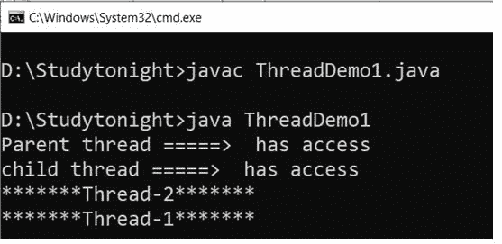

**2 .activeCount()**

在 Java 中，`activeCount()`方法属于 ThreadGroup 类。它用于统计组中当前正在运行的活动线程。

```java
	 public static int activeCount() 

```

**示例:**

```java
	 class Demo2 extends Thread   
{  
    Demo2 (String a, ThreadGroup b)  
    {  
        super(b, a);  
    }  
    public void run()  
    {  
        for (inti = 0; i< 10; i++)   
        {  
            try  
            {  
                Thread.sleep(10);  
            }  
            catch (InterruptedException ex)   
            {  
                Syste  m.out.println(Thread.currentThread().getName());  
            }  
        }  
            System.out.println(Thread.currentThread().getName());  
    }  
}   
public class ThreadDemo2
{  
    public static void main(String arg[])  
    {  
        ThreadGroup o1 = new ThreadGroup("parent thread group");   
        Demo2 obj1 = new Demo2 ("Thread 1 =====> ", o1);  
        Demo2 obj2 = new Demo2 ("Thread 2 =====> ", o1);  
        Demo2 obj3 = new Demo2 ("Thread 3 =====> ", o1);  
    	Demo2 obj4 = new Demo2 ("Thread 4 =====> ", o1);  
        Demo2 obj5 = new Demo2 ("Thread 5 =====> ", o1);  
        Demo2 obj6 = new Demo2 ("Thread 6 =====> ", o1); 
        obj1.start();  
        obj2.start();  
        obj3.start(); 
    	obj4.start();
    	obj5.start();
    	obj6.start();
        System.out.println("Total number of active thread =====> "+ o1.activeCount());  
    }  
} 

```

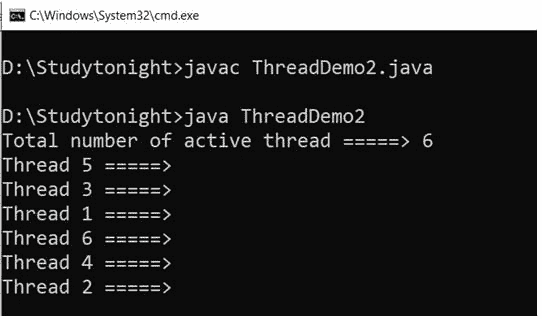

**3 .activeGroupCount()**

在 Java 中，`activeGroupCount()`方法属于 ThreadGroup 类。它用于计算当前正在运行的活动线程组。

**语法公共 int activeGroupCount()。**

```java
	 public int activeGroupCount(). 

```

**示例:**

```java
	 class Demo2 extends Thread   
{  
    Demo2 (String a, ThreadGroup b)  
    {  
        super(b, a);  
    }  
    public void run()  
    {  
        for (inti = 0; i< 10; i++)   
        {  
            try  
            {  
                Thread.sleep(10);  
            }  
            catch (InterruptedException ex)   
            {  
                System.out.println(Thread.currentThread().getName());  
            }  
        }  
        System.out.println(Thread.currentThread().getName()+" =====> completed executing");  
    }  
}   
public class ThreadDemo2
{  
    public static void main(String arg[])  
    {  
        ThreadGroup o1 = new ThreadGroup("parent thread group");   
        ThreadGroup o2 = new ThreadGroup(o1,"Child thread group");   
        ThreadGroup o3 = new ThreadGroup(o1,"parent thread group");   

        Demo2 obj1 = new Demo2("*****Thread 1*****",o1);
        System.out.println(obj1.getName() + " =====> starts");  

        obj1.start(); 

        System.out.println("Total number of active thread =====> "+ o1.activeGroupCount());  
    }  
} 

```

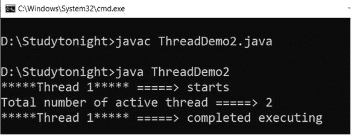

**4。销毁()**

在 Java 中，`destroy()`方法是 ThreadGroup 的。它用来摧毁一个线程组。要销毁任何线程组，必须停止该组中的所有线程。

**语法**

```java
	 public void destroy() 

```

**示例:**

```java
	 class Demo2 extends Thread   
{  
    Demo2 (String a, ThreadGroup b)  
    {  
        super(b, a);  
    }  
    public void run()  
    {  
        for (inti = 0; i< 10; i++)   
        {  
            try  
            {  
                Thread.sleep(10);  
            }  
            catch (InterruptedException ex)   
            {  
                System.out.println(Thread.currentThread().getName());  
            }  
        }  
        System.out.println(Thread.currentThread().getName()+" =====> completed executing");  
    }  
}   
public class ThreadDemo2
{  
    public static void main(String arg[])  throws InterruptedException, SecurityException
    {  
        ThreadGroup o1 = new ThreadGroup("*****parent thread group*****");   
        ThreadGroup o2 = new ThreadGroup(o1,"*****Child thread group*****");   

        Demo2 obj1 = new Demo2("*****Thread 1*****",o1);  
        obj1.start(); 
        Demo2 obj2 = new Demo2("*****Thread 2*****",o1);  
        obj2.start(); 

        obj1.join();
        obj2.join();

        o2.destroy();
        System.out.println(o2.getName()+" ====> Destroyed");
        o1.destroy();
        System.out.println(o1.getName()+" ====> Destroyed");
    }  
} 

```

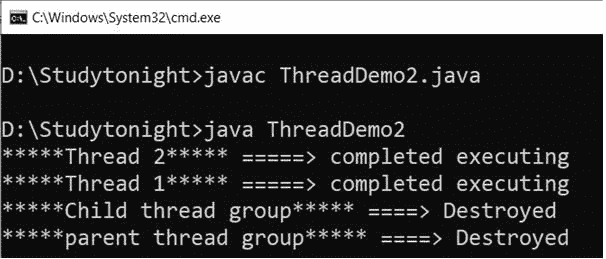

**5。枚举(线程[]列表)**

在 Java 中，`enumerate()`方法属于 ThreadGroup 类。它用于将活动线程复制到指定的数组中。

```java
	 public int enumerate(Thread[] array) 

```

**示例:**

```java
	 class Demo2 extends Thread   
{  
    Demo2 (String a, ThreadGroup b)  
    {  
super(b, a);  
    }  
    public void run()  
    {  
        for (inti = 0; i< 10; i++)   
        {  
            try  
            {  
Thread.sleep(10);  
            }  
            catch (InterruptedException ex)   
            {  
System.out.println(Thread.currentThread().getName());  
            }  
        }  
System.out.println(Thread.currentThread().getName()+" =====> completed executing");  
    }  
}   
public class ThreadDemo2
{  
    public static void main(String arg[])  
    {  
ThreadGroup o1 = new ThreadGroup("*****parent thread group*****");   
ThreadGroup o2 = new ThreadGroup(o1,"*****Child thread group*****");   

	Demo2 obj1 = new Demo2("*****Thread 1*****",o1); 
	System.out.println("Thread 1 Starts"); 
        obj1.start(); 
	Demo2 obj2 = new Demo2("*****Thread 2*****",o1);  
	System.out.println("Thread 2 Starts"); 
        obj2.start(); 

	Thread[] tarray = new Thread[o1.activeCount()];  
int count1 = o1.enumerate(tarray);  

        for (inti = 0; i< count1; i++)   
System.out.println(tarray[i].getName() + " =====> Found");          

	}  
} 

```

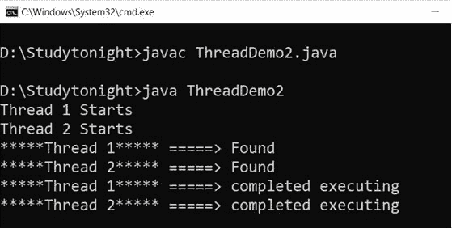

**6。get axpriority()**

在 Java 中，getMaxPriority()方法属于 ThreadGroup 类。它用于检查线程组的最大优先级。

**语法**

```java
	 public final int getMaxPriority() 

```

**示例:**

```java
	 class Demo2 extends Thread   
{  
    Demo2 (String a, ThreadGroup b)  
    {  
        super(b, a);  
    }  
    public void run()  
    {  
        for (inti = 0; i< 10; i++)   
        {  
            try  
            {  
                Thread.sleep(10);  
            }  
            catch (InterruptedException ex)   
            {  
                System.out.println(Thread.currentThread().getName());  
            }  
        }  
        System.out.println(Thread.currentThread().getName()+" =====> completed executing");  
    }  
}   
public class ThreadDemo2
{  
    public static void main(String arg[])  
    {  
        ThreadGroup o1 = new ThreadGroup("*****parent thread group*****");
        System.out.println("Maximum priority of Parent Thread: " + o1.getMaxPriority());   
        ThreadGroup o2 = new ThreadGroup(o1,"*****Child thread group*****"); 
        System.out.println("Maximum priority of Child Thread: " + o2.getMaxPriority());
        Demo2 obj1 = new Demo2("*****Thread 1*****",o1); 
        System.out.println("Thread 1 Starts"); 
        obj1.start(); 
        Demo2 obj2 = new Demo2("*****Thread 2*****",o1);  
        System.out.println("Thread 2 Starts"); 
        obj2.start();           

    }  
} 

```

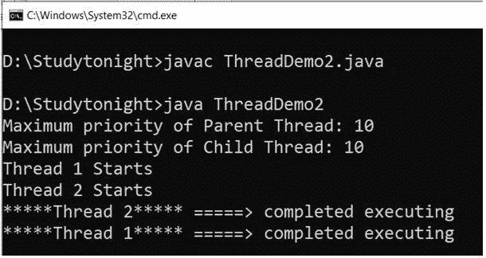

**7.getName（）**

在 Java 中，`getName()`方法属于 ThreadGroup 类。它用于获取当前线程组的名称。

```java
	 public final String getName() 

```

**示例:**

```java
	 class Demo3 extends Thread   
{  
    Demo3(String a, ThreadGroup b)  
    {  
        super(b, a);  
        start();  
    }  
    public void run()  
    {  
        System.out.println(Thread.currentThread().getName());  
    }  
}   
public class ThreadDemo3
{  
    public static void main(String arg[]) throws InterruptedException,  
    SecurityException, Exception  
    {  
        ThreadGroup o1 = new ThreadGroup("*****Parent thread*****");  
        ThreadGroup o2 = new ThreadGroup(o1, "*****Child thread*****");  

        Demo3 obj1 = new Demo3("Thread-1", o1);  
        System.out.println("Name of First threadGroup : " +obj1.getThreadGroup().getName());  

        Demo3 obj2 = new Demo3("Thread-2", o2);  
        System.out.println("Name of Second threadGroup: " +obj2.getThreadGroup().getName());  
    }  
} 

```

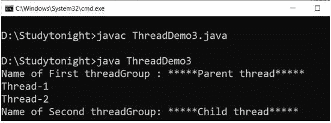

**8 .get arent()**

在 Java 中，`getParent()`方法属于 ThreadGroup 类。它用于从线程组中获取父线程。

```java
	 public final ThreadGroup getParent() 

```

**示例:**

```java
	 class Demo3 extends Thread   
{  
    Demo3(String a, ThreadGroup b)  
    {  
        super(b, a);  
        start();  
    }  
    public void run()  
    {  
        System.out.println(Thread.currentThread().getName());  
    }  
}   
public class ThreadDemo3
{  
    public static void main(String arg[]) throws InterruptedException,  SecurityException, Exception  
    {  
        ThreadGroup o1 = new ThreadGroup("*****Parent thread*****");  
        ThreadGroup o2 = new ThreadGroup(o1, "*****Child thread*****");  

        Demo3 obj1 = new Demo3("Thread-1", o1);  
        System.out.println("Thread one starting");  
        obj1.start();

        Demo3 obj2 = new Demo3("Thread-2", o2);  
        System.out.println("Thread second starting");
        obj2.start();

        System.out.println("Parent Thread Group for " + o1.getName() + " is " + o1.getParent().getName());  

        System.out.println("Parent Thread Group for " + o2.getName() + " is " + o2.getParent().getName());               
    }    
} 

```

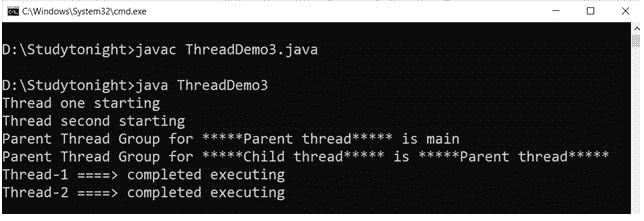

**9。中断()**

在 Java 中，`interrupt()`方法属于 ThreadGroup 类。它用于中断线程组的所有线程。

**语法**

```java
	 public final void interrupt() 

```

**示例:**

```java
	 class Demo2 extends Thread   
{  
    Demo2 (String a, ThreadGroup b)  
    {  
        super(b, a);  
    }  
    public void run()  
    {  
        for (inti = 0; i< 10; i++)   
        {  
            try  
            {  
                Thread.sleep(10);  
            }  
            catch (InterruptedException ex)   
            {  
                System.out.println(Thread.currentThread().getName()+ " =====> interrupted");  
            }  
        }  
        System.out.println(Thread.currentThread().getName()+" =====> completed executing");  
    }  
}   
public class ThreadDemo2
{  
    public static void main(String arg[]) throws InterruptedException, SecurityException
    {  
        ThreadGroup o1 = new ThreadGroup("*****parent thread group*****");
        ThreadGroup o2 = new ThreadGroup(o1,"*****Child thread group*****");  

        Demo2 obj1 = new Demo2("*****Thread 1*****",o1); 
        System.out.println(obj1.getName()+"Thread 1 Starts"); 
        obj1.start();
        o1.interrupt();  

        Demo2 obj2 = new Demo2("*****Thread 2*****",o1);  
        System.out.println(obj2.getName()+"Thread 2 Starts"); 
        obj2.start();           

    }  
} 

```

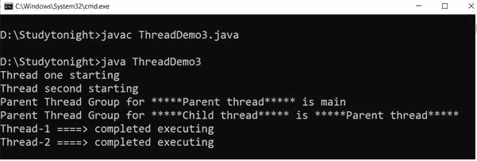

**10。isDaemon()**

在 Java 中，`isDaemon()`方法属于 ThreadGroup 类。它用于检查一个线程是否是 Daemon 线程。

**语法**

```java
	 public final boolean isDaemon() 

```

**示例:**

```java
	 class Demo4 extends Thread   
{  
    Demo4(String a, ThreadGroup b)  
    {  
        super(b, a);  
    }  
    public void run()  
    {  
        for(inti = 0;i < 10;i++)   
            {  
                i++;  
            }  
        System.out.println(Thread.currentThread().getName() + " ====> Execution Finished");  
    }  
}  
public class ThreadDemo4
{  
    public static void main(String arg[]) throws InterruptedException, SecurityException, Exception  
    { 
        ThreadGroup o1 = new ThreadGroup("*****Parent thread*****");  
        Demo4 obj1 = new Demo4 ("*****Thread-1*****", o1);  
        obj1.start();   
        System.out.println("Is " + o1.getName() + " a daemon threadGroup? " + o1.isDaemon());  
    }  
} 

```

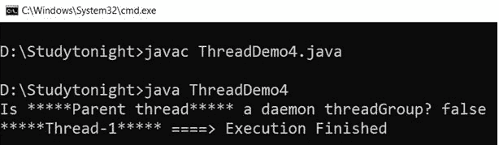

**11。setDaemon(Boolean daemon)**

在 Java 中，`setDaemon()`方法属于 ThreadGroup 类。它用于使一个线程成为守护线程。

语法:

```java
	 public final void setDaemon(boolean daemon) 

```

**示例:**

```java
	 class Demo4 extends Thread   
{  
    Demo4(String a, ThreadGroup b)  
    {  
        super(b, a);  
    }  
    public void run()  
    {  
        for(int i = 0;i < 10;i++)   
        {  
            i++;  
        }  
        System.out.println(Thread.currentThread().getName() + " ====> Execution Finished");  
    }  
}  
public class ThreadDemo4
{  
    public static void main(String arg[]) throws InterruptedException, SecurityException, Exception  
    {  

        ThreadGroup o1 = new ThreadGroup("*****Parent thread*****");  
        o1.setDaemon(true);
        ThreadGroup o2 = new ThreadGroup("*****Child thread*****");  
        o2.setDaemon(true);

        Demo4 obj1 = new Demo4 ("*****Thread-1*****", o1);  
        obj1.start();   
        Demo4 obj2 = new Demo4 ("*****Thread-2*****", o2);  
        obj2.start();   
        System.out.println("Is " + o1.getName() + " a daemon threadGroup? " + o1.isDaemon());  
        System.out.println("Is " + o2.getName() + " a daemon threadGroup? " + o2.isDaemon());         

    }  
} 

```

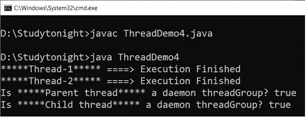

**12。isdstoryed()**

在 Java 中，`isDestroyed()`方法属于 ThreadGroup 类。用于检查线程组是否被破坏。

**语法**

```java
	 public boolean isDestroyed() 

```

**示例:**

```java
	 class Demo4 extends Thread   
{  
    Demo4(String a, ThreadGroup b)  
    {  
        super(b, a);  
    }  
    public void run()  
    {  
        for(int i = 0;i < 10;i++)   
        {  
            i++;  
        }  
        System.out.println(Thread.currentThread().getName() + " ====> Execution Finished");  
    }  
}  
public class ThreadDemo4
{  
    public static void main(String arg[]) throws InterruptedException, SecurityException, Exception  
    {  

        ThreadGroup o1 = new ThreadGroup("*****Parent thread*****");  
        ThreadGroup o2 = new ThreadGroup("*****Child thread*****");  

        Demo4 obj1 = new Demo4 ("*****Thread-1*****", o1); 
        System.out.println("Starting Thread 1"); 
        obj1.start();   
        Demo4 obj2 = new Demo4 ("*****Thread-2*****", o2); 
        System.out.println("Starting Thread 2");  
        obj2.start();   
        if(o1.isDestroyed()==true)
            System.out.println("The Group is destroyed");
        else
            System.out.println("The Group is not destroyed");
    }  
} 

```

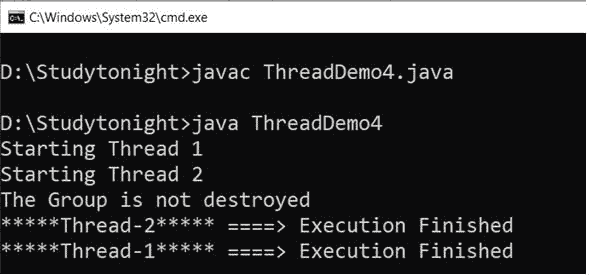

**13。list()**

在 Java 中，`list()`方法属于 ThreadGroup 类。它用于获取关于线程组的所有信息。它在调试时非常有用。

**语法**

```java
	 public void list() 

```

**示例:**

```java
	 class Demo4 extends Thread   
{  
    Demo4(String a, ThreadGroup b)  
    {  
        super(b, a);  
    }  
    public void run()  
    {  
        for(int i = 0;i < 10;i++)   
        {  
            i++;  
        }  
        System.out.println(Thread.currentThread().getName() + " ====> Execution Finished");  
    }  
}  
public class ThreadDemo4
{  
    public static void main(String arg[]) throws InterruptedException, SecurityException, Exception  
    {  

        ThreadGroup o1 = new ThreadGroup("*****Parent thread*****");  
        ThreadGroup o2 = new ThreadGroup("*****Child thread*****");  

        Demo4 obj1 = new Demo4("*****Thread-1*****", o1); 
        System.out.println(obj1.getName()+"Starting Thread 1"); 
        obj1.start();  

        Demo4 obj2 = new Demo4 ("*****Thread-2*****", o2); 
        System.out.println(obj2.getName()+"Starting Thread 2"); 
        obj2.start(); 

        System.out.println("List of parent Thread Group: " + o1.getName() + ":");  
        o1.list();
    }  
} 

```

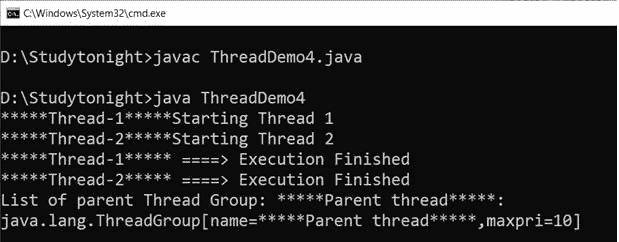

**14。ParentOf(ThreadGroup g)**

在 Java 中，`ParentOf()`方法属于 ThreadGroup 类。它用于检查当前运行的线程是否是哪个线程组的父线程。

**语法**

```java
	 public final boolean parentOf(ThreadGroup g) 

```

**示例:**

```java
	 class Demo4 extends Thread   
{  
    Demo4(String a, ThreadGroup b)  
    {  
        super(b, a);  
    }  
    public void run()  
    {  
        for(int i = 0;i < 10;i++)   
        {  
            i++;  
        }  
        System.out.println(Thread.currentThread().getName() + " ====> Execution Finished");  
    }  
}  
public class ThreadDemo4
{  
    public static void main(String arg[]) throws InterruptedException, SecurityException, Exception  
    {  

        ThreadGroup o1 = new ThreadGroup("*****Parent thread*****");  
        ThreadGroup o2 = new ThreadGroup("*****Child thread*****");  

        Demo4 obj1 = new Demo4("*****Thread-1*****", o1); 
        System.out.println(obj1.getName()+"Starting Thread 1"); 
        obj1.start();  

        Demo4 obj2 = new Demo4 ("*****Thread-2*****", o2); 
        System.out.println(obj2.getName()+"Starting Thread 2"); 
        obj2.start(); 

        boolean isParent = o2.parentOf(o1);  
        System.out.println(o2.getName() + " is the parent of " + o1.getName() +": "+ isParent);  

        isParent = o1.parentOf(o2);  
        System.out.println(o1.getName() + " is the parent of " + o2.getName() +": "+ isParent);  
    }  
} 

```

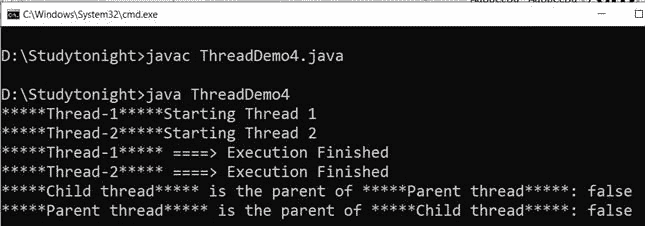

**15。suspend()**

在 Java 中，`suspend()`方法属于 ThreadGroup 类。它用于挂起线程组的所有线程。

**语法**

```java
	 public final void suspend() 

```

**示例:**

```java
	 class Demo4 extends Thread   
{  
    Demo4(String a, ThreadGroup b)  
    {  
        super(b, a);  
    }  
    public void run()  
    {  
        for(int i = 0;i < 10;i++)   
        {  
            i++;  
        }  
        System.out.println(Thread.currentThread().getName() + " ====> Execution Finished");  
    }  
}  
public class ThreadDemo4
{  
    public static void main(String arg[]) throws InterruptedException, SecurityException, Exception  
    {  

        ThreadGroup o1 = new ThreadGroup("*****Parent thread*****");  
        ThreadGroup o2 = new ThreadGroup("*****Child thread*****");  

        Demo4 obj1 = new Demo4("*****Thread-1*****", o1); 
        System.out.println(obj1.getName()+"Starting Thread 1"); 
        obj1.start();  

        Demo4 obj2 = new Demo4 ("*****Thread-2*****", o2); 
        System.out.println(obj2.getName()+"Starting Thread 2"); 
        obj2.start(); 

        o1.suspend();   
    }  
} 

```

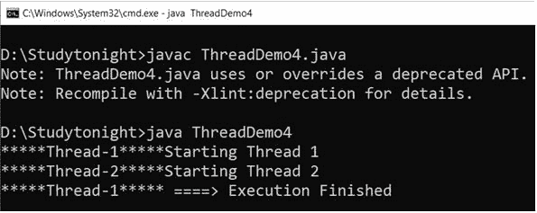

**16。简历()**

在 Java 中，`resume()`方法属于 ThreadGroup 类。它用于恢复线程组中所有挂起的线程。

**语法**

```java
	 public final void resume() 

```

**示例:**

```java
	 class Demo4 extends Thread   
{  
    Demo4(String a, ThreadGroup b)  
    {  
        super(b, a);  
    }  
    public void run()  
    {  
        for(int i = 0;i < 10;i++)   
        {  
            i++;  
        }  
        System.out.println(Thread.currentThread().getName() + " ====> Execution Finished");  
    }  
}  
public class ThreadDemo4
{  
    public static void main(String arg[]) throws InterruptedException, SecurityException, Exception  
    {  

        ThreadGroup o1 = new ThreadGroup("*****Parent thread*****");  
        ThreadGroup o2 = new ThreadGroup("*****Child thread*****");  

        Demo4 obj1 = new Demo4("*****Thread-1*****", o1); 
        System.out.println(obj1.getName()+"Starting Thread 1"); 
        obj1.start();
        o1.suspend();  

        Demo4 obj2 = new Demo4 ("*****Thread-2*****", o2); 
        System.out.println(obj2.getName()+"Starting Thread 2"); 
        obj2.start(); 
        o1.resume();
    }  
} 

```

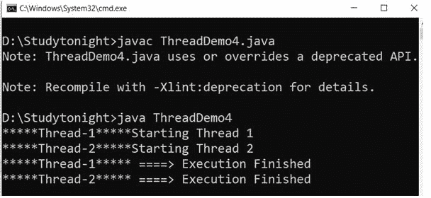

**17。setmaxpriority(inti)**

在 Java 中，`setMaxPriority()`方法属于 ThreadGroup 类。它用于设置线程组的最大优先级。

**语法**

```java
	 public final void setMaxPriority(int pri) 

```

**示例:**

```java
	 class Demo5 extends Thread   
{  
    Demo5(String a, ThreadGroup b)  
    {  
        super(b, a);  
    }  
    public void run()  
    {  
        for (int i = 0; i< 10; i++)   
        {  
            try  
            {  
                Thread.sleep(10);  
            }  
            catch (InterruptedException ex) {  
                System.out.println("Thread " + Thread.currentThread().getName() + " =====> Interrupted"); }  
        }  
        System.out.println(Thread.currentThread().getName() + " [Priority = " +   
                Thread.currentThread().getPriority() + "]");  
        System.out.println(Thread.currentThread().getName()+" =====> Execution finish");  
    }  
}   
public class ThreadDemo5
{  
    public static void main(String arg[]) throws InterruptedException,  
    SecurityException, Exception  
    {  
        ThreadGroup o1 = new ThreadGroup("*****Parent threadGroup*****");  
        ThreadGroup o2 = new ThreadGroup(o1, "*****Child threadGroup*****");  
        o1.setMaxPriority(Thread.MAX_PRIORITY-3);  
        o2.setMaxPriority(Thread.MIN_PRIORITY);  

        Demo5 obj1 = new Demo5("*****Thread-1*****", o1);  
        obj1.setPriority(Thread.MAX_PRIORITY);  
        System.out.println(obj1.getName() + " ====> starts");  
        obj1.start();  

        Demo5 obj2 = new Demo5("*****Thread-2*****", o2);  
        obj2.setPriority(Thread.MAX_PRIORITY);  
        System.out.println(obj2.getName() + " ====> starts");  
        obj2.start();  
    }  
} 

```

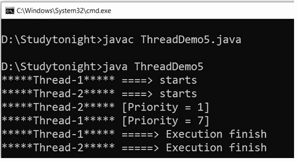

**18。stop()**

在 Java 中，`stop()`方法属于 ThreadGroup 类。它用于停止线程组的线程。

**语法**

```java
	 public final void stop() 

```

**示例:**

```java
	 class Demo5 extends Thread   
{  
    Demo5(String a, ThreadGroup b)  
    {  
        super(b, a);  
    }  
    public void run()  
    {  
        for (int i = 0; i< 10; i++)   
        {  
            try  
            {  
                Thread.sleep(10);  
            }  
            catch (InterruptedException ex) {  
                System.out.println("Thread " + Thread.currentThread().getName() + " =====> Interrupted"); }  
        }  
        System.out.println(Thread.currentThread().getName() + " [Priority = " +   
                Thread.currentThread().getPriority() + "]");  
        System.out.println(Thread.currentThread().getName()+" =====> Execution finish");  
    }  
}   
public class ThreadDemo5
{  
    public static void main(String arg[]) throws InterruptedException,  
    SecurityException, Exception  
    {  
        ThreadGroup o1 = new ThreadGroup("*****Parent threadGroup*****");  
        ThreadGroup o2 = new ThreadGroup(o1, "*****Child threadGroup*****");  
        o1.setMaxPriority(Thread.MAX_PRIORITY-3);  
        o2.setMaxPriority(Thread.MIN_PRIORITY);  

        Demo5 obj1 = new Demo5("*****Thread-1*****", o1);    
        System.out.println("Thread one starting");  
        obj1.start();  

        Demo5 obj2 = new Demo5("*****Thread-2*****", o2);  
        System.out.println("Thread second starting");  
        obj2.start(); 

        o1.stop(); 
    }  
} 

```

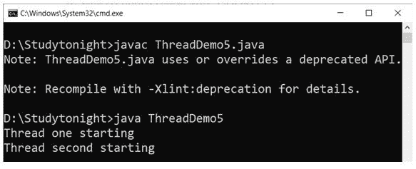

**19。toString()**

在 Java 中，`toString()`方法属于 ThreadGroup 类。它用于获取线程组的字符串表示形式。

**语法**

```java
	 public String toString() 

```

**示例:**

```java
	 class Demo5 extends Thread   
{  
    Demo5(String a, ThreadGroup b)  
    {  
        super(b, a);  
    }  
    public void run()  
    {  
        for (int i = 0; i< 10; i++)   
        {  
            try  
            {  
                Thread.sleep(10);  
            }  
            catch (InterruptedException ex) {  
                System.out.println("Thread " + Thread.currentThread().getName() + " =====> Interrupted"); }  
        }  
        System.out.println(Thread.currentThread().getName() + " [Priority = " +   
                Thread.currentThread().getPriority() + "]");  
        System.out.println(Thread.currentThread().getName()+" =====> Execution finish");  
    }  
}   
public class ThreadDemo5
{  
    public static void main(String arg[]) throws InterruptedException,  
    SecurityException, Exception  
    {  
        ThreadGroup o1 = new ThreadGroup("*****Parent threadGroup*****");  
        ThreadGroup o2 = new ThreadGroup(o1, "*****Child threadGroup*****");  

        Demo5 obj1 = new Demo5("*****Thread-1*****", o1);    
        System.out.println(obj1.getName() + " ====> starts");  
        obj1.start();  

        Demo5 obj2 = new Demo5("*****Thread-2*****", o2);  
        System.out.println(obj2.getName() + " ====> starts");  
        obj2.start();  
        System.out.println("String equivalent: " + o1.toString()); 

        System.out.println("String equivalent: " + o2.toString()); 
    }  
} 

```

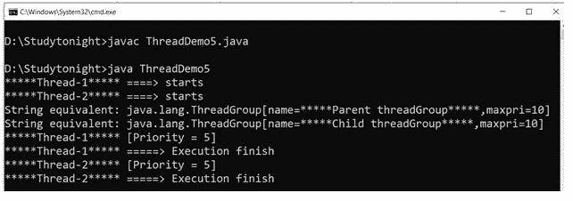

* * *

* * *