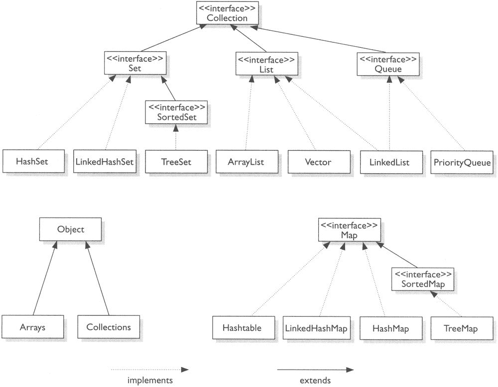

# Java 集合框架

> 原文：<https://www.studytonight.com/java/collection-framework.php>

Java 集合框架表示用于操作对象组的一组接口和类的层次结构。

Java 1.2 版本增加了集合框架。在 Java 2 之前，Java 提供了字典、向量、堆栈和属性等特殊类来存储和操作对象组。

Java 集合框架包含在 java.util 包中。它提供了许多重要的类和接口来收集和组织一组对象。

### 什么是收藏

java 中的集合可以指将多个元素收集到一个单元中的对象。它用于存储、提取和操作数据。例如，列表用于收集元素并由列表对象引用。

### 集合框架的组成部分

集合框架包括:

*   集合接口，如集合、列表和地图。这些用于收集不同类型的对象。
*   集合类，如`ArrayList`、哈希集等，它们是集合接口的实现。
*   为高度并发使用而设计的并发实现类。
*   提供静态方法来对集合执行有用功能的算法，例如对列表进行排序。

### 收藏框架的优势

*   它通过提供一组内置的数据结构和算法来减少编程工作。
*   通过提供数据结构和算法的高性能实现来提高性能。
*   通过建立一种通用语言来来回传递集合，从而在不相关的 API 之间提供互操作性。
*   提高生产率
*   缩短运营时间
*   多功能性也适用于当前系列

### 收集应用编程接口的重要接口

| 连接 | 描述 |
| **集合** | 使您能够处理对象组；它位于集合层次结构的顶部 |
| 从开始 | 扩展队列以处理双端队列。 |
| **列表** | 扩展集合以处理对象的序列列表。 |
| 队列 | 扩展集合以处理特殊类型的列表，在该列表中只从头部移除元素。 |
| **设置** | 将集合扩展到句柄集，句柄集必须包含唯一的元素。 |
| **排序集** | 扩展集合以处理排序的集合。 |

### Java 集合层次结构

集合框架层次结构用图表表示。您可以了解接口和类是如何相互链接的，以及它们位于什么层次结构中。在框架的顶部，集合框架是可用的，其余的接口是它的子接口。

**收藏层级**

所有这些接口都给出了由实现这些接口的集合类定义的几种方法。

### 集合框架的常用方法

| 方法 | 描述 |
| 公共布尔加法 | 它在此集合中插入一个元素。 |
| 公共布尔地址(集合 extends E> c) | 它在调用集合中插入指定的集合元素。 |
| 公共布尔移除(对象元素) | 它从集合中删除一个元素。 |
| 公共布尔 removeAll(集合> c) | 它从调用集合中删除指定集合的所有元素。 |
| 默认布尔移除 If(谓词 super E>过滤器) | 它删除集合中满足指定谓词的所有元素。 |
| 公共布尔零售(集合> c) | 它删除调用集合的所有元素，除了指定的集合。 |
| 公共 int 大小() | 它返回集合中元素的总数。 |
| 公共无效清除() | 它从集合中移除元素的总数。 |
| 公共布尔包含(对象元素) | 它搜索一个元素。 |
| 公共布尔包含所有(集合> c) | 它用于搜索集合中的指定集合。 |

### 为什么收藏品变得通用？

泛型在 Collection 框架中增加了**类型安全**。早期的集合存储了**对象类**引用，这意味着任何集合都可以存储任何类型的对象。因此，有可能在集合中存储不兼容的类型，这可能导致运行时不匹配。因此，引入了泛型，通过它可以显式地声明被存储的对象的类型。

### 收集和自动装箱

我们已经研究了自动装箱将基元类型转换成包装类对象。由于集合不存储基本数据类型(只存储引用)，因此自动装箱通过将基本数据类型打包到其包装类型中来促进集合中基本数据类型的存储。

### 集合框架中最常见的抛出异常

使用集合时可能会出现异常。我们已经列出了在程序执行过程中可能发生的一些最常见的异常。

| 异常名 | 描述 |
| 不支持操作例外 | 如果无法修改集合，则发生此事件 |
| 抛出 | 当一个对象与另一个对象不兼容时发生 |
| 空指针异常 | 当您尝试在集合中存储空对象时发生 |
| 非法数据异常 | 如果使用了无效参数，则引发 |
| IllegalStateException | 如果试图向已满的集合中添加柠檬，则抛出 |

* * *

* * *