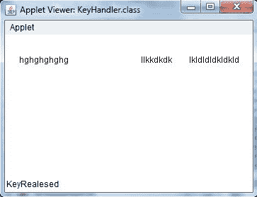

# Java 图形用户界面事件处理

> 原文：<https://www.studytonight.com/java/event-handling-in-java.php>

任何使用图形用户界面(GUI)的程序，比如为 windows 编写的 Java 应用程序，都是事件驱动的。事件描述任何对象的状态变化。**例如:**按下按钮、在文本框中输入字符、点击或拖动鼠标等。

* * *

## 事件处理的组件

事件处理有三个主要组件，

*   **事件:**事件是物体状态的变化。
*   **事件源:**事件源是生成事件的对象。
*   **监听器:**监听器是监听事件的对象。当事件发生时，监听器会收到通知。

* * *

## 事件是如何处理的？

一个源生成一个事件，并将其发送给一个或多个在该源中注册的侦听器。一旦侦听器接收到事件，它们就会处理该事件，然后返回。许多 Java 包都支持事件，如 **java.util** 、 **java.awt** 和 **java.awt.event** 。

* * *

### 重要事件类和接口

| 事件类 | 描述 | 监听器接口 |
| 动作事件 | 当按下按钮、选择菜单项、双击列表项时生成 | 动作监听器 |
| **MouseEvent** | 当鼠标被拖动、移动、点击、按下或释放时，以及当鼠标进入或退出组件时生成 | 鼠标监听器 |
| 关键事件 | 从键盘接收输入时生成 | 监听器 |
| **ItemEvent** | 单击复选框或列表项时生成 | ItemListener |
| **文字风** | 当 textarea 或 textfield 的值更改时生成 | 文本监听器 |
| **摩梭事件** | 鼠标滚轮移动时生成 | 鼠标滚轮监听器 |
| **WindowEvent** | 当窗口被激活、停用、去形象化、图标化、打开或关闭时生成 | WindowListener |
| **分量事件** | 当组件被隐藏、移动、调整大小或设置为可见时生成 | 组件事件侦听器 |
| 集装箱事件 | 在容器中添加或移除组件时生成 | 集装箱装卸机 |
| **调整事件** | 操作滚动条时生成 | 调整监听器 |
| **聚焦事件** | 当组件获得或失去键盘焦点时生成 | 聚焦监听器 |

* * *

### 处理事件的步骤:

1.  在类中实现适当的接口。
2.  向侦听器注册组件。

* * *

### 事件处理示例

```java
import java.awt.*;
import java.awt.event.*;
import java.applet.*;
import java.applet.*;
import java.awt.event.*;
import java.awt.*;

public class Test extends Applet implements KeyListener
{
	String msg="";
	public void init()
	{
		addKeyListener(this);
	}
	public void keyPressed(KeyEvent k)
	{
		showStatus("KeyPressed");
	}
	public void keyReleased(KeyEvent k)
	{
		showStatus("KeyRealesed");
	}
	public void keyTyped(KeyEvent k)
	{
		msg = msg+k.getKeyChar();
		repaint();
	}
	public void paint(Graphics g)
	{
		g.drawString(msg, 20, 40);
	}
}
```

**HTML 代码:**

```java
<applet code="Test" width=300, height=100>
</applet>

```



* * *

* * *