# Java AWT

> 原文：<https://www.studytonight.com/java/java-awt.php>

Java AWT 是一个包含大量类和方法的 API，用于创建和管理图形用户界面(GUI)应用。AWT 旨在为图形用户界面设计提供一套通用的工具，可以在各种平台上工作。AWT 提供的工具是使用每个平台的本映射形用户界面工具包实现的，因此保留了每个平台的外观和感觉。这是使用 AWT 的一个优势。但是这种方法的缺点是，在一个平台上设计的图形用户界面在另一个平台上显示时可能看起来不同，这意味着 AWT 组件依赖于平台。

AWT 是 Swing 的基础，即 Swing 是一个改进的图形用户界面API，扩展了 AWT。但是现在使用 AWT 仅仅是因为大多数图形用户界面 Java 程序是使用 Swing 实现的，因为它丰富的图形用户界面控件实现和轻量级的特性。

## Java AWT 层次结构

下面给出了 Java AWT 类的层次结构，所有的类都在 **java.awt** 包中提供。

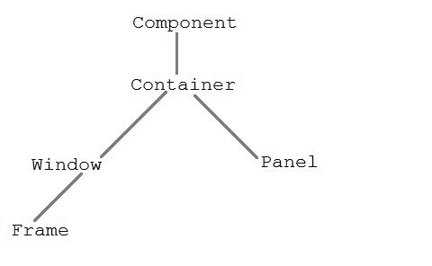

### 组件类

组件类位于 AWT 层次结构的顶部。它是一个抽象类，封装了可视组件的所有属性。组件对象负责记住当前的前景和背景颜色以及当前选定的文本字体。

### 容器

**容器**是 AWT 中的一个组件，它包含另一个组件，如按钮、文本字段、表格等。**容器**是组件类的子类。**容器**类跟踪添加到另一个组件的组件。

### 面板

面板类是**容器**的具体子类。面板不包含标题栏、菜单栏或边框。它是一个用来装组件的容器。

### 窗口类

**窗口**类创建顶层窗口。窗口没有边框和菜单栏。

### 基本框架

框架是**窗口**的子类，有调整大小画布。它是一个容器，包含几个不同的组件，如按钮、标题栏、文本字段、标签等。在 Java 中，大多数 AWT 应用都是使用**框架**窗口创建的。Frame 类有两种不同的构造器，

```java
Frame() throws HeadlessException
Frame(String title) throws HeadlessException
```

### 创建框架

有两种方法可以创建框架。他们是，

1.  通过实例化框架类
2.  通过扩展框架类

### 通过实例化框架类创建框架窗口

```java
import java.awt.*;
public class Testawt
{
  Testawt()
  {
    Frame fm=new Frame();    //Creating a frame
    Label lb = new Label("welcome to java graphics");   //Creating a label
    fm.add(lb);                  //adding label to the frame
    fm.setSize(300, 300);   //setting frame size.
    fm.setVisible(true);     //set frame visibilty true
  }
  public static void main(String args[])
  {
    Testawt ta = new Testawt();
  }
} 
```

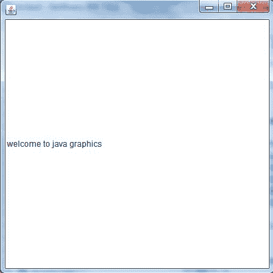

### 通过扩展框架类创建框架窗口

```java
package testawt;

import java.awt.*;
import java.awt.event.*;

public class Testawt extends Frame
{
    public Testawt()
    {
        Button btn=new Button("Hello World");
        add(btn); 		//adding a new Button.
        setSize(400, 500);        //setting size.
        setTitle("StudyTonight");  //setting title.
        setLayout(new FlowLayout());	 //set default layout for frame.
        setVisible(true);           //set frame visibilty true.
    }

    public static void main (String[] args)
    {
        Testawt ta = new Testawt();   //creating a frame.
    }
}
```

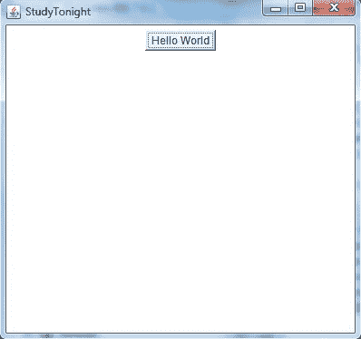

### 需要记住的要点:

1.  创建框架时(通过实例化或扩展框架类)，框架的可见性必须具备以下两个属性:
    *   **setSize(int width，int height)；**
    *   **set visible(true)；**
2.  当您创建其他组件时，如按钮、文本字段等。然后需要使用 **add(组件的对象)的方法将其添加到框架中；**
3.  您也可以添加以下方法来调整框架的大小- **设置大小可调整(真)；**

* * *

### AWT 按钮

在 Java 中，AWT 包含一个按钮类。它用于创建一个可以执行动作的标签按钮。

### 自动测试按钮类别声明:

公共类 Button 扩展了组件实现 Accessible

### 示例:

让我们举一个例子来创建一个按钮，并通过提供坐标将其添加到框架中。

```java
  import java.awt.*;  
public class ButtonDemo1
{  
public static void main(String[] args) 
{  
    Frame f1=new Frame("studytonight ==> Button Demo");  
    Button b1=new Button("Press Here");  
    b1.setBounds(80,200,80,50);  
    f1.add(b1);  
    f1.setSize(500,500);  
    f1.setLayout(null);  
    f1.setVisible(true);   
}  
} 

```

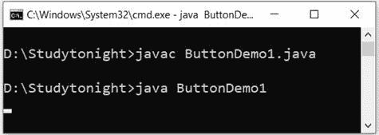 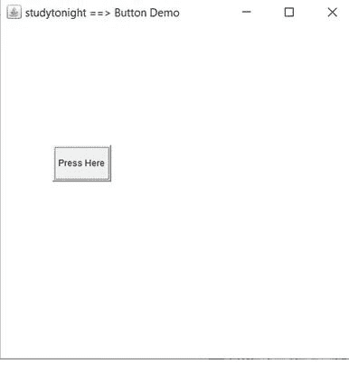

* * *

### AWT 标签

在 Java 中，AWT 包含一个标签类。它用于将文本放置在容器中。只允许单行文本，不能直接更改文本。

### 标签声明:

公共类标签扩展了组件实现可访问

### 示例:

在本例中，我们创建了两个标签来向框架显示文本。

```java
  import java.awt.*;  
class LabelDemo1
{  
  public static void main(String args[])
  {     
    Frame l_Frame= new Frame("studytonight ==> Label Demo");  
    Label lab1,lab2;  
    lab1=new Label("Welcome to studytonight.com");  
    lab1.setBounds(50,50,200,30);  
    lab2=new Label("This Tutorial is of Java");  
    lab2.setBounds(50,100,200,30);  
l_Frame.add(lab1); 
l_Frame.add(lab2);  
l_Frame.setSize(500,500);  
l_Frame.setLayout(null);  
l_Frame.setVisible(true);  
}  
} 

```

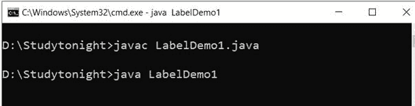 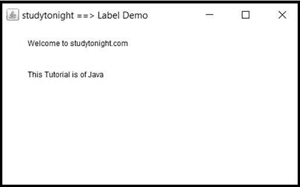

### AWT TextField 物件

在 Java 中，AWT 包含一个 TextField 类。它用于显示单行文本。

### 文本字段声明:

公共类 TextField 扩展了 TextComponent

### 示例:

我们正在创建两个文本字段来显示单行文本字符串。该文本本质上是可编辑的，参见下面的示例。

```java
  import java.awt.*;  
class TextFieldDemo1{  
public static void main(String args[]){  
    Frame TextF_f= new Frame("studytonight ==>TextField");  
TextField text1,text2;  
    text1=new TextField("Welcome to studytonight");  
    text1.setBounds(60,100, 230,40);  
    text2=new TextField("This tutorial is of Java");  
    text2.setBounds(60,150, 230,40);  
TextF_f.add(text1); 
TextF_f.add(text2);  
TextF_f.setSize(500,500);  
TextF_f.setLayout(null);  
TextF_f.setVisible(true);  
}  
} 

```

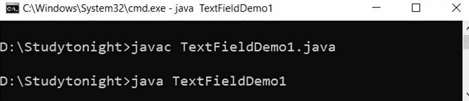 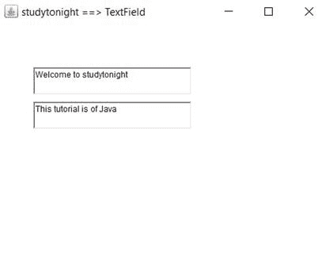

### AWT TextArea(阿拉伯文)

在 Java 中，AWT 包含一个文本区域类。它用于显示多行文本。

### 文本区域声明:

公共类 TextArea 扩展了 TextComponent

### 示例:

在本例中，我们创建了一个文本区域，用于显示多行文本字符串并允许文本编辑。

```java
  import java.awt.*;  
public class TextAreaDemo1 
{  
  TextAreaDemo1()
  {  
    Frame textArea_f= new Frame();  
    TextArea area=new TextArea("Welcome to studytonight.com");  
    area.setBounds(30,40, 200,200);  
    textArea_f.add(area);  
    textArea_f.setSize(300,300);  
    textArea_f.setLayout(null);  
    textArea_f.setVisible(true);  
  }  
  public static void main(String args[])  
  {  
    new TextAreaDemo1();  
  }  
} 

```

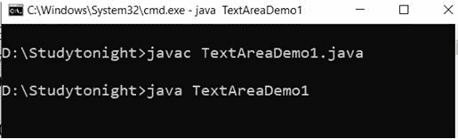 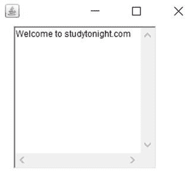

### AWT 复选框

在 Java 中，AWT 包含一个复选框类。当我们只想选择一个选项，即“真”或“假”时，就会用到它。勾选复选框后，其状态为“开”(真)，否则为“关”(假)。

### 复选框语法

公共类 Checkbox 扩展组件实现项目可选择，可访问

### 示例:

在这个例子中，我们正在创建用于获取用户输入的复选框。如果复选框被选中，它返回真，否则返回假。

```java
  import java.awt.*;  
public class CheckboxDemo1  
{  
  CheckboxDemo1(){
    Frame checkB_f= new Frame("studytonight ==>Checkbox Example");  
    Checkbox ckbox1 = new Checkbox("Yes", true);  
    ckbox1.setBounds(100,100, 60,60);  
    Checkbox ckbox2 = new Checkbox("No");  
    ckbox2.setBounds(100,150, 60,60);  
    checkB_f.add(ckbox1);  
    checkB_f.add(ckbox2);  
    checkB_f.setSize(400,400);  
    checkB_f.setLayout(null);  
    checkB_f.setVisible(true);  
  }  
  public static void main(String args[])  
  {  
    new CheckboxDemo1();  
  }  
} 

```

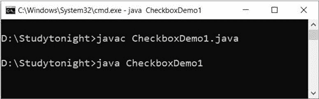 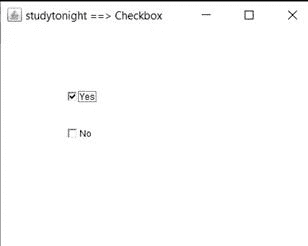

### AWT 复选框组

在 Java 中，AWT 包含了 aCheckboxGroup 类。它用于对一组复选框进行分组。将复选框分组后，一次只能选中一个复选框。

### 复选框组声明:

公共类 CheckboxGroup 扩展了实现 Serializable 的对象

### 示例:

本示例创建一个 checkboxgroup，用于将多个复选框分组到一个单元中。当我们必须在多个选项中选择一个选项时，这很有帮助。

```java
  import java.awt.*;    
public class CheckboxGroupDemo
{    
  CheckboxGroupDemo(){    
    Frame ck_groupf= new Frame("studytonight ==>CheckboxGroup");    
    CheckboxGroupobj = new CheckboxGroup();  
    Checkbox ckBox1 = new Checkbox("Yes", obj, true);    
    ckBox1.setBounds(100,100, 50,50);    
    Checkbox ckBox2 = new Checkbox("No", obj, false);    
    ckBox2.setBounds(100,150, 50,50);    
    ck_groupf.add(ckBox1);    
    ck_groupf.add(ckBox2);    
    ck_groupf.setSize(400,400);    
    ck_groupf.setLayout(null);    
    ck_groupf.setVisible(true);    
  }    
  public static void main(String args[])    
  {    
    new CheckboxGroupDemo();    
  }    
} 

```

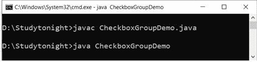 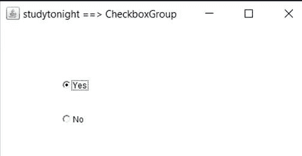

### AWT 选择

在 Java 中，AWT 包含一个选择类。它用于创建选项的下拉菜单。当用户从下拉列表中选择特定项目时，它会显示在菜单的顶部。

### 选择声明:

公共类选择扩展组件实现项目可选择，可访问

### 示例:

在本例中，我们正在创建下拉菜单，用于从多个选项中获得用户选择。

```java
  import java.awt.*;  
public class ChoiceDemo
{  
  ChoiceDemo()
  {  
    Frame choice_f= new Frame();  
    Choice obj=new Choice();  
    obj.setBounds(80,80, 100,100);  
    obj.add("Red");  
    obj.add("Blue");  
    obj.add("Black");  
    obj.add("Pink");  
    obj.add("White");  
    obj.add("Green");
    choice_f.add(obj);  
    choice_f.setSize(400,400);  
    choice_f.setLayout(null);  
    choice_f.setVisible(true);  
  }  
  public static void main(String args[])  
  {  
    new ChoiceDemo();  
  }  
} 

```

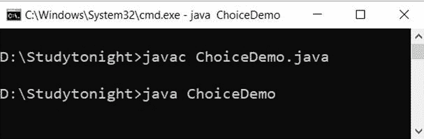 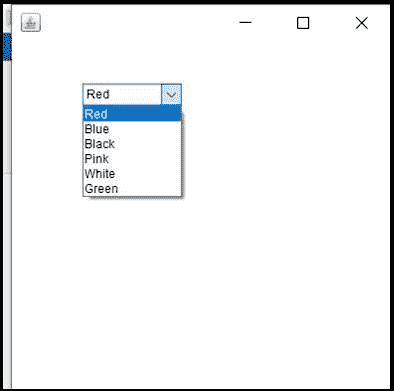

### 自动气象测试列表

在 Java 中，AWT 包含一个列表类。它用于一起表示项目列表。可以从列表中选择一个或多个项目。

### 列表声明:

公共类列表扩展组件实现项目可选择，可访问

### 示例:

在本例中，我们创建了一个用于列出项目的列表。

```java
  import java.awt.*;  
public class ListDemo
{  
  ListDemo()
  {  
    Frame list_f= new Frame();  
    List obj=new List(6);  
    obj.setBounds(80,80, 100,100);  
    obj.add("Red");  
    obj.add("Blue");  
    obj.add("Black");  
    obj.add("Pink");  
    obj.add("White");  
    obj.add("Green");
    list_f.add(obj);  
    list_f.setSize(400,400);  
    list_f.setLayout(null);  
    list_f.setVisible(true);  
  }  
  public static void main(String args[])  
  {  
    new ListDemo();  
  }  
} 

```

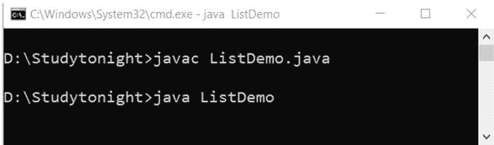 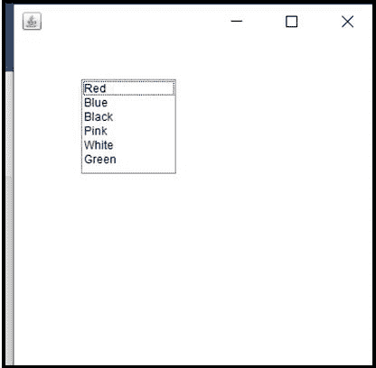

### AWT 画布

在 Java 中，AWT 包含一个画布类。提供空白矩形区域。当用户想要在屏幕上绘图时使用它。

### 声明:

公共类 Canvas 扩展了组件实现可访问

### 示例:

画布用于提供使用鼠标指针进行绘制的位置。我们可以用它来获取用户架构用户输入。

```java
  import java.awt.*;  
public class CanvasDemo1  
{  
  public CanvasDemo1()  
  {  
    Frame canvas_f= new Frame("studytonight ==> Canvas");  
    canvas_f.add(new CanvasDemo());  
    canvas_f.setLayout(null);  
    canvas_f.setSize(500, 500);  
    canvas_f.setVisible(true);  
  }  
  public static void main(String args[])  
  {  
    new CanvasDemo1();  
  }  
}  
class CanvasDemo extends Canvas  
{  
  public CanvasDemo() {  
    setBackground (Color.WHITE);  
    setSize(300, 200);  
  }  
  public void paint(Graphics g)  
  {  
    g.setColor(Color.green);  
    g.fillOval(80, 80, 150, 75);  
  }  
} 

```

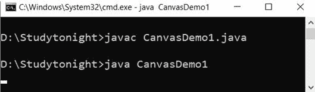 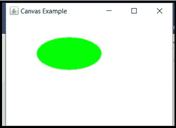

* * *