# Java 抽象窗口工具包

> 原文：<https://www.studytonight.com/java/java-awt-1.php>

在我们之前的主题中，我们讨论了 AWT API 的一些组件，现在这里我们将讨论其余的组件和事件侦听器。

### 菜单和菜单

在 Java 中，AWT 包含一个菜单项和菜单类。菜单项用于在菜单中添加标签。菜单用于创建菜单组件的下拉列表

### MenuItem 声明

公共类 MenuItem 扩展了 MenuComponent 实现的可访问性

### 菜单声明

公共类 Menu 扩展 MenuItem 实现 MenuContainer，可访问

### 示例:

在这个例子中，我们正在创建一个包含子菜单的菜单项。我们使用菜单项和菜单类来创建菜单。

```java
  import java.awt.*;  
class MenuDemo1  
{  
  MenuDemo1()
  {  
    Frame menu_f= new Frame("studytonight ==> Menu and MenuItem Demo");  
    MenuBarmenu_bar=new MenuBar();  
    Menu menu11=new Menu("Menu");  
    Menu sub_menu1=new Menu("Sub Menu =>");  
    MenuItem a1=new MenuItem("Red");  
    MenuItem a2=new MenuItem("Light Red");  
    MenuItem a3=new MenuItem("Drak Red");  
    MenuItem b1=new MenuItem("Green");  
    MenuItem b2=new MenuItem("Light Green");  
    MenuItem b3=new MenuItem("Dark Green");
    menu11.add(a1); 
    sub_menu1.add(a2);
    sub_menu1.add(a3); 
    menu11.add(b1);    
    sub_menu1.add(b2);  
    sub_menu1.add(b3);  
    menu11.add(sub_menu1);  
    menu_bar.add(menu11);  
    menu_f.setMenuBar(menu_bar);  
    menu_f.setSize(400,400);  
    menu_f.setLayout(null);  
    menu_f.setVisible(true);  
  }  
  public static void main(String args[])  
  {  
    new MenuDemo1();  
  }  
} 

```

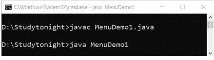 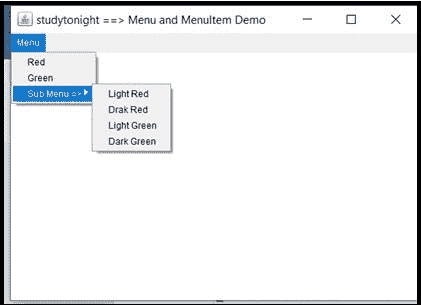

### AWT 弹出菜单

在 Java 中，AWT 包含一个弹出菜单。这是一个动态的弹出窗口。

### 人口数量声明

公共类弹出菜单扩展菜单实现菜单容器，可访问

### 示例:

```java
  import java.awt.*;  
import java.awt.event.*;  
class PopupMenuDemo1  
{  
  PopupMenuDemo1()
  {  
    final Frame pop_menuf= new Frame("studytonight ==>PopupMenu Demo");  
    final PopupMenupop_menu = new PopupMenu("*Edit*");   
    MenuItempop_cut = new MenuItem("Cut");  
    pop_cut.setActionCommand("Cut");  
    MenuItempop_copy = new MenuItem("Copy");  
    pop_copy.setActionCommand("Copy");  
    MenuItempop_paste = new MenuItem("Paste");  
    pop_paste.setActionCommand("Paste");      
    pop_menu.add(pop_cut);  
    pop_menu.add(pop_copy);  
    pop_menu.add(pop_paste);        
    pop_menuf.addMouseListener(new MouseAdapter() 
    {  
      public void mouseClicked(MouseEvent a) 
      {              
        pop_menu.show(pop_menuf , a.getX(), a.getY());  
      }                 
    });  
    pop_menuf.add(pop_menu);   
    pop_menuf.setSize(400,400);  
    pop_menuf.setLayout(null);  
    pop_menuf.setVisible(true);  
  }  
  public static void main(String args[])  
  {  
    new PopupMenuDemo1();  
  }  
} 

```

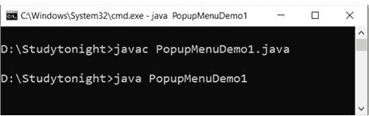 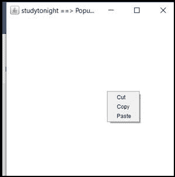

### AWT 面板

在 Java 中，AWT 包含一个面板。面板提供了一个可以放置组件的自由空间。

### 小组声明

公共类 Panel 扩展了容器实现可访问

### 示例:

让我们创建一个面板来添加组件，如:按钮，文本框等。面板提供了添加 awt 组件的位置。

```java
  import java.awt.*;  
public class PanelDemo1{  
  PanelDemo1()  
  {  
    Frame panel_f= new Frame("studytonight ==> Panel Demo");    
    Panel panel11=new Panel();  
    panel11.setBounds(40,80,200,200);    
    panel11.setBackground(Color.red);  
    Button box1=new Button("On");     
    box1.setBounds(50,100,80,30);    
    box1.setBackground(Color.gray);   
    Button box2=new Button("Off");   
    box2.setBounds(100,100,80,30);    
    box2.setBackground(Color.gray);   
    panel11.add(box1); 
    panel11.add(box2);  
    panel_f.add(panel11);  
    panel_f.setSize(400,400);    
    panel_f.setLayout(null);    
    panel_f.setVisible(true);    
  }  
  public static void main(String args[])  
  {  
    new PanelDemo1();  
  }  
} 

```

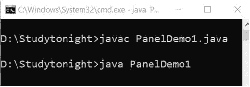 

### 怎么用

在 Java 中，AWT 包含一个对话框。这是一种有边框和标题的窗口。但是它没有任何最大化和最小化按钮。

### 申报

公共类对话框扩展窗口

### 示例:

在这个例子中，我们正在创建一个对话框。对话框用于向用户提供信息。

```java
  import java.awt.*;  
import java.awt.event.*;  
public class DialogDemo1
{  
  private static Dialog dialog_d;  
  DialogDemo1() 
  {  
    Frame dialog_f= new Frame();  
    dialog_d = new Dialog(dialog_f , "studytonight ==> Dialog Demo", true);  
    dialog_d.setLayout( new FlowLayout() );  
    Button dialog_b = new Button ("OK");  
    dialog_b.addActionListener ( new ActionListener()  
    {  
      public void actionPerformed( ActionEvent e )  
      {  
        DialogDemo1.dialog_d.setVisible(false);  
      }  
    });  
    dialog_d.add( new Label ("Welcome to studytonight. Click on button to continue."));  
    dialog_d.add(dialog_b);   
    dialog_d.setSize(300,300);    
    dialog_d.setVisible(true);  
  }  
  public static void main(String args[])  
  {  
    new DialogDemo1();  
  }  
} 

```

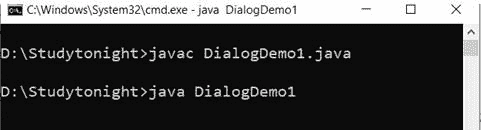 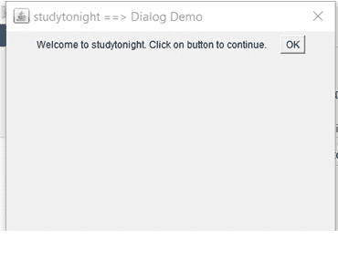

### AWT 工具包

在 Java 中，AWT 包含一个工具包。它是抽象窗口工具包的超类，可以在任何地方实现。

### 申报

公共抽象类工具包扩展了对象

### 示例:

```java
  import java.awt.*;  
import java.awt.event.*;  
public class ToolkitDemo1 
{  
  public static void main(String[] args) 
  {  
    Frame toolkit_f=new Frame("studytonight ==> Toolkit Demo");  
    Button toolkit_b=new Button("beep");  
    toolkit_b.setBounds(50,100,60,30);  
    toolkit_f.add(toolkit_b);     
    toolkit_f.setSize(300,300);  
    toolkit_f.setLayout(null);  
    toolkit_f.setVisible(true);  
    toolkit_b.addActionListener(new ActionListener()
    {  
      public void actionPerformed(ActionEvent a)
      {  
        Toolkit.getDefaultToolkit().beep();  
      }  
    });       
  }  
} 

```

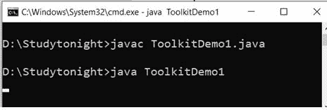 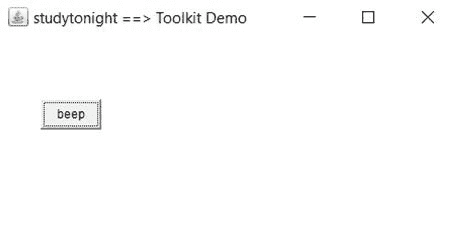

### 动作监听器接口

在 java 中，ActionListener 接口位于 **java.awt** 下。事件包。当您想要通知按钮或菜单项上的点击操作时，使用此界面。它有`actionPeformed()`法。

### 句法

```java
public abstract void actionPerformed(ActionEvent e)
```

### 以下是添加操作侦听器接口的三个步骤

**步骤 1:** 在类中实现 ActionListener 接口。

### 语法:

```java
public class ActionListenerDemo Implements ActionListener
```

**步骤 2:** 现在向监听器注册所有组件。

### 语法:

```java
component.addActionListener(instanceOfListenerclass);
```

**步骤 3:** 最后覆盖 actionPerformed()方法。

### 语法:

```java
 public void actionPerformed(ActionEvent e)
{  
           //statements
} 
```

### 示例:

我们可以使用动作监听器在 awt 组件中实现事件。事件可以是任何像:鼠标时钟，鼠标拖动等。在这个例子中，我们实现了 actionlistener。

```java
  import java.awt.BorderLayout;
import java.awt.event.ActionEvent;
import java.awt.event.ActionListener;
import javax.swing.JButton;
import javax.swing.JFrame;
import javax.swing.JTextArea;

public class ActionListenerDemo1 implements ActionListener {

  JButton aL_button;
  JFrame aL_frame;
  JTextArea aL_textArea;

  public ActionListenerDemo1() {
    aL_button = new JButton("Click Me");
    aL_frame = new JFrame("studytonight ==>ActionListener Demo");
    aL_textArea = new JTextArea(50, 50);

    aL_button.addActionListener(this);
    aL_textArea.setLineWrap(true);
    aL_frame.setLayout(new BorderLayout());
    aL_frame.add(aL_textArea, BorderLayout.NORTH);
    aL_frame.add(aL_button, BorderLayout.SOUTH);
    aL_frame.pack();

    aL_frame.setDefaultCloseOperation(JFrame.EXIT_ON_CLOSE);
    aL_frame.setVisible(true);
  }

  @Override
  public void actionPerformed(ActionEvent e) {
    aL_textArea.setText(aL_textArea.getText().concat("Welocme to studytonight.com\n"));
  }

  public static void main(String args[]) {
    ActionListenerDemo1 obj= new ActionListenerDemo1();
  }
} 

```

 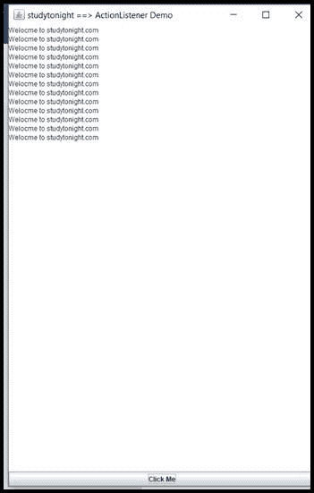

### 鼠标监听器接口

在 Java 中，MouseListener 接口在 java.awt.event 包下。当鼠标状态改变时，使用这个接口。它有以下 5 种方法:

1.公共抽象 void MouseClicked(MouseEvent e)；

2.公共抽象 void MouseEnTER(MouseEvent e)；

3.公共抽象 void MouseExIt(MouseEvent e)；

4.公共抽象 void MousePressed(MouseEvent e)；

5.公共抽象 void MouseReleased(MouseEvent e)；

### 示例:

```java
  import java.awt.*;  
import java.awt.event.*;  
public class MouseListenerDemo1 extends Frame implements MouseListener{
  Label mL_l;  
  MouseListenerDemo1(){
    addMouseListener(this);  

    mL_l=new Label();  
    mL_l.setBounds(10,20,500,100);  
    add(mL_l);  
    setSize(300,300);  
    setLayout(null);  
    setVisible(true);  
  }  
  public void mouseClicked(MouseEvent e) {  
    mL_l.setText("studytonight ==> Mouse Clicked");  
  }  
  public void mouseEntered(MouseEvent e) {  
    mL_l.setText("studytonight ==> Mouse Entered");  
  }  
  public void mouseExited(MouseEvent e) {  
    mL_l.setText("studytonight ==> Mouse Exited");  
  }  
  public void mousePressed(MouseEvent e) {  
    mL_l.setText("studytonight ==> Mouse Pressed");  
  }  
  public void mouseReleased(MouseEvent e) {  
    mL_l.setText("studytonight ==> Mouse Released");  
  }  
  public static void main(String[] args) {  
    new MouseListenerDemo1();  
  }  
} 

```

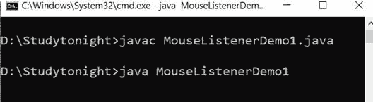 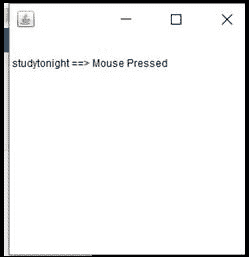

### mousemotionlistener 接口

在 Java 中，MouseMotionListener 接口在 **java.awt.event** 包下。每当移动或拖动鼠标时，都会使用此界面。它有以下两种方法:

1.公共抽象 void MouseDrawed(MouseEvent e)；

2.公共抽象 void Mousemoved(MouseEvent e)；

### 示例:

```java
  import java.awt.*;  
import java.awt.event.*;  
public class MouseMotionListenerDemo1 extends Frame implements MouseMotionListener{
  MouseMotionListenerDemo1(){
    addMouseMotionListener(this);  

    setSize(500,500);  
    setLayout(null);  
    setVisible(true);  
  }  
  public void mouseDragged(MouseEvent a) {  
    Graphics mM_g=getGraphics();  
    mM_g.setColor(Color.ORANGE);  
    mM_g.fillOval(a.getX(),a.getY(),10,10);  
  }  
  public void mouseMoved(MouseEvent e) {}  

  public static void main(String[] args) {  
    new MouseMotionListenerDemo1();  
  }  
} 

```

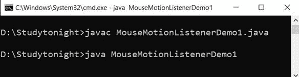 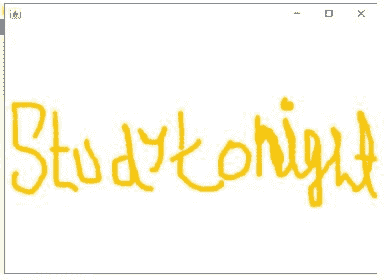

### 项目筛选器接口

在 Java 中，ItemListener 接口在 **java.awt.event** 包下。只要点击复选框，就会使用该界面。它有 itemStateChanged()方法。

### 语法:

```java
public abstract void itemStateChanged(ItemEvent e)
```

### 示例:

此界面用于处理项目侦听器事件，如:项目已选中或复选框已选中。在这个例子中，我们正在处理复选框选中事件。

```java
  import java.awt.*;    
import java.awt.event.*;    
public class ItemListenerDemo1 implements ItemListener{
  Checkbox iT_checkBox1,iT_checkBox2;  
  Label iT_label;  
  ItemListenerDemo1(){
    Frame iT_f= new Frame("studytonight ==>CheckBox Demo");    
    iT_label = new Label();            
    iT_label.setAlignment(Label.CENTER);    
    iT_label.setSize(400,100);    
    iT_checkBox1 = new Checkbox("Core Java");    
    iT_checkBox1.setBounds(100,100, 100,40);    
    iT_checkBox2 = new Checkbox("jsp");    
    iT_checkBox2.setBounds(100,150, 100,40);    
    iT_f.add(iT_checkBox1); 
    iT_f.add(iT_checkBox2); 
    iT_f.add(iT_label);    
    iT_checkBox1.addItemListener(this);    
    iT_checkBox2.addItemListener(this);    
    iT_f.setSize(400,400);    
    iT_f.setLayout(null);    
    iT_f.setVisible(true);    
  }    
  public void itemStateChanged(ItemEventiT) {      
    if(iT.getSource()==iT_checkBox1)  
      iT_label.setText("Core Java Checkbox: "+ (iT.getStateChange()==1?"checked":"unchecked"));   
    if(iT.getSource()==iT_checkBox2)  
      iT_label.setText("jsp Checkbox: "+ (iT.getStateChange()==1?"checked":"unchecked"));    
  }  
  public static void main(String args[])    
  {    
    new ItemListenerDemo1();    
  }    
} 

```

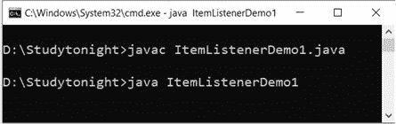 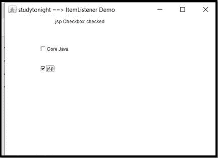

### KeyListener 接口

在 Java 中，KeyListener 接口在 java.awt.event 包下。当键的状态改变时，使用这个接口。它有以下三种方法:

1.公共抽象 void KeyPress(KeyEvent e)；

2.公共抽象 void KeyReleased(KeyEvent e)；

3.公共抽象 void KeyType(KeyEvent e)；

### 示例:

在这个例子中，我们使用 keylistener 接口来处理按键事件，可以是按键释放、键入等。请参见下面的示例。

```java
  import java.awt.*;  
import java.awt.event.*;  
public class KeyListenerDemo1 extends Frame implements KeyListener{
  Label kL_l;  
  TextArea kL_area;  
  KeyListenerDemo1(){

    kL_l=new Label();  
    kL_l.setBounds(20,50,500,20);  
    kL_area=new TextArea();  
    kL_area.setBounds(20,80,300, 300);  
    kL_area.addKeyListener(this);  

    add(kL_l);
    add(kL_area);  
    setSize(400,400);  
    setLayout(null);  
    setVisible(true);  
  }  
  public void keyPressed(KeyEvent e) {  
    kL_l.setText("studytonight ==> Key Pressed");  
  }  
  public void keyReleased(KeyEvent e) {  
    kL_l.setText("studytonight ==> Key Released");  
  }  
  public void keyTyped(KeyEvent e) {  
    kL_l.setText("studytonight ==> Key Typed");  
  }  

  public static void main(String[] args) {  
    new KeyListenerDemo1();  
  }  
} 

```

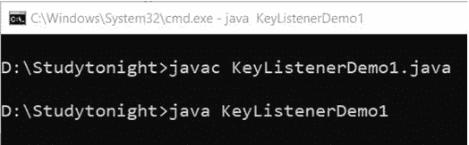 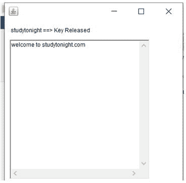

### 窗口侦听器接口

在 Java 中，WindowListener Interface 位于 java.awt.event 包下。当窗口的状态改变时，使用这个接口。它有以下 7 种方法:

1.公共抽象 void window activated(window event e)；

2.公共抽象 void window closed(window event e)；

3.公共抽象 void window closing(window event e)；

4.公共抽象 void window deactivated(window event e)；

5.公共抽象 void windowDeiconified(WindowEvent e)；

6.公共抽象 void windowIconified(WindowEvent e)；

7.公共抽象 void window open(window event e)；

### 示例:

在这个例子中，我们正在处理窗口事件，如:窗口打开，关闭等。

```java
  import java.awt.*;  
import java.awt.event.WindowEvent;  
import java.awt.event.WindowListener;  
public class WindowDemo1 extends Frame implements WindowListener
{  
  WindowDemo1()
  {  
    addWindowListener(this);  
    setSize(500,500);  
    setLayout(null);  
    setVisible(true);  
  }  

  public static void main(String[] args) 
  {  
    new WindowDemo1();  
  }  
  public void windowActivated(WindowEvent arg0) 
  {  
    System.out.println("studytonight ==> activated");  
  }  
  public void windowClosed(WindowEvent arg0) 
  {  
    System.out.println("studytonight ==> closed");  
  }  
  public void windowClosing(WindowEvent arg0) 
  {  
    System.out.println("studytonight ==> closing");  
    dispose();  
  }  
  public void windowDeactivated(WindowEvent arg0) 
  {  
    System.out.println("studytonight ==> deactivated");  
  }  
  public void windowDeiconified(WindowEvent arg0) 
  {  
    System.out.println("studytonight ==>deiconified");  
  }  
  public void windowIconified(WindowEvent arg0) 
  {  
    System.out.println("studytonight ==>iconified");  
  }  
  public void windowOpened(WindowEvent arg0) 
  {  
    System.out.println("studytonight ==> opened");  
  }  
} 

```

在控制台中，它会打印如下消息:今晚研究== >已打开研究今晚== >已激活研究今晚== >正在关闭研究今晚== >已停用研究今晚== >已关闭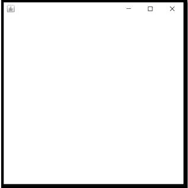

* * *