# Java Swing 组件和容器

> 原文：<https://www.studytonight.com/java/java-swing-components.php>

一个组件是一个独立的视觉控件，而 Java Swing 框架包含了一大组这样的组件，它们提供了丰富的功能并允许高级定制。它们都是从 JComponent 类派生的。所有这些组件都是轻量级组件。这个类提供了一些常见的功能，比如可插拔的外观、对可访问性的支持、拖放、布局等。

容器容纳一组组件。它提供了一个可以管理和显示组件的空间。容器有两种类型:

1.  **顶层容器**

*   它继承了 AWT 的组件和容器。
*   它不能包含在其他容器中。
*   重量级。
*   示例:JFrame、JDialog、JApplet

*   **Lightweight Containers**
    *   它继承了 JComponent 类。
    *   它是一个通用容器。
    *   它可以用来将相关组件组织在一起。
    *   示例:JPanel

    ### 摇摆 JButton

    ### JButton 类提供了按钮的功能。它用于创建按钮组件。JButton 类有三个构造器，

    ### JButton 的例子

    在这个例子中，我们使用 Jbutton 类创建了两个按钮，并将它们添加到 Jframe 容器中。

    ```java
    import javax.swing.*;
    import java.awt.event.*;
    import java.awt.*;
    public class testswing extends JFrame
    {

      testswing()
      {
        JButton bt1 = new JButton("Yes");             //Creating a Yes Button.
        JButton bt2 = new JButton("No");              //Creating a No Button.
        setDefaultCloseOperation(JFrame.EXIT_ON_CLOSE)     //setting close operation.
        setLayout(new FlowLayout());          //setting layout using FlowLayout object
        setSize(400, 400);                    //setting size of Jframe
        add(bt1);             //adding Yes button to frame.
        add(bt2);             //adding No button to frame.

        setVisible(true);
      }
      public static void main(String[] args)
      {
        new testswing();
      }
    } 
    ```

    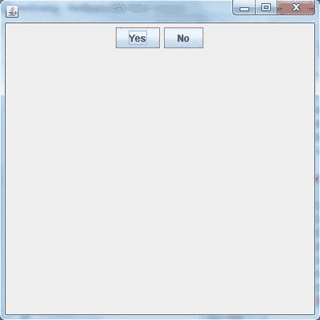

    ### jtextfield(jtextfield)

    **JTextField** 用于输入单行文本。它是使用最广泛的文本组件。它有三个构造器，

    ```java
    **JTextField**(int *cols*)
    **JTextField**(String *str*, int *cols*)
    **JTextField**(String *str*)
    ```

    *列*代表文本字段中的列数。

    ### 使用 JTextField 的示例

    在这个例子中，我们使用 JtextField 类创建文本字段，并将其添加到 jframe 容器中。

    ```java
    import javax.swing.*;
    import java.awt.event.*;
    import java.awt.*;
    public class MyTextField extends JFrame
    {
      public MyTextField()
      {
        JTextField jtf = new JTextField(20);  //creating JTextField.
        add(jtf);                             //adding JTextField to frame.
        setLayout(new FlowLayout());
        setDefaultCloseOperation(JFrame.EXIT_ON_CLOSE);
        setSize(400, 400);
        setVisible(true);
      }
      public static void main(String[] args)
      {
        new MyTextField();
      }
    } 
    ```

    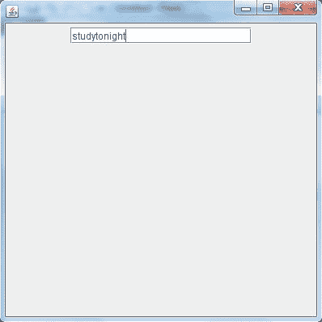

    ### 检验盒

    JcheckBox 类用于在 swing 框架中创建 checkBox。在这个例子中，我们创建了三个复选框来获得用户响应。

    ```java
    **JCheckBox**(String *str*)
    ```

    using JCheckBox

    ```java
    import javax.swing.*;
    import java.awt.event.*;
    import java.awt.*;
    public class Test extends JFrame
    {
      public Test()
      {
        JCheckBox jcb = new JCheckBox("yes");   //creating JCheckBox.
        add(jcb);                               //adding JCheckBox to frame.
        jcb = new JCheckBox("no");              //creating JCheckBox.
        add(jcb);                               //adding JCheckBox to frame.
        jcb = new JCheckBox("maybe");           //creating JCheckBox.
        add(jcb);                               //adding JCheckBox to frame.
        setLayout(new FlowLayout());
        setDefaultCloseOperation(JFrame.EXIT_ON_CLOSE);
        setSize(400, 400);
        setVisible(true);
      }
      public static void main(String[] args)
      {
        new Test();
      }
    } 
    ```

    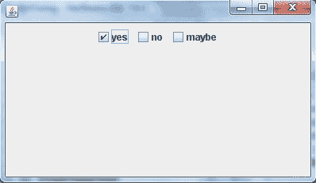

    ### 按钮

    单选按钮是一组相关按钮，其中只能选择一个。类用于在框架中创建一个单选按钮。下面是 JRadioButton 的构造器，

    ```java
    **JRadioButton**(String *str*)
    ```

    ### 使用 radiobutton 的示例

    为了在 swing 中创建单选按钮，我们使用了 jradiobutton 类。它用于一次获得单个用户响应。

    ```java
    import javax.swing.*;
    import java.awt.event.*;
    import java.awt.*;
    public class Test **extends** JFrame
    {
     public Test()
     {
      **JRadioButton jcb = new JRadioButton("A")**;	//creating JRadioButton.
      add(jcb);					//adding JRadioButton to frame.
      **jcb = new JRadioButton("B")**;			//creating JRadioButton.
      add(jcb);					//adding JRadioButton to frame.
      **jcb = new JRadioButton("C")**;			//creating JRadioButton.
      add(jcb);					//adding JRadioButton to frame.
      **jcb = new JRadioButton("none")**;
      add(jcb);
      setLayout(new FlowLayout());
      setDefaultCloseOperation(JFrame.EXIT_ON_CLOSE);
      setSize(400, 400);
      setVisible(true);
     }
     public static void main(String[] args)
     {
      new Test();
     }
    }
    ```

    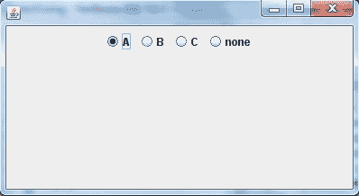

    ### jcombo box-jcombo 方块

    组合框是文本字段和下拉列表的组合。 **JComboBox** 组件用于在 Swing 中创建组合框。下面是 JComboBox 的构造器，

    ```java
    **JComboBox**(String *arr[]*)
    ```

    ### 使用 JComboBox 的示例

    让我们创建一个向 jframe 添加 combobox 的示例。组合框用于创建下拉菜单。见下面的例子。

    ```java
    import javax.swing.*;
    import java.awt.event.*;
    import java.awt.*;
    public class Test **extends** JFrame
    {
     String **name[]** = {"Abhi","Adam","Alex","Ashkay"};  //list of name.
     public Test()
     {
      **JComboBox jc = new JComboBox(name)**;	//initialzing combo box with list of name.
      add(jc);				//adding JComboBox to frame.
      setLayout(new FlowLayout());
      setDefaultCloseOperation(JFrame.EXIT_ON_CLOSE);
      setSize(400, 400);
      setVisible(true);
     }
     public static void main(String[] args)
     {
      new Test();
     }
    }
    ```

    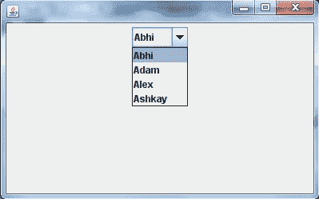

    ### 改变框架背景颜色的程序(使用动作事件)

    ```java
    import java.awt.*;  //importing awt package
    import javax.swing.*;  //importing swing package
    import java.awt.event.*;  //importing event package

    //For an event to occur upon clicking the button, ActionListener interface should be implemented
    class StColor extends JFrame implements ActionListener{

    JFrame frame;
    JPanel panel;
    JButton b1,b2,b3,b4,b5;

    StColor(){

       frame = new JFrame("COLORS");
       frame.setDefaultCloseOperation(JFrame.EXIT_ON_CLOSE);

       panel = new JPanel();  //Creating a panel which is a container and will hold all the buttons
       panel.setSize(100, 50);

       b1 = new JButton("BLUE");  //Creating a button named BLUE
       b1.addActionListener(this);  //Registering the button with the listener

       b2 = new JButton("RED");  //Creating a button named RED
       b2.addActionListener(this);  //Registering the button with the listener

       b3 = new JButton("CYAN");//Creating a button named CYAN
       b3.addActionListener(this);//Registering the button with the listener

       b4 = new JButton("PINK");  //Creating a button named PINK
       b4.addActionListener(this);  //Registering the button with the listener

       b5 = new JButton("MAGENTA");  //Creating a button named MAGENTA
       b5.addActionListener(this);  //Registering the button with the listener

       //Adding buttons to the Panel
       panel.add(b1);
       panel.add(b2);
       panel.add(b3);
       panel.add(b4);
       panel.add(b5);

       frame.getContentPane().add(panel);  //adding panel to the frame
       frame.setSize(500,300);
       frame.setVisible(true);
       frame.setLayout(new FlowLayout());

    }
    //The below method is called whenever a button is clicked
        @Override
        public void actionPerformed(ActionEvent e) {

            //This method returns an object of the button on which the Event-
            Pressing of button initially occurred
            Object see = e.getSource();

            if(see ==(b1)){  //Checking if the object returned is of button1
            frame.getContentPane().setBackground(java.awt.Color.blue);  //changing the panel color to blue
            }
            if(see == b2){  //Checking if the object returned is of button2
                frame.getContentPane().setBackground(java.awt.Color.red);  //changing the panel color to red
            }
            if(see == b3){  //Checking if the object returned is of button3
            frame.getContentPane().setBackground(java.awt.Color.cyan);//changing the panel color to cyan
            }
            if(see == b4){  //Checking if the object returned is of button4
                frame.getContentPane().setBackground(java.awt.Color.pink);  //changing the panel color to pink
            }
            if(see == b5){  //Checking if the object returned is of button5
            frame.getContentPane().setBackground(java.awt.Color.magenta);  //changing the panel color to magenta
            }
        }
    }

    class Test {
        public static void main(String[] args) {
            StColor o = new StColor();
        }
    }
    ```

    ### 输出:

    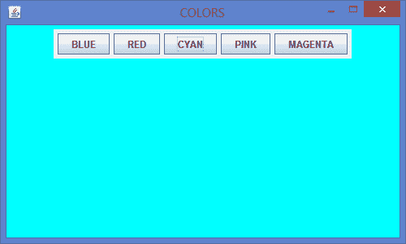

    ### JLabel

    在 Java 中，Swingtoolkit 包含一个 JLabel 类。它在 package javax.swing.JLabel 类下。它用于在框中放置文本。只允许单行文本，不能直接更改文本。

    ### 申报

    公共类 JLabel 扩展了 JComponent 实现了 SwingConstants，可访问

    ### JLabel 包含 4 个构造器。它们如下:

    1\. JLabel（）

    2\. JLabel（字符串）

    3\. JLabel（图标 i）

    4.字符串，图标，内部水平对齐

    ### 示例:

    ```java
      import javax.swing.*;  
    class SLabelDemo1  
    {  
    public static void main(String args[])  
    {  
        JFrame label_f= new JFrame("studytonight ==> Label Demo");  
        JLabel label_l1,label_l2;  
        label_l1=new JLabel("Welcome to studytonight.com");  
        label_l1.setBounds(50,50, 200,30);  
        label_l2=new JLabel("How are You?");  
        label_l2.setBounds(50,100, 200,30);  
        label_f.add(label_l1); 
        label_f.add(label_l2);  
        label_f.setSize(300,300);  
        label_f.setLayout(null);  
        label_f.setVisible(true);  
        }  
    } 

    ```

    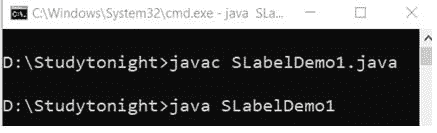 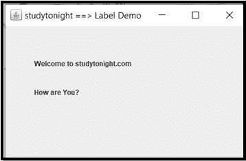

    ### JTextArea(人名)

    在 Java 中，Swing 工具包包含一个 JTextArea 类。它在 package javax.swing.JTextArea 类下。它用于显示多行文本。

    ### 申报

    公共类 JTextArea 扩展了 JTextComponent

    ### JTextArea 包含 4 个构造器。它们如下:

    1.JTextArea()

    2.字符串区域

    3.JTextArea(内部行，内部列)

    4.字符串，内部行，内部列

    ### 示例:

    让我们举个例子来创建文本区域。我们使用 JtextArea 类来创建文本区域并添加到 Jframe 容器中。

    ```java
      import javax.swing.*;  
    public class STextAreaDemo1  
    {  
        STextAreaDemo1()
      {  
            JFrame textArea_f= new JFrame();  
            JTextArea textArea_area=new JTextArea("Welcome to studytonight.com ");  
            textArea_area.setBounds(10,30, 200,200);  
            textArea_f.add(textArea_area);  
            textArea_f.setSize(400,400);  
            textArea_f.setLayout(null);  
            textArea_f.setVisible(true);  
            }  
    public static void main(String args[])  
        {  
       new STextAreaDemo1();  
    }
    } 

    ```

    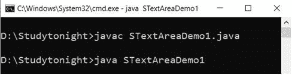 

    * * *

    ### jpassword field(jpassword 字段)

    在 Java 中，Swing 工具包包含一个 JPasswordField 类。它在 package javax . swing . jpasswordfield 类下。它专门用于密码，可以编辑。

    ### 申报

    公共类 JPasswordField 扩展了 JTextField

    ### JPasswordFieldContains 包含 4 个构造器。它们如下:

    1.jpasswordfield()

    2.JPasswordField(整数列)

    3.字符串字段(字符串文本)

    4.字符串文本，整型列

    ### 示例:

    为了生成密码组件，swing 提供了以加密格式接受用户输入的 Jpasswordfield。

    ```java
      import javax.swing.*;    
    public class SPasswordFieldDemo1 
    {  
        public static void main(String[] args) 
      {    
      JFrame passWord_f=new JFrame("studytonight ==> Password Field Demo");    
      JPasswordField passWord_value = new JPasswordField();   
      JLabel passWord_l1=new JLabel("Password ");    
            passWord_l1.setBounds(20,100, 100,30);    
            passWord_value.setBounds(100,100,100,30);    
            passWord_f.add(passWord_value);  
      passWord_f.add(passWord_l1);  
            passWord_f.setSize(300,300);    
            passWord_f.setLayout(null);    
            passWord_f.setVisible(true);     
      }  
    } 

    ```

    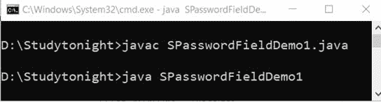 

    ### 组建

    在 Java 中，Swing 工具包包含一个 JTable 类。它在 package javax.swing.JTable 类下。它用于绘制表格来显示数据。

    ### jtable 包含两个构造器。它们如下:

    1.JTable()

    2.JTable(对象[]行，对象[]列)

    ### 示例:

    我们正在创建一个示例，使用 Jtable 类创建一个表，然后将其添加到 Jframe 容器中。

    ```java
      import javax.swing.*;    
    public class STableDemo1 
    {    
        JFrame table_f;    
        STableDemo1(){    
        table_f=new JFrame();    
        String table_data[][]={ {"1001","Cherry"}, {"1002","Candy"}, {"1003","Coco"}};    
        String table_column[]={"SID","SNAME"};         
        JTable table_jt=new JTable(table_data,table_column);    
        table_jt.setBounds(30,40,200,300);          
        JScrollPane table_sp=new JScrollPane(table_jt);    
        table_f.add(table_sp);          
        table_f.setSize(300,400);    
        table_f.setVisible(true);    
    }     
    public static void main(String[] args) 
    {    
        new STableDemo1();    
    }    
    } 

    ```

    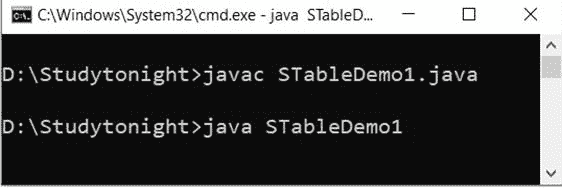 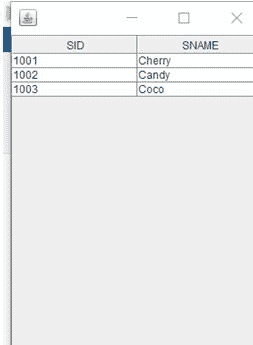

    ### 列表框

    在 Java 中，Swing 工具包包含一个 JList 类。它在 package javax.swing.JList 类下。它用于一起表示项目列表。可以从列表中选择一个或多个项目。

    ### 申报

    公共类 JList 扩展了 JComponent，实现了可滚动、可访问

    ### jlist 包含 3 个构造器。它们如下:

    1.JList()

    2\. JList（和[] listData）

    3.JList(列表模型<ary>数据模型)</ary>

    ### 示例:

    在这个例子中，我们使用 Jlist 类创建了一个项目列表。该列表用于以列表格式显示项目，并从项目列表中获取用户输入。见下面的例子。

    ```java
      import javax.swing.*;  
    public class SListDemo  
    {  
         SListDemo()
      {  
            JFrame list_f= new JFrame();  
            DefaultListModel<String> list_l1 = new DefaultListModel<>();  
            list_l1.addElement("Red");  
            list_l1.addElement("Pink");  
            list_l1.addElement("Blue");  
            list_l1.addElement("Black");  
            JList<String> list1 = new JList<>(list_l1);  
            list1.setBounds(100,100, 75,75);  
            list_f.add(list1);  
            list_f.setSize(400,400);  
            list_f.setLayout(null);  
            list_f.setVisible(true);  
         }  
    public static void main(String args[])  
        {  
      new SListDemo();  
        }
    } 

    ```

    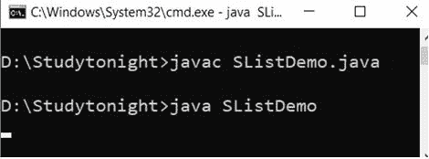 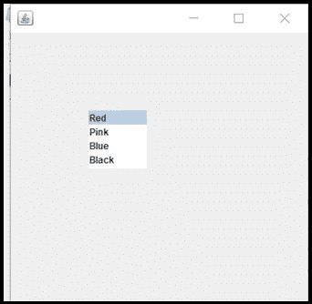

    * * *

    * * *