# Java Swing 组件和容器

> 原文：<https://www.studytonight.com/java/java-swing-components-1.php>

在上一个主题中，我们讨论了 swing 及其一些组件。现在，我们将介绍 swing 框架的其余组件。让我们从 JoptionPane 开始。

### jooption pane

在 Java 中，Swing 工具包包含一个 JOptionPane 类。它在 package javax . swing . JoOptionpane 类下。它用于创建显示消息、确认框或输入对话框的对话框。

### 申报

公共类 JOptionPane 扩展了 JComponent 实现可访问

### JOptionPaneContains 包含 3 个构造函数。它们如下:

1.JOptionPane()

2\. JOptionPane（对象消息）

3.JOptionPane(对象消息，intmessageType)

### 示例:

让我们举一个例子来创建 JoptionPane 来显示对话框。见下面的例子。

```java
  import javax.swing.*;  
public class SOptionPaneDemo
{  
  JFrameoptionPane_f;  
  SOptionPaneDemo()
  {  
    optionPane_f=new JFrame();  
    JOptionPane.showMessageDialog(optionPane_f,"Hello, Welcome to studytonight.com");  
  }  
  public static void main(String[] args) 
  {  
    new SOptionPaneDemo();  
  }  
} 

```

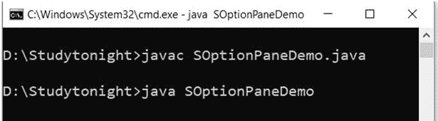 

### 示例:

让我们再举一个例子来理解 JoptionPane 的用法。这里我们创建了一个对话来向用户显示更新消息。

```java
  import javax.swing.*;  
public class SOptionPaneDemo
{  
  JFrame optionPane_f;  
  SOptionPaneDemo()
  {  
    optionPane_f=new JFrame();  
    JOptionPane.showMessageDialog(optionPane_f,"Successfully Updated.","studytonight",JOptionPane.WARNING_MESSAGE);     
  }  
  public static void main(String[] args) 
  {  
    new SOptionPaneDemo();  
  }  
} 

```

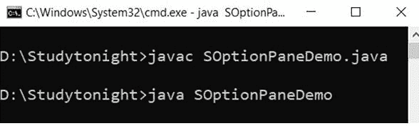 

### 示例:

我们可以使用 JoptionPane 创建用于获取用户输入的提示框。在这个例子中，我们创建了一个对话框来获取用户名。

```java
  import javax.swing.*;  
public class SOptionPaneDemo
{  
  JFrame optionPane_f;  
  SOptionPaneDemo()
  {  
    optionPane_f=new JFrame();  
    JOptionPane.showInputDialog(optionPane_f,"Enter your Name");     
  }  
  public static void main(String[] args) 
  {  
    new SOptionPaneDemo();  
  }  
} 

```

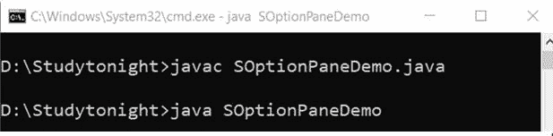 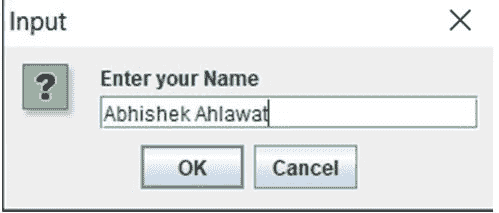

### JScrollBar

在 Java 中，Swing 工具包包含一个 JScrollBar 类。它在 package javax.swing.JScrollBar 类下。它用于添加水平和垂直滚动条。

### 申报

公共类 JScrollBar 扩展了 JComponent 实现可调整、可访问

### JScrollBarContains 包含 3 个构造函数。它们如下:

1\. JScrollBar（）

2.内部定向(JScrollBar)

3.JScrollBar(int 方向，int 值，int 范围，int min_，intmax_)

### 示例:

我们可以使用 swing JscrollBar 类来创建水平和垂直滚动条。在这个例子中，我们创建了水平和垂直滚动条。

```java
  import javax.swing.*;  
class SScrollBarDemo
{  
  SScrollBarDemo()
  {  
    JFrame scrollBar_f= new JFrame("studytonight ==> Scrollbar Demo");  
    JScrollBar scrollBar_s=new JScrollBar();  
    scrollBar_s.setBounds(100,100, 80,100);  
    scrollBar_f.add(scrollBar_s);  
    scrollBar_f.setSize(500,500);  
    scrollBar_f.setLayout(null);  
    scrollBar_f.setVisible(true);  
  }  
  public static void main(String args[])  
  {  
    new SScrollBarDemo();  
  }
} 

```

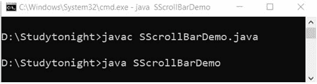 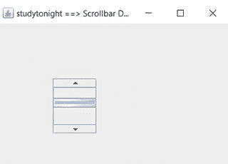

### 名字，名字，名字

在 Java 中，Swing 工具包包含一个 JMenuBar、JMenu 和 JMenuItem 类。它在 package javax.swing.JMenuBar、javax.swing.JMenu 和 javax.swing.JMenuItem 类下。JMenuBar 类用于在框架上显示菜单栏。JMenu 对象用于下拉菜单栏的组件。对象用于添加带标签的菜单项。

### 姓名、名称和名称声明

公共类 JMenuBar 扩展了 JComponent 实现的 MenuElement，可访问

公共类 JMenu 扩展 JMenuItem 实现 MenuElement，可访问

公共类 JMenuItem 扩展了 AbstractButton 实现了 Accessible，MenuElement

### 示例:

让我们举一个例子，在 swing jframe 容器中创建菜单和子菜单。见下面的例子。

```java
  import javax.swing.*;  
class SMenuDemo1  
{  
  JMenu m_menu, m_submenu;  
  JMenuItem menu_i1, menu_i2, menu_i3, menu_i4, menu_i5;  
  SMenuDemo1()
  {  
    JFrame menu_f= new JFrame("Menu and MenuItem Example");  
    JMenuBar menu_mb=new JMenuBar();  
    m_menu=new JMenu("Menu");  
    m_submenu=new JMenu("Sub Menu");  
    menu_i1=new JMenuItem("Red");  
    menu_i2=new JMenuItem("Pink");  
    menu_i3=new JMenuItem("Black");  
    menu_i4=new JMenuItem("Green");  
    menu_i5=new JMenuItem("White");  
    m_menu.add(menu_i1); 
    m_menu.add(menu_i2); 
    m_menu.add(menu_i3);  
    m_submenu.add(menu_i4); 
    m_submenu.add(menu_i5);  
    m_menu.add(m_submenu);  
    menu_mb.add(m_menu);  
    menu_f.setJMenuBar(menu_mb);  
    menu_f.setSize(500,500);  
    menu_f.setLayout(null);  
    menu_f.setVisible(true);  
  }  
  public static void main(String args[])  
  {  
    new SMenuDemo1();  
  }
} 

```

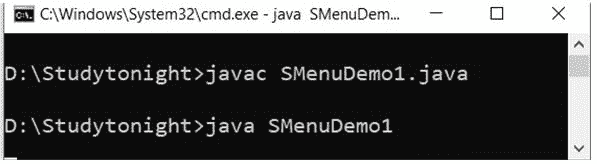 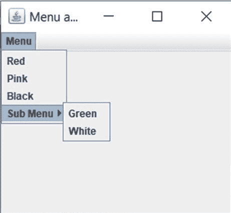

### JPopupMenu

在 Java 中，Swing 工具包包含一个 JPopupMenu 类。它在 package javax.swing.JPopupMenu 类下。它用于在指定位置动态创建弹出窗口。

### 申报

公共类 JPopupMenu 扩展了 JComponent 实现了 Accessible，MenuElement

### JPopupMenuContains 包含 2 个构造函数。它们如下:

1\. JPopupMenu（）

2\. JPopupMenu（字符串标签）

### 示例:

```java
  import javax.swing.*;  
import java.awt.event.*;  
class PopupMenuDemo
{  
  PopupMenuDemo(){  
    final JFrame pop_upf= new JFrame("studytonight ==>PopupMenu Demo");  
    final JPopupMenu popupmenu1 = new JPopupMenu("Edit");   
    JMenuItem pop_upcut = new JMenuItem("Cut");  
    JMenuItem pop_upcopy = new JMenuItem("Copy");  
    JMenuItem pop_uppaste = new JMenuItem("Paste");  
    popupmenu1.add(pop_upcut); 
    popupmenu1.add(pop_upcopy); 
    popupmenu1.add(pop_uppaste);        
    pop_upf.addMouseListener(new MouseAdapter() 
    {  
      public void mouseClicked(MouseEvent a) 
      {              
        popupmenu1.show(pop_upf ,a.getX(), a.getY());  
      }                 
    });  
    pop_upf.add(popupmenu1);   
    pop_upf.setSize(300,300);  
    pop_upf.setLayout(null);  
    pop_upf.setVisible(true);  
  }  
  public static void main(String args[])  
  {  
    new PopupMenuDemo();  
  }
} 

```

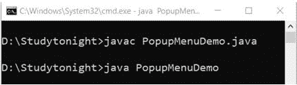 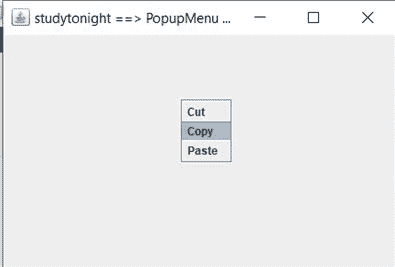

### 复选菜单项

在 Java 中，Swing 工具包包含一个 JCheckBoxMenuItem 类。它在 package javax . swing . jcheckbox menuitem 类下。它用于在菜单上创建复选框。

### JCheckBoxMenuItemContains 包含 2 个构造函数。它们如下:

1.JCheckBoxMenuItem()

2.jcheckboxmenuitem(动作 a)

3.jcheckboxmenuitem(图标)

4.jcheckboxmenuitem(字符串文本)

5.jcheckboxmenuitem(字符串文本，布尔型 b)

6.jcheckboxmenuitem(字符串文本图标)

7.jcheckboxmenuitem(字符串文本、图标、布尔 b)

### 示例:

```java
  import java.awt.event.ActionEvent;  
import java.awt.event.ActionListener;  
import java.awt.event.KeyEvent;  
import javax.swing.AbstractButton;  
import javax.swing.Icon;  
import javax.swing.JCheckBoxMenuItem;  
import javax.swing.JFrame;  
import javax.swing.JMenu;  
import javax.swing.JMenuBar;  
import javax.swing.JMenuItem;  

public class SCheckBoxDemo
{  
  public static void main(final String args[]) 
  {  
    JFrame checkbox_frame = new JFrame("studytonight ==>Jmenu Example");  
    checkbox_frame.setDefaultCloseOperation(JFrame.EXIT_ON_CLOSE);  
    JMenuBar checkbox_menuBar = new JMenuBar();  
    JMenu checkbox_fileMenu = new JMenu("File");  
    checkbox_fileMenu.setMnemonic(KeyEvent.VK_F);  
    checkbox_menuBar.add(checkbox_fileMenu);  
    JMenuItem checkbox_menuItem1 = new JMenuItem("Open", KeyEvent.VK_N);  
    checkbox_fileMenu.add(checkbox_menuItem1);  

    JCheckBoxMenuItem checkbox_caseMenuItem = new JCheckBoxMenuItem("Option_1");  
    checkbox_caseMenuItem.setMnemonic(KeyEvent.VK_C);  
    checkbox_fileMenu.add(checkbox_caseMenuItem);  

    ActionListener checkbox_aListener = new ActionListener() 
    {  
      public void actionPerformed(ActionEvent event) 
      {  
        AbstractButton checkbox_aButton = (AbstractButton) event.getSource();  
        boolean checkbox_selected = checkbox_aButton.getModel().isSelected();  
        String checkbox_newLabel;  
        Icon checkbox_newIcon;  
        if (checkbox_selected) {  
          checkbox_newLabel = "Value-1";  
        } else {  
          checkbox_newLabel = "Value-2";  
        }  
        checkbox_aButton.setText(checkbox_newLabel);  
      }  
    };  

    checkbox_caseMenuItem.addActionListener(checkbox_aListener);  
    checkbox_frame.setJMenuBar(checkbox_menuBar);  
    checkbox_frame.setSize(350, 250);  
    checkbox_frame.setVisible(true);  
  }  
} 

```

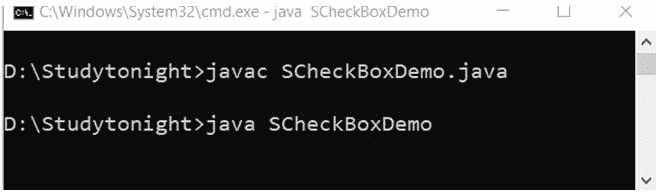 

### JSeparator

在 Java 中，Swing 工具包包含一个 JSeparator 类。它在 package javax.swing.JSeparator 类下。它用于在两个组件之间创建分隔线。

### 申报

公共类 JSeparator 扩展 JComponent 实现 SwingConstants，可访问

### JSeparatorContains 包含 2 个构造函数。它们如下:

1\. JSeparator（）

2.JSeparator(面向内部)

### 示例:

```java
  import javax.swing.*;    
class SeparatorDemo
{    
  JMenu sep_menu, sep_submenu;    
  JMenuItem sep_i1, sep_i2, sep_i3, sep_i4, sep_i5;    
  SeparatorDemo()  
  {    
    JFrame sep_f= new JFrame("Separator Example");    
    JMenuBar sep_mb=new JMenuBar();    
    sep_menu = new JMenu("Menu");    
    sep_i1=new JMenuItem("Black");    
    sep_i2=new JMenuItem("White");       
    sep_menu.add(sep_i1);  
    sep_menu.addSeparator();  
    sep_menu.add(sep_i2);  
    sep_mb.add(sep_menu);    
    sep_f.setJMenuBar(sep_mb);    
    sep_f.setSize(500,500);    
    sep_f.setLayout(null);    
    sep_f.setVisible(true);    
  }    
  public static void main(String args[])    
  {    
    new SeparatorDemo();    
  }
} 

```

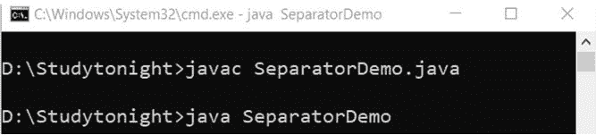 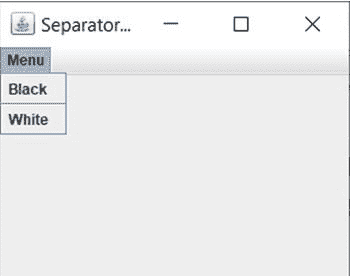

* * *

### 进程条

在 Java 中，Swing 工具包包含一个 JProgressBar 类。它位于 package javax . swing . jprogressbarclass 下，用于创建任务的进度条。

### 申报

公共类 JProgressBar 扩展了 JComponent 实现 SwingConstants，可访问

### JProgressBarContains 包含 4 个构造函数。它们如下:

1.JProgressBar()

2 . jprogressbar(内部最小值、内部最大值)

3 . jprogressbar(内部东方)

4.jpprogress(int orient、int min、int max)

### 示例:

```java
  import javax.swing.*;    
public class ProgressBarDemo extends JFrame
{    
  JProgressBar progBar_jb;    
  int progBar_i=0, progBar_num=0;     
  ProgressBarDemo()
  {    
    progBar_jb=new JProgressBar(0,2000);    
    progBar_jb.setBounds(40,40,180,30);         
    progBar_jb.setValue(0);    
    progBar_jb.setStringPainted(true);    
    add(progBar_jb);    
    setSize(250,150);    
    setLayout(null);    
  }    
  public void iterate()
  {    
    while(progBar_i<=2000)
    {    
      progBar_jb.setValue(progBar_i);    
      progBar_i = progBar_i + 10;    
      try
      {
        Thread.sleep(150);
      }
      catch(Exception e){}    
    }    
  }    
  public static void main(String[] args) {    
    ProgressBarDemo obj=new ProgressBarDemo();    
    obj.setVisible(true);    
    obj.iterate();    
  }    
} 

```

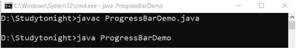 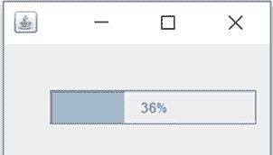

### 树形结构

在 Java 中，Swing 工具包包含一个 JTree 类。它位于包 javax.swing.JTreeclass 下，用于创建树结构的数据。这是一个非常复杂的组件。

### 申报

公共类 JTree 扩展了 JComponent，实现了可滚动、可访问

### jtree 包含 3 个构造函数。它们如下:

1.JTree()

2.对象[]值

3\. J 树（树节点根）

### 示例:

在这个例子中，我们创建了一个显示目录的树形菜单结构。我们使用 Jtree 类来创建树结构。见下面的例子。

```java
  import javax.swing.*;  
import javax.swing.tree.DefaultMutableTreeNode;  
public class TreeDemo
{  
  JFrame tree_f;  
  TreeDemo()
  {  
    tree_f=new JFrame();   
    DefaultMutableTreeNode tree_style=new DefaultMutableTreeNode("Style");  
    DefaultMutableTreeNode tree_color=new DefaultMutableTreeNode("color");  
    DefaultMutableTreeNode tree_font=new DefaultMutableTreeNode("font");  
    tree_style.add(tree_color);  
    tree_style.add(tree_font);  
    DefaultMutableTreeNode tree_red=new DefaultMutableTreeNode("red");  
    DefaultMutableTreeNode tree_blue=new DefaultMutableTreeNode("blue");  
    DefaultMutableTreeNode tree_black=new DefaultMutableTreeNode("black");  
    DefaultMutableTreeNode tree_green=new DefaultMutableTreeNode("green");  
    tree_color.add(tree_red); 
    tree_color.add(tree_blue); 
    tree_color.add(tree_black); 
    tree_color.add(tree_green);      
    JTree tree_jt=new JTree(tree_style);  
    tree_f.add(tree_jt);  
    tree_f.setSize(200,200);  
    tree_f.setVisible(true);  
  }  
  public static void main(String[] args) {  
    new TreeDemo();  
  }
} 

```

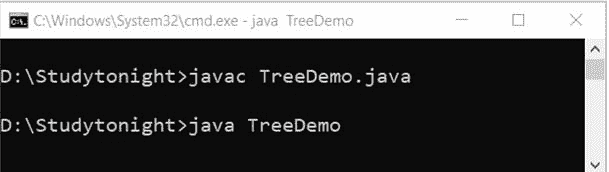 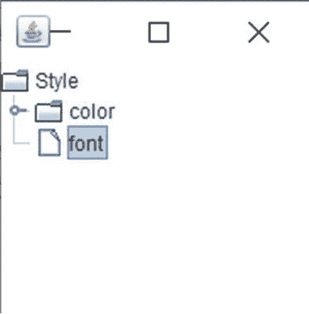

* * *