# Java 包装类

> 原文：<https://www.studytonight.com/java/wrapper-class.php>

在 Java 中，包装类用于将原始类型数据类型转换为对象，并将对象转换为原始类型数据类型。对于每个原始数据类型，都有一个预定义的类，称为 包装类。从 J2SE 5.0 版本开始，自动装箱和拆箱功能用于将原始数据类型自动转换为对象，并将对象自动转换为原始数据类型。

### 为什么要使用包装类？

我们知道，在 Java 中，当用户给出输入时，它是以字符串的形式。为了将字符串转换成不同的数据类型，使用了 包装类。

当我们想要将原始类型转换为对象或者相反时，每次都可以使用包装类。

以下是原始数据类型及其包装类名和用于对话的方法。

| 原始数据类型 | 类包装 Name | 转换方法 |
| 字节 | 字节 | 公共静态字节解析字节(字符串) |
| 短的 | 短的 | 公共静态短解析短(字符串) |
| （同 Internationalorganizations）国际组织 | 整数 | 公共静态整数解析整数(字符串) |
| 长的 | 长的 | 公共静态长解析长(字符串) |
| 漂浮物 | 浮动 | 公共静态浮点解析浮点(字符串) |
| 两倍 | 两倍 | 公共静态双解析双(字符串) |
| 茶 | 性格；角色；字母 |  |
| 布尔 | 布尔代数学体系的 | 公共静态布尔解析布尔(字符串) |

在 Java 中，所有的原始包装类都是不可变的。创建新对象时，旧对象不会被修改。下面是一个例子来证明这个概念。

### 示例:

```java
	 class WrapperPrimitiveDemo1 
{ 
    public static void main(String[] args) 
    { 
        Integer a = new Integer(12); 
        System.out.println("Old value = "+a); 
        xyz(a); 
        System.out.println("New Value = "+a); 
    } 
    private static void xyz(Integer a) 
    { 
        a = a + 10; 
    } 
} 

```

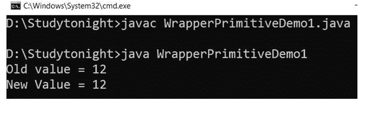

### 数字类

Java Number 类是所有数值包装类中的超级类。有 6 个子类，你可以通过跟随图片得到想法。

Number 类包含一些为所有子类提供通用操作的方法。

### 下面是 Number 类的方法和例子

### 1.值()方法

此方法用于将数值对象转换为基本数据类型。例如，我们可以将一个整型对象转换为整型，或者将一个双精度对象转换为浮点型。value()方法适用于每种基元类型，语法如下。

### 语法:

```java
	 byte byteValue()
short shortValue()
int intValue()
long longValue()
float floatValue()
double doubleValue() 

```

### 示例:

这里我们使用了几种方法，如:`byteValue(), intValue(), floatValue()`等，将对象类型转换为基本类型。double 类型对象用于获取不同类型的基元值。

```java
	 public class NumberDemo1
{ 
    public static void main(String[] args)  
    { 
        Double d1 = new Double("4.2365"); 
        byte b = d1.byteValue();  
        short s = d1.shortValue();  
        int i = d1.intValue();  
        long l = d1.longValue();  
        float f = d1.floatValue();  
        double d = d1.doubleValue();  

        System.out.println("converting Double to byte : " + b); 
        System.out.println("converting Double to short : " + s); 
        System.out.println("converting Double to int : " + i); 
        System.out.println("converting Double to long : " + l); 
        System.out.println("converting Double to float : " + f); 
        System.out.println("converting Double to double : " + d1); 
    } 
} 

```


### Java `Integer`类

Java Integer 类用于处理整数对象。它提供了可用于将基元转换为对象的方法，反之亦然。

它将一个基元类型的值包装在一个对象中。这个类提供了几种将 int 转换为 String 和将 String 转换为 int 的方法，以及在使用 int 时有帮助的其他常量和方法。

它位于 **java.lang** pakage 和 **java.base** 模块中。下面给出了这个类的声明。

### 申报

```java
public final class Integer extends Number implements Comparable<Integer>
```

下面讨论`Integer`类的方法和例子。

### 1.toString()方法

此方法返回一个 String 对象，表示该整数的值。该值被转换为带符号的十进制表示形式，并作为字符串返回。它覆盖了对象类的`toString()`方法。

它不接受任何参数，但返回以 10 为基数的该对象值的字符串表示形式。下面给出了该方法的语法。

```java
	 public String toString(int b) 

```

### 示例:

在这个例子中，我们使用 toString 方法来获取 Integer 对象的字符串表示。

```java
	 public class IntegerClassDemo1  
{ 
    public static void main(String args[])  
    { 
		int a = 95;
        Integer x = new Integer(a); 
		System.out.println("toString(a) = " + Integer.toString(a));           
    } 
} 

```

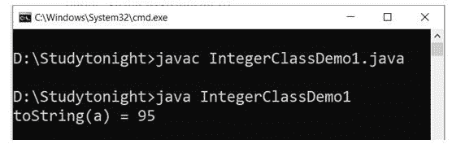

### 2\. 十六进制字符串（）

`toHexString()`方法用于获取整数参数的字符串表示形式，以 16 为基数表示无符号整数。

此方法接受 int 类型的参数，并返回一个十六进制字符串。下面给出了该方法的语法。

### 语法:

```java
	 public String toHexString(int b) 

```

### 示例:

我们正在使用 toHexString()方法获取 int 值的十六进制字符串值。在这个例子中，我们传递了 95 作为参数，得到了 5f 作为十六进制字符串。见下面的例子。

```java
	 public class IntegerClassDemo1  
{ 
    public static void main(String args[])  
    { 
		int a = 95;
        Integer x = new Integer(a); 
		System.out.println("toHexString(a) = " + Integer.toHexString(a));           
    } 
} 

```

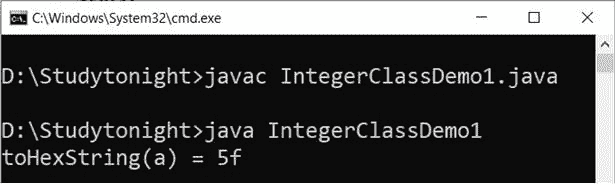

### 3.toOctalString()

当我们想要获取 int 类型值的八进制字符串表示时，此方法很有帮助。

它可用于获取整数参数的字符串表示形式，即以 8 为基数的无符号整数。

它接受 int 类型的参数，并返回该参数的无符号字符串表示形式。下面给出了该方法的语法。

### 语法:

```java
	 public String toOctalString(int b) 

```

### 示例:

让我们举一个例子来获取一个 int 值的八进制值。这里我们将 95 传递给`toOctalString()`方法，并得到它的八进制值 135。

```java
	 public class IntegerClassDemo1  
{ 
    public static void main(String args[])  
    { 
		int a = 95;
        Integer x = new Integer(a); 
		System.out.println("toOctalString(a) = " + Integer.toOctalString(a));           
    } 
} 

```

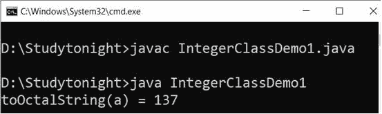

### 4.toBinaryString()

`toBinaryString()`方法用于获取整数参数的字符串表示形式，作为基数为 2 的无符号整数。

它采用整数参数，并返回无符号整数值的字符串表示形式。下面给出了该方法的语法。

### 语法:

```java
	 public String toBinaryString(int b) 

```

### 示例:

在这个例子中，我们使用 toBinaryString()方法来获取一个 int 值的二进制。这是获取整数值二进制的有效方法。

```java
	 public class IntegerClassDemo1  
{ 
    public static void main(String args[])  
    { 
		int a = 95;
        Integer x = new Integer(a); 
		System.out.println("toBinaryString(a) = " + Integer.toBinaryString(a));           
    } 
} 

```

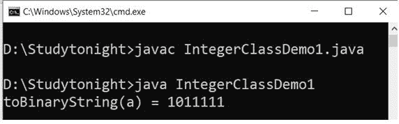

### 5.valueOf()

`valueOf()`方法用于获取表示指定 int 值的 Integer 对象。它接受一个 int 类型的参数，并返回一个 Integer 实例。下面给出了该方法的语法。

### 语法:

```java
	 public static Integer valueOf(int b) 

```

### Exmaple(前枫树镇)：

```java
	 public class IntegerClassDemo1  
{ 
    public static void main(String args[])  
    { 
		int a = 95;
        Integer x = Integer.valueOf(a); 
		System.out.println("valueOf(a) = " + x);           
    } 
} 

```

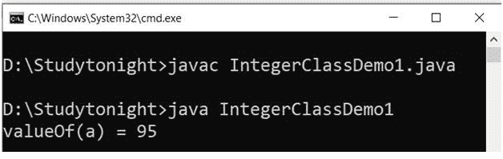

### 6.parseInt()

`parseInt()`方法用于将指定的字符串参数解析为带符号的十进制整数。字符串中的字符必须都是十进制数字。

它接受`String`类型的单个参数，并返回一个 int 值。

### 语法:

```java
	 public static intparseInt(String val, int radix) throws NumberFormatException 

```

### 示例:

在下面的例子中，我们将一个包含数字的字符串传递给`parseInt()`方法。方法返回与字符串对应的 int 值。

```java
	 public class IntegerClassDemo1  
{ 
    public static void main(String args[])  
    { 
        String a = "95";
        Integer x = Integer.parseInt(a); 
		System.out.println("parseInt(a) = " + x);           
    } 
} 

```

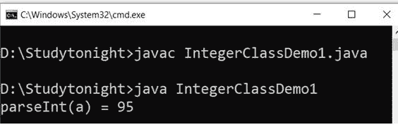

### 7 .整数()

### 语法:

```java
	 public static Integer getInteger(String prop) 

```

### 示例:

```java
	 public class IntegerClassDemo1  
{ 
    public static void main(String args[])  
    { 
		int a = Integer.getInteger("sun.arch.data.model");
		System.out.println("getInteger(sun.arch.data.model) = " + a);           
    } 
} 

```

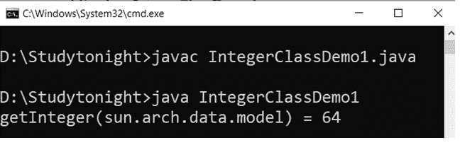

### 8.解码()

`decode()`方法用于将字符串解码为整数。它接受可以是十进制、十六进制和八进制数的`String`类型参数，并返回`Integer`类的实例。下面给出了该方法的语法。

### 语法:

```java
	 public static Integer decode(String s)
             throws NumberFormatException 

```

### 示例:

在本例中，我们使用不同类型的数值对其进行解码并获得整数实例。

```java
	 public class IntegerClassDemo1  
{ 
    public static void main(String args[])  
    { 
        String a = "55";
		String b = "004";
		String c = "0x0f";

		Integer a1 = Integer.decode(a); 
		System.out.println("decode(55) = " + a1); 
		a1 = Integer.decode(b); 
		System.out.println("decode(004) = " + a1); 
		a1 = Integer.decode(c); 
		System.out.println("decode(0x0f) = " + a1);           
    } 
} 

```

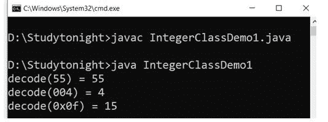

### 9.旋转垂直()和旋转垂直()

这两种方法用于将指定 int 值的二进制补码表示向左或向右旋转指定的位数。

### 语法:

```java
	 public static introtateLeft(intval, intdist)
public static introtateRight(intval, intdist) 

```

### 示例:

```java
	 public class IntegerClassDemo1  
{ 
    public static void main(String args[])  
    { 
        int a = 5;
        System.out.println("rotateLeft = "+ Integer.rotateLeft(a, 5));
        System.out.println("rotateRight = "+ Integer.rotateRight(a, 4));            
    } 
} 

```

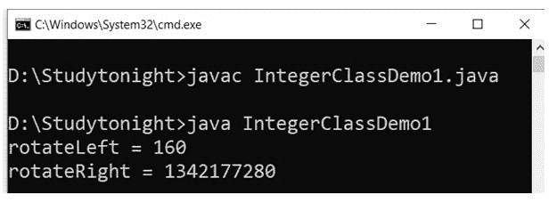

### Java `Long`类

long 类是一个包装类，用于包装对象中的基元类型 Long 的值。long 类型的对象包含类型为 Long 的单个字段。

此外，这个类提供了几种将 long 转换为 String 的方法，反之亦然。该类的声明如下。

### 申报

```java
public final class Long extends Number implements Comparable<Long>
```

该类位于 **java.lang** 包和 **java.base** 模块中。下面我们就用龙课堂的例子来讨论一下他们的方法。

### 1.toString()

此方法返回一个 String 对象，表示这个 Long 的值。该值被转换为带符号的十进制表示形式，并作为字符串返回。它覆盖了对象类的`toString()`方法。

它不接受任何参数，但返回以 10 为基数的该对象值的字符串表示形式。下面给出了该方法的语法。

### 语法:

```java
	 public String toString(long b) 

```

### 示例:

```java
	 public class LongDemo1
{
	public static void main(String as[])
	{
		long a = 25;
		System.out.println("toString(a) = " + Long.toString(a));
	}
} 

```

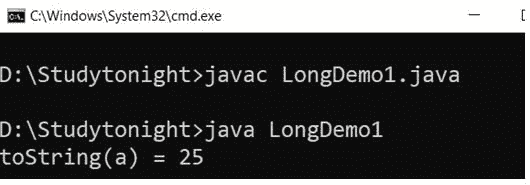

### 2\. 十六进制字符串（）

`toHexString()`方法用于获取长参数的字符串表示。

此方法接受一个`Long`类型的参数，并返回一个十六进制字符串。下面给出了该方法的语法。

### 语法:

```java
	 public String toHexString(long b) 

```

### 3.toOctalString()

当我们想要获得`Long`类型值的八进制字符串表示时，这个方法很有帮助。

它可以用来获取长参数的字符串表示形式。

它接受一个`Long`类型参数，并返回该参数的无符号字符串表示形式。下面给出了该方法的语法。

### 语法:

```java
	 public String toOctalString(long b) 

```

### 4.toBinaryString()

`toBinaryString()`方法用于获取长参数的字符串表示形式，以 2 为基数的无符号整数表示。

它接受一个长参数，并返回无符号长值的字符串表示形式。下面给出了该方法的语法。

### 语法:

```java
	 public String toBinaryString(long b) 

```

### 示例:

我们正在使用`toHexString()`方法获取一个长值的十六进制字符串值。在这个例子中，我们传递了 25 作为参数，并得到了它的二进制、十六进制和八进制字符串。见下面的例子。

```java
	 public class LongDemo1
{
	public static void main(String as[])
	{
		long a = 25;
		System.out.println("toHexString(a) =" + Long.toHexString(a)); 
		System.out.println("toOctalString(a) =" + Long.toOctalString(a)); 
		System.out.println("toBinaryString(a) =" + Long.toBinaryString(a)); 
	}
} 

```

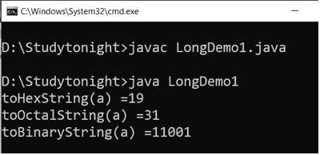

### 5.valueOf()

`valueOf()`方法用于获取表示指定长值的长对象。它接受一个`Long`类型参数并返回一个长实例。下面给出了该方法的语法。

### 语法:

```java
	 public static Long valueOf(long b) 

```

### 示例:

```java
	 public class LongDemo1
{
	public static void main(String as[])
	{
		long a = 25;
		String b = "45";
		Long x = Long.valueOf(a); 
		System.out.println("valueOf(a) = " + x); 
		x = Long.valueOf(b); 
		System.out.println("ValueOf(b) = " + x); 
		x = Long.valueOf(b, 6); 
		System.out.println("ValueOf(b,6) = " + x); 		
	}
} 

```

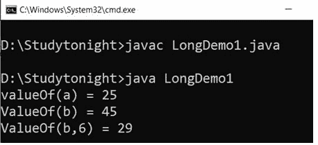

### 6\. 解析龙（）

`parseLong()`方法用于将指定的字符串参数解析为带符号的十进制长整型。字符串中的字符必须都是十进制数字。

它接受`String`类型的单个参数，并返回一个 Long 值。

### 语法:

```java
	 public static long parseInt(String val, int radix) throws NumberFormatException 

```

### 示例:

在下面的例子中，我们将一个包含数字的字符串传递给`parseLong()`方法。方法返回对应于字符串的长值。

```java
	 public class LongDemo1
{
	public static void main(String as[])
	{
		long a = 25;
		String b = "45";
		Long x = Long.parseLong(b); 
		System.out.println("parseLong(b) = " + x); 
		x = Long.parseLong(b, 6); 
		System.out.println("parseLong(b,6) = " + x); 		
	}
} 

```

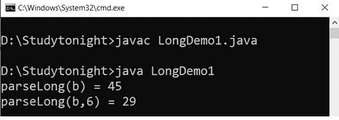

### 7 .格龙()

`getLong()`方法用于确定指定名称的系统属性的长值。它采用指定属性名称的字符串参数，并返回一个 Long 值。下面给出了该方法的语法。

### 语法:

```java
	 public static Long getLong(String prop) 

```

### 示例:

```java
	 public class LongDemo1
{
	public static void main(String as[])
	{
		long a = Long.getLong("sun.arch.data.model"); 
		System.out.println("getLong(sun.arch.data.model) = " + a); 
		System.out.println("getLong(abcd) =" + Long.getLong("abcd"));
	}
} 

```

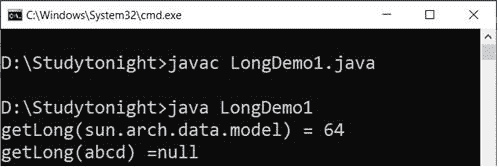

### 8 .解码()

`decode()`方法用于将字符串解码为长字符串。它接受可以是十进制、十六进制和八进制数的`String`类型参数，并返回 Long 类的实例。下面给出了该方法的语法。

### 语法:

```java
	 public static Long decode(String s) throws NumberFormatException 

```

### 示例:

在这个例子中，我们使用不同类型的数值来解码和获取长实例。

```java
	 public class LongDemo1
{
	public static void main(String as[])
	{
	String a = "25"; 
        String b = "007"; 
        String c = "0x0f"; 

        Long x = Long.decode(a); 
		System.out.println("decode(25) = " + x); 
		x = Long.decode(b); 
		System.out.println("decode(007) = " + x); 
		x = Long.decode(c); 
		System.out.println("decode(0x0f) = " + x); 	
	}
} 

```

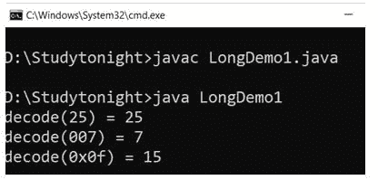

### 9.旋转垂直()和旋转垂直()

这两种方法用于将指定长值的二进制补码表示向左或向右旋转指定的位数。

### 语法:

```java
	 public static long rotateLeft(long val, int dist)       
public static long rotateRight(long val, int dist) 

```

### 示例:

```java
	 public class LongDemo1
{
    public static void main(String as[])
    {
	    long a = 3;
	    System.out.println("rotateLeft(0000 0000 0000 0011 , 3) =" + Long.rotateLeft(a, 3));    
	    System.out.println("rotateRight(0000 0000 0000 0011 , 3) =" + Long.rotateRight(a, 3));          
    }
} 

```

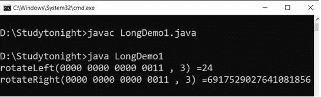

* * *