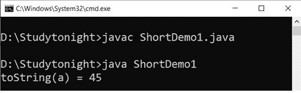
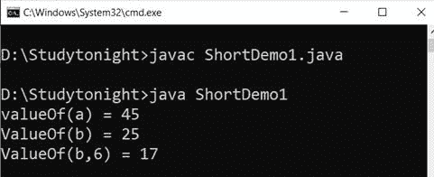
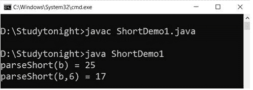
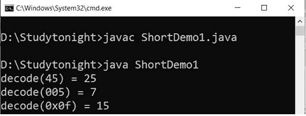
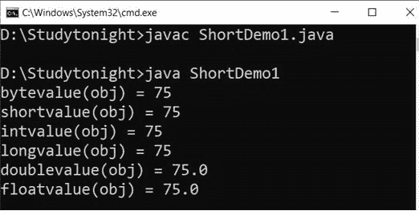
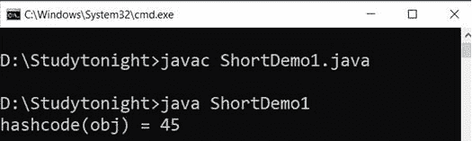
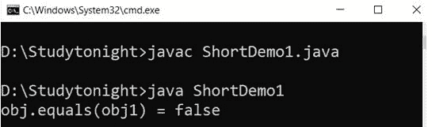
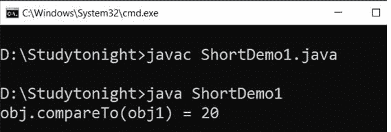
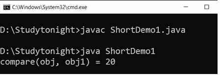
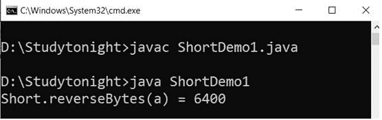

# Java 短类

> 原文：<https://www.studytonight.com/java/short-class.php>

Short 类是一个包装类，用于包装对象类型中基本 short 类型值。

类型为“短”的对象包含类型为“短”的单个字段。

此类提供了几种将短字符串转换为字符串和将字符串转换为短字符串的方法，以及在使用短类型时有帮助的其他常量和方法。简短类型的声明如下。

### 声明:

```java
public final class Short extends Number implements Comparable<Short>
```

下面是短训班的方法和他们的例子。

### 1.toString()

此方法用于获取字节对象的字符串表示形式。它返回一个新的 String 对象，表示指定的短字符串。它采用字符串类型单参数。

### 语法:

```java
	 public String toString(short b) 

```

### 示例:

在这个例子中，我们使用`toString()`方法来获得短类型对象的字符串表示。

```java
	 public class ShortDemo1 
{ 
    public static void main(String[] args)  
	{ 
        short a = 45;
		String b ="25";
		Short obj = new Short(a);
		Short obj1 = new Short(b);
		System.out.println("toString(a) = " + Short.toString(a));
	}
} 

```



### 2.valueOf()

此方法返回表示指定短值的短实例。该方法通常应优先于构造函数 Short(short)使用。它接受一个短类型的参数。

### 语法:

```java
	 public static Short valueOf(short b) 

```

### 示例:

在这个例子中，我们使用`valueOf()`方法返回代表指定短类型的短类实例。

```java
	 public class ShortDemo1 
{ 
    public static void main(String[] args)  
	{ 
        short a = 45;
		String b ="25";
		Short obj = new Short(a);
		Short obj1 = new Short(b);
		Short x = Short.valueOf(a); 
		System.out.println("valueOf(a) = " + x); 
        x = Short.valueOf(b); 
		System.out.println("ValueOf(b) = " + x); 
        x = Short.valueOf(b, 6); 
		System.out.println("ValueOf(b,6) = " + x); 
	}
} 

```



### 3.parseShort()

此方法返回指定字符串值的短值。我们可以用它从字符串类型值中获取一个短值。它需要两个参数:一个是 String 类型，第二个是 int 类型。

### 语法:

```java
	 public static short parseShort(String val, int radix) throws NumberFormatException 

```

### 示例:

让我们举一个例子，其中我们有一个字符串类型的变量，并使用`parseShort()`方法获得它的短值。

```java
	 public class ShortDemo1 
{ 
    public static void main(String[] args)  
	{ 
        short a = 45;
		String b ="25";
		Short obj = new Short(a);
		Short obj1 = new Short(b);
		Short x = Short.parseShort(b); 
		System.out.println("parseShort(b) = " + x);  
        x = Short.valueOf(b, 6); 
		System.out.println("parseShort(b,6) = " + x); 
	}
} 

```



### 4.解码()

此方法用于将字符串解码为短字符串。它接受十进制、十六进制和八进制数字。它接受一个字符串类型的参数。

```java
	 public static Short decode(String s) throws NumberFormatException 

```

### 示例:

我们可以使用 decode 方法将字符串类型解码为一个短对象。见下面的例子。

```java
	 public class ShortDemo1 
{ 
    public static void main(String[] args)  
	{ 
        String a = "25"; 
        String b = "007"; 
        String c = "0x0f"; 
        Short x = Short.decode(a); 
		System.out.println("decod(45) = " + x); 
        x = Short.decode(b); 
		System.out.println("decode(005) = " + x); 
        x = Short.decode(c); 
		System.out.println("decode(0x0f) = " + x); 
	}
} 

```



### 5\. 字节值（）

此方法用于从 Short 对象中获取基元类型字节值。在转换为类型字节后，它返回由该对象表示的数值。

### 语法:

```java
	 public byte byteValue() 

```

### 6\. 短值（）

此方法将此 Short 的值作为扩展基元转换后的短值返回。

### 语法:

```java
	 public short shortValue() 

```

### 7\. intValue（）

`intValue()`方法在扩展原语转换后，将此 Short 的值作为原语 int 类型返回。

### 语法:

```java
	 Syntax : public int intValue() 

```

### 8\. 长值（）

`longValue()`方法在扩展原语转换后，将此短类型的值作为长类型返回。

### 语法:

```java
	 public long longValue() 

```

### 9.doubleValue()

它在扩展基元转换后将此短类型的值作为双精度类型返回。

### 语法:

```java
	 public double doubleValue() 

```

### 10\. 浮点值（）

此方法用于在扩展基元转换后将此短类型的值作为浮点类型获取。

### 语法:

```java
	 public float floatValue() 

```

### 示例:

让我们举一个例子，将短类型转换为 int、long 和 float 类型的值。在这个例子中，我们使用`intValue(), floatValue(), doubleValue()`方法。

```java
	 public class ShortDemo1 
{ 
    public static void main(String[] args)  
	{ 
		short a = 75; 
        Short obj = new Short(a);
		System.out.println("bytevalue(obj) = " + obj.byteValue()); 
		System.out.println("shortvalue(obj) = " + obj.shortValue()); 
		System.out.println("intvalue(obj) = " + obj.intValue()); 
		System.out.println("longvalue(obj) = " + obj.longValue()); 
		System.out.println("doublevalue(obj) = " + obj.doubleValue()); 
		System.out.println("floatvalue(obj) = " + obj.floatValue()); 
	}
} 

```



### 11\. hashCode()

此方法用于获取短值的哈希代码。它返回一个短对象的 int 值。

### 语法:

```java
	 public inthashCode() 

```

### 示例:

```java
	 public class ShortDemo1 
{ 
   public static void main(String[] args)  
	{ 
        short a = 45;
		Short obj = new Short(a);
		int x =obj.hashCode(); 
		System.out.println("hashcode(obj) = " + x); 
	}
} 

```



### 12.等于()

`equals()`方法将一个对象与指定的对象进行比较。如果对象相同，则返回 true 否则为假

### 语法:

```java
	 public boolean equals(Object obj) 

```

### 示例:

我们使用 equals 方法比较两个字节对象，如果两个对象都为真，则该方法返回 true。

```java
	 public class ShortDemo1 
{ 
   public static void main(String[] args)  
	{ 
        short a = 45;
		String b ="25";
		Short obj = new Short(a);
		Short obj1 = new Short(b);
		boolean z = obj.equals(obj1); 
		System.out.println("obj.equals(obj1) = " + z); 
	}
} 

```



### 13.compareTo()

这种方法用于对两个短物体进行数值比较。如果两个短对象相等，则返回 0。如果一个短对象小于参数对象，则返回小于 0 的值。如果一个短对象的数值大于参数短对象，则返回大于 0 的值。

### 语法:

```java
	 public intcompareTo(Short b) 

```

### 示例:

在本例中，我们使用 compareTo 方法比较两个短对象，该方法对两个短对象进行数值比较并返回一个数值。

```java
	 public class ShortDemo1 
{ 
   public static void main(String[] args)  
	{ 
        short a = 45;
		String b ="25";
		Short obj = new Short(a);
		Short obj1 = new Short(b);
		int z = obj.compareTo(obj1); 
		System.out.println("obj.compareTo(obj1) = " + z); 
	}
} 

```



### 14.比较()

它用于在数字上比较两个字节值。返回的值与。

### 语法:

```java
	 public static int compare(short x,short y) 

```

### 示例:

我们可以使用比较方法来比较两个短值。如果两者相等，则返回 0，否则返回负值或正值。

```java
	 public class ShortDemo1 
{ 
   public static void main(String[] args)  
	{ 
        short a = 45;
		String b ="25";
		Short obj = new Short(a);
		Short obj1 = new Short(b);
		int z = Short.compare(obj, obj1); 
		System.out.println("compare(obj, obj1) = " + z); 
	}
} 

```



### 15.反转字节数()

此方法用于获取通过反转指定短值的二进制补码表示中的字节顺序而获得的值。

### 语法:

```java
	 public static short reverseBytes(short val) 

```

### 示例:

在反转字节后，我们得到一个短的值。返回值不同于参数值。

```java
	 public class ShortDemo1 
{ 
   public static void main(String[] args)  
	{ 
        short a = 25;
		System.out.println("Short.reverseBytes(a) = " + Short.reverseBytes(a)); 
	}
} 

```



* * *