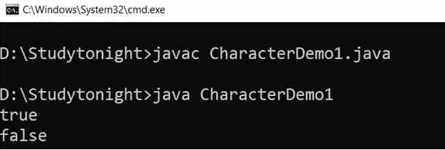
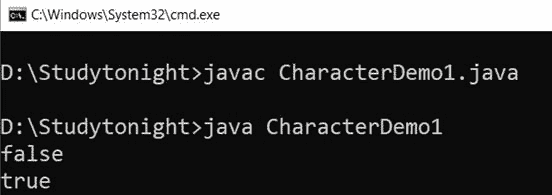
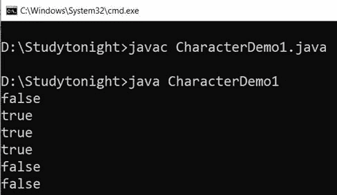
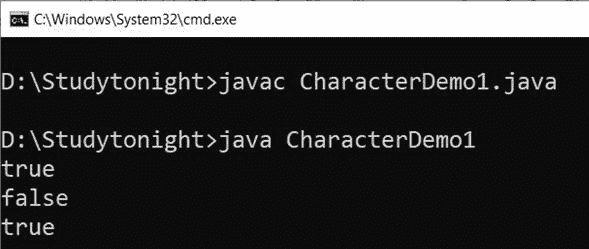
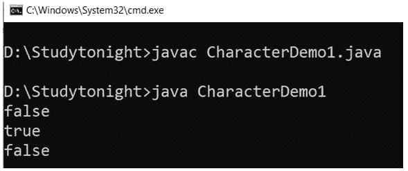
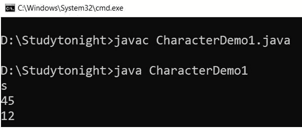
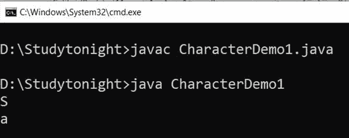
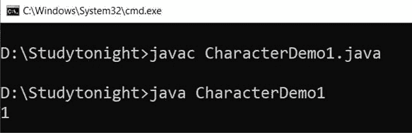
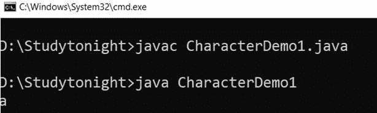

# Java `Character`类

> 原文：<https://www.studytonight.com/java/character-class.php>

`Character`类是一个包装器，用于包装对象中基本类型字符的值。`Character`类的对象包含一个类型为字符的字段。

这个类提供了大量静态方法来确定字符的类别(小写字母、数字等)。)和用于将字符从大写转换为小写，反之亦然。

这个类位于 **java.lang** 包中，声明如下。

### 申报

```java
public final class Character extends Object implements Serializable, Comparable<Character>
```

这里我们通过例子来解释`Character`类的方法。

### 1.伊斯雷尔(char ch)

此方法用于确定指定字符是否为字母。它返回真或假的布尔值。如果字符是字母，则返回 true，否则返回 false。它采用单个`Character`类型参数。下面给出了该方法的一般语法。

### 语法:

```java
	 boolean isLetter(char ch) 

```

### 示例:

让我们举个例子来检查指定的字符是否是字母。我们使用`isLetter()`方法来确保这一点。见下面的例子。

```java
	 public class CharacterDemo1
{ 
    public static void main(String[] args) 
    { 
		System.out.println(Character.isLetter('S'));  

		System.out.println(Character.isLetter('9'));     
     } 
} 

```



### 2.isdigt(char ch)

`Character`类提供了一个`isDigit()`方法来确定指定的字符是否是数字。如果指定的字符是数字，则返回 true，否则返回 false。

它采用单个`Character`类型参数。下面给出了该方法的一般语法。

### 语法:

```java
	 boolean isDigit(char ch) 

```

### 示例:

在这个例子中，我们检查指定的字符是否是数字。如果指定的字符是数字，则返回 true。

```java
	 public class CharacterDemo1
{ 
    public static void main(String[] args) 
    { 
		System.out.println(Character.isDigit('S'));  

		System.out.println(Character.isDigit('9'));     
     } 
} 

```



### 3.isWhitespace(char ch)

此方法用于确定指定字符是否为空格。如果字符是 Unicode 空格字符，则它是 Java 空白字符。如果字符是 Java 空白，则返回 true，否则返回 false。

它采用单个`Character`类型参数。下面给出了该方法的一般语法。

### 语法:

```java
	 boolean isWhitespace(char ch) 

```

### 示例:

我们可以使用`isWhitespace()`方法来检查指定的字符是否是空白，就像我们在下面的例子中所做的那样。

```java
	 public class CharacterDemo1
{ 
    public static void main(String[] args) 
    { 
		System.out.println(Character.isWhitespace('S'));  
		System.out.println(Character.isWhitespace(' '));  
		System.out.println(Character.isWhitespace('\n'));  
		System.out.println(Character.isWhitespace('\t'));   
		System.out.println(Character.isWhitespace(5)); 
		System.out.println(Character.isWhitespace('5'));     
     } 
} 

```



### 4 . isppender case(char ch)

`isUpperCase()`方法用于确定指定字符是否为大写字符。如果指定的字符是大写字母，则返回 true，否则返回 false。

它采用单个`Character`类型参数。下面给出了该方法的一般语法。

### 语法:

```java
	 booleanisUpperCase(char ch) 

```

### 示例:

让我们举个例子来检查指定的字符是否是大写字母。

```java
	 public class CharacterDemo1
{ 
    public static void main(String[] args) 
    { 
		System.out.println(Character.isUpperCase('S')); 
		System.out.println(Character.isUpperCase('s')); 
		System.out.println(Character.isUpperCase(89));      
     } 
} 

```



### 5.ispower case(char ch)

此方法用于检查指定字符是否为小写字母。如果指定字符为小写，则返回 true，否则返回 false。下面给出了该方法的语法。

### 语法:

```java
	 boolean isLowerCase(char ch) 

```

### 示例:

要检查字符的小写，我们可以使用返回 true 的 isLowerCase()方法。

```java
	 public class CharacterDemo1
{ 
    public static void main(String[] args) 
    { 
		System.out.println(Character.isLowerCase('S'));  
		System.out.println(Character.isLowerCase('s'));  
		System.out.println(Character.isLowerCase(46));    
     } 
} 

```



### 6.toUpperCase(char ch)

此方法用于将字符参数转换为大写。它在转换为大写后返回一个字符。它只需要一个 char 类型的参数。下面给出了该方法的语法。

### 语法:

```java
	 char toUpperCase(char ch) 

```

### 示例:

如果我们想把一个字符转换成大写，那么我们可以使用这个方法，在转换成大写后返回一个字符。

```java
	 public class CharacterDemo1
{ 
    public static void main(String[] args) 
    { 
		System.out.println(Character.toUpperCase('s'));  
		System.out.println(Character.toUpperCase(45));  
		System.out.println(Character.toUpperCase(12)); 
     } 
} 

```


### 7.托勒温案(char ch)

此方法用于将字符参数转换为小写字母。它在转换为小写后返回一个字符。它采用单`Character`类型参数。该方法的声明如下。

### 语法:

```java
	 char toLowerCase(char ch) 

```

### 示例:

我们正在创建一个将字符转换为小写的示例。它使用`toLowerCase()`方法进行字符大小写转换。

```java
	 public class CharacterDemo1
{ 
    public static void main(String[] args) 
    { 
		System.out.println(Character.toLowerCase('S'));  
		System.out.println(Character.toLowerCase(45));  
		System.out.println(Character.toLowerCase(12));
     } 
} 

```



### 8.toString(char ch)

`toString()`方法用于获取表示指定字符的字符串对象。结果是长度为 1 的字符串，仅由指定的字符组成。

此方法以单个字符作为参数，并返回一个字符串。该方法的声明如下。

### 语法:

```java
	 String toString(char ch) 

```

### 示例:

```java
	 public class CharacterDemo1
{ 
    public static void main(String[] args) 
    { 
		System.out.println(Character.toString('S'));  
		System.out.println(Character.toString('a'));  
     } 
} 

```



### 9\. charCount(内部代码点)

此方法用于确定表示指定字符所需的字符值的数量

如果指定的字符等于或大于 0x10000，它将 int 类型参数作为代码点并返回 2，否则返回 1。

### 语法:

```java
	 public static intcharCount(int code) 

```

### 示例:

让我们举一个例子来使用 charCount()方法，该方法将对代码点的字符进行计数。

```java
	 public class CharacterDemo1
{ 
    public static void main(String[] args) 
    { 
		int a = 0x9001; 
		int b = Character.charCount(a); 
		System.out.println(b);   
     } 
} 

```



### 10.charValue()

`charValue()`方法用于从 char 对象中获取一个原始 char 类型值。它返回这个字符对象的一个字符值。该方法的声明如下。

### 语法:

```java
	 public char charValue() 

```

### 示例:

在这个例子中，我们使用`charValue()`方法从角色对象中获取一个原始字符。

```java
	 public class CharacterDemo1
{ 
    public static void main(String[] args) 
    { 
		Character a = new Character('a'); 
		char b = a.charValue(); 
		System.out.println(b);   
     } 
} 

```



* * *