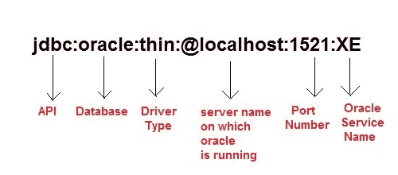

# Java：使用瘦驱动连接到 Oracle 数据库

> 原文：<https://www.studytonight.com/java/connecting-to-oracle.php>

使用瘦驱动将 Java 应用与 Oracle 数据库连接。您需要遵循以下步骤

1.  **加载驱动类:**oracle 数据库的驱动类为**Oracle . JDBC . Driver . oracledriver**，`Class.forName("oracle.jdbc.driver.OracleDriver")`方法用于加载 Oracle 数据库的驱动类。
2.  **Create Connection:** For creating a connection you will need a Connection URL. The Connection URL for Oracle is

    

    You will also require **Username** and **Password** of your Oracle Database Server for creating connection.
3.  **加载 jar 文件:**要将您的 java 应用与 Oracle 连接，您还需要加载`ojdbc14.jar`文件。这个文件可以通过两种方式加载。
    1.  Copy the jar file into `C:\Program Files\Java\jre7\lib\ext` folder.

        或者，

    2.  将其设置到类路径中。更多详情参见 [**如何设置类路径**](setting-classpath-for-java.php)

**注:**这里讨论的是 Oracle 10g 作为数据库。对于其他版本的甲骨文，你将需要做一些小的改变在连接网址。

### 是时候举个例子了！

让我们看看执行简单操作的程序，比如在数据库表上创建、插入和选择。

### 在 Oracle 数据库中创建一个表

使用下面的 SQL 命令在 oracle 数据库中创建一个表**学生**。这个表有两列:sid 和 sname。

```java
create table Student(sid number(10),sname varchar2(20));

```

### 在表格中插入一些记录

创建表后，现在使用下面的 sql 命令将两条记录插入表中。这里，我们插入了名为两行的 adam 和 abhi。

```java
insert into Student values(101,'adam');
insert into Student values(102,'abhi');

```

### JDBC 示例:访问记录

在上面的例子中，我们使用 SQL 命令插入了两条记录。现在我们使用 JDBC Java 应用获取这些记录。

```java
	 import java.sql.*;
class Test
{
	public static void main(String []args)
	{
		try{
			//Loading driver
			Class.forName("oracle.jdbc.driver.OracleDriver");

			//creating connection
			Connection con = DriverManager.getConnection
					("jdbc:oracle:thin:@localhost:1521:XE","username","password");

			Statement s=con.createStatement();      //creating statement

			ResultSet rs=s.executeQuery("select * from Student");   //executing statement

			while(rs.next()){
				System.out.println(rs.getInt(1)+" "+rs.getString(2));
			}

			con.close();    //closing connection
		}catch(Exception e){
			e.printStackTrace();
		}
	}
} 

```

101 个男人 102 个 abhi

### 示例:插入记录

我们可以使用 JDBC 使用 Java 应用将数据插入到表中。这里我们使用的是前一主题中讨论过的 Prepared 语句和参数化查询。

```java
import java.sql.*;
class Test
{
	public static void main(String []args)
	{
		try{
			//Loading driver...
			Class.forName("oracle.jdbc.driver.OracleDriver");

			//creating connection...
			Connection con = DriverManager.getConnection
					("jdbc:oracle:thin:@localhost:1521:XE","username","password");

			PreparedStatement pst=con.prepareStatement("insert into Student values(?,?)");

			pst.setInt(1,104);
			pst.setString(2,"Alex");
			pst.executeUpdate();

			con.close();    //closing connection
		}catch(Exception e){
			e.printStackTrace();
		}
	}
} 
```