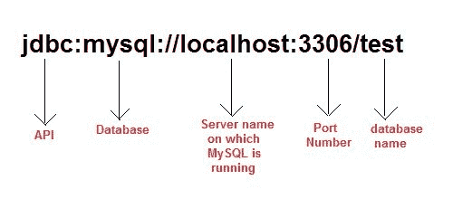

# 使用精简驱动程序连接到 MySQL 数据库

> 原文：<https://www.studytonight.com/java/connecting-to-mysql.php>

使用瘦驱动程序连接 Java 应用程序和 MySQL 数据库。您需要遵循以下步骤

1.  **加载驱动类:**MySQL 数据库的驱动类为 **com.mysql.jdbc.Driver** ，`Class.forName("com.mysql.jdbc.Driver")`方法用于加载 MySQL 数据库的驱动类。
2.  **Create Connection:** For creating a connection you will need a Connection URL. The Connection URL for MySQL is

    

    You will also require **Username** and **Password** of your MySQL Database Server for creating connection.
3.  **加载 jar 文件:**要将你的 java 应用与 MySQL 连接起来，你还需要加载`mysql-connector.jar`文件。这个文件可以通过两种方式加载。
    1.  Copy the jar file into `C:\Program Files\Java\jre7\lib\ext` folder.

        或者，

    2.  将其设置到类路径中。更多详情参见 [**如何设置类路径**](setting-classpath-for-java.php)

### 是时候举个例子了！

让我们看看执行简单操作的程序，比如在数据库表上创建、插入和选择。

### 在 MySQL 数据库中创建一个表

使用下面的 SQL 命令在 mysql 数据库中创建一个表**学生**。该表有两列:sid 和 name。

```java
create table Student(sid int(10),name varchar(20));

```

### 在表格中插入一些记录

创建表后，现在使用下面的 sql 命令将两条记录插入表中。这里，我们插入了名为两行的 adam 和 abhi。

```java
insert into Student values(102,'adam');
insert into Student values(103,'abhi');

```

### 示例:访问记录

在上面的例子中，我们使用 SQL 命令插入了两条记录。现在我们使用 JDBC Java 应用程序获取这些记录。

```java
import java.sql.*;
class Test
{
	public static void main(String []args)
	{
		try{
			//Loading driver
			Class.forName("com.mysql.jdbc.Driver");

			//creating connection
			Connection con = DriverManager.getConnection
					("jdbc:mysql:/ /localhost:3306/test","username","password");

			Statement s = con.createStatement();    //creating statement

			ResultSet rs = s.executeQuery("select * from Student"); //executing statement

			while(rs.next()){
				System.out.println(rs.getInt(1)+" "+rs.getString(2));
			}

			con.close();    //closing connection
		}catch(Exception e){
			e.printStackTrace();
		}
	}
} 
```

102 个男人 103 个 abhi

### 示例:插入记录

我们可以使用 Java 应用程序将数据插入到表中。这里我们使用准备语句和参数化查询来执行 SQL 查询。 **executeUpdate()** 方法用于执行插入查询。见下面的例子。

```java
import java.sql.*;
class Test
{
	public static void main(String []args)
	{
		try{
			//Loading driver
			Class.forName("com.mysql.jdbc.Driver");

			//creating connection
			Connection con = DriverManager.getConnection
					("jdbc:mysql:/ /localhost:3306/test","username","password");

			PreparedStatement pst=con.prepareStatement("insert into Student values(?,?)");

			pst.setInt(1,104);
			pst.setString(2,"Alex");
			pst.executeUpdate();

			con.close();    //closing connection
		}catch(Exception e){
			e.printStackTrace();
		}
	}
} 
```